# InclineYou Backend — Database Schema Reference

Every table the Postgres schema holds, what it is for, its primary key, its
foreign keys, and its indexes. Generated from the Flyway migrations under
`backend/src/main/resources/db/migration/`, which is now a single consolidated
`V1__init_schema.sql`.

> **The V-numbers in this file are provenance, not file names.** Forty-two
> migrations built this schema; on 11 Sep 2026, during the rename to InclineYou,
> they were flattened into one baseline because the rename changed the database
> name and both roles and so no instance had to be carried forward. The
> attributions below — `· V1, V8, V11, V23, V33, V34, V35` — are kept because
> they say *when and why* a column arrived, which is often the only record of
> the argument. They no longer name a file; `git log` has those. **`V2`, `V3` and
> `V4` have since landed as real files; `V5` to `V22` followed, so the next free
> number is `V23`.**
>
> **Behind by one, and it is recorded rather than quietly true:** `V28`'s
> `attention_dismissal` predates this note and does not yet have a section here.
> `V29`'s `client_note` does, below. **`V5` to `V22` have since landed too, so
> the next free number is `V23`.**

This file is to the schema what `API.md` is to the wire format. **Change a
migration, change this file in the same commit** — and remember that changing a
migration means *appending* one, never editing one that has run.

The last section, [The device mirror](#the-device-mirror--watermelondb), maps
every table here onto the app's WatermelonDB copy, because a column that has to
reach a phone is two migrations in one commit.

- **Engine:** Postgres 16, `pgcrypto` enabled (for `gen_random_uuid()`).
- **Owner of the schema:** Flyway. Hibernate runs `ddl-auto: validate` and only
  checks that what it expects is there.
- **Migrations:** `V1__init_schema.sql` (the consolidated baseline of the
  forty-two historical migrations) and **`V2`–`V22`**, all additive but one (`V22` drops a table — see its row):

  | File | What it added |
  | --- | --- |
  | `V2__program_shape.sql` · `V3__session_from_schedule.sql` · `V4__package_adjustment_sessions.sql` | see the sections that cite them |
  | `V5__body_assessment.sql` | the measuring cycle's columns on `client` / `trainer` and `idx_client_next_assessment`. **Rewritten before it shipped (23 Sep 2026):** it no longer creates the `assessment` sitting table or `body_metric.assessment_id`; the one local database it had run on was reset |
  | `V6__trainer_gender.sql` | `trainer.gender` |
  | `V7__client_birth_date_and_shared_notes.sql` | `client.date_of_birth`, `client_note.shared_with_client` |
  | `V8__payment_invoice.sql` | `payment.invoice_no` / `invoiced_at`, `idx_payment_invoice_no`, table `invoice_counter` |
  | `V9__exercise_status_and_cues.sql` | `exercise.status`, `exercise.secondary_targets`, `exercise.form_cues` |
  | `V10__program_exercise_workout.sql` | `program_exercise.workout_id`, `program_exercise.workout_name` |
  | `V11__certified_templates.sql` | table `certified_template` (+ two **sample** rows, its SELECT-only policy and `certified_template_used()`), `template.source` / `copied_from_id` / `copied_from_name` / `copied_from_updated_at`, `idx_template_copied_from` |
  | `V12__certified_used_count_is_not_a_revision.sql` | re-creates `trg_certified_template_updated_at` so a use-count bump does not move the revision clock |
  | `V13__workout_template.sql` | table `workout_template` (tier 1) |
  | `V14__assessment_questionnaire.sql` | tables `assessment_template` and `assessment` (tier 1; `assessment` also tier 4) |
  | `V15__trainer_notification.sql` | table `trainer_notification` (tier 1, read/mark only) and `mint_trainer_notification()` |
  | `V16__portal_reads.sql` | tables `client_message` and `milestone`; client-lens READ policies `pack_client_read`, `client_note_shared_read`, `assessment_template_client_read` |
  | `V17__portal_workouts.sql` | table `workout_feedback`; `milestone_client_insert` |
  | `V18__client_prefs_and_notifications.sql` | tables `client_prefs` (client-only) and `client_notification`; `mint_client_notification()` |
  | `V19__portal_account.sql` | `portal_phone_in_use(text)` and `portal_change_client_phone(text, text)` — SECURITY DEFINER, for the portal's number change |
  | `V20__portal_phone_guard.sql` | re-creates `portal_change_client_phone` so its own-number guard reads `app_phone()`'s `''` as "no session phone" (V19 read it as NULL and fired everywhere) |
  | `V21__schema_review_hardening.sql` | **the pre-launch schema review (24 Sep 2026)** — narrower grants (no DELETE, no UPDATE on the three logs, no default privileges), `exercise` / `tenant` / `tenant_member` policies split by command, the caller checks in `portal_change_client_phone` and `mint_trainer_notification`, same-workspace composite foreign keys, status / money / range / format CHECKs, seven missing `updated_at` triggers, nine indexes added and 26 redundant ones dropped, table `subscription` (the trial clock, MUST-16), `assessment.entered_by` (MUST-21) and `trainer.timezone`. Section [V21](#v21--the-pre-launch-review) below |
  | `V22__drop_body_metric.sql` | **drops `body_metric` (24 Sep 2026)** — the one drop under the additive-only law. A body is measured in an assessment and nowhere else, so readings live on `assessment.readings` alone; the table had no writer left (phone sync, `POST /v1/clients/{id}/body-metrics` and its correction routes, and the portal weigh-in are all gone) and nothing was in production. Its policies, triggers, indexes and four foreign keys went with it. Not the historical V22 (exercise media) |

  > **The new files reuse numbers the historical labels already hold.** `V5`–`V10`
  > as FILES (above) are not the historical V5, V6, V9 and V10 cited in section
  > headings such as `scheduled_session · V1, V5, V6, V9, V10 …`. Where a row
  > here could be read either way, the new file is marked **(file)**.

---

## Contents

| Area | Tables |
| --- | --- |
| [Tenancy](#0-tenancy) | `tenant`, `tenant_member` |
| [Identity & auth](#1-identity--auth) | `app_user`, `otp_request`, `trainer`, `web_session`, `subscription` |
| [Roster](#2-roster) | `client`, `assessment_template`, `assessment`, `client_note` |
| [Team coaching](#3-team-coaching) | `team`, `team_member`, `client_assignment`, `team_activity` |
| [Exercise library](#4-exercise-library) | `exercise`, `exercise_favourite` |
| [Planning](#5-planning) | `template`, `certified_template`, `program`, `program_exercise`, `workout_template` |
| [Diary](#6-diary) | `scheduled_session`, `working_hours`, `time_block`, `batch` |
| [Logging](#7-logging) | `workout_session`, `workout_exercise`, `set_log`, `workout_feedback` |
| [Money book](#8-money-book) | `pack`, `package`, `payment`, `invoice_counter`, `gym_settlement` |
| [Comms & reports](#9-comms--reports) | `client_prefs`, `client_notification`, `client_message`, `milestone`, `trainer_notification`, `nudge_rule`, `nudge_log`, `weekly_report` |

**46 tables** — V22 (file) dropped `body_metric`, after V21 added `subscription` (the trial clock) to make 47. Before those, **46 tables** (counted against a migrated database on 23 Sep 2026, after V18 — the
figure had read 34 before this pass; V8 added `invoice_counter`, V11 `certified_template`, V13 `workout_template`, V14 `assessment_template` and `assessment`, V15 `trainer_notification`, V16 `client_message` and `milestone`, V17 `workout_feedback`, V18 `client_prefs` and `client_notification`, and V5's original `assessment` table was removed before it shipped), plus Flyway's own `flyway_schema_history`. Since V37 the schema
has **two** ownership axes and they are independent:

| | Question | Column |
| --- | --- | --- |
| **Who coaches** | which human runs this session, is owed this money | `trainer_id` — unchanged, still `NOT NULL` |
| **Whose books** | which workspace this row is in, who may read it | `tenant_id` — V37–V39, **immutable** |

They used to be the same fact. They came apart when one trainer had to be able to
coach privately *and* at a gym with different clients. See
[Tenancy](#0-tenancy) and [Row-level security](#row-level-security).

Reference sections: [Entity relationships](#entity-relationships) ·
[Foreign key reference](#foreign-key-reference) ·
[Fan-in](#fan-in-what-points-at-the-hub-tables) ·
[Logical relationships with no FK](#logical-relationships-with-no-foreign-key) ·
[Uniqueness](#uniqueness-constraints) · [Index inventory](#index-inventory) ·
[Triggers](#triggers) · [Sync surface](#sync-surface) ·
[Evolution law](#evolution-law) ·
**[Planned: the gym platform](#planned-the-gym-platform)** ·
**[The device mirror — WatermelonDB](#the-device-mirror--watermelondb)**

---

## Conventions that hold across every table

These are the schema's invariants. A new table that breaks one of them is a bug,
not a style choice.

| Convention | Detail |
| --- | --- |
| **Primary key** | `id UUID PRIMARY KEY DEFAULT gen_random_uuid()`, on every table without exception. The default is a fallback — ids are normally **generated client-side** (UUID v4) so an offline write has a stable key the server accepts as-is. |
| **Ownership** | Trainer-scoped tables carry `trainer_id UUID NOT NULL REFERENCES trainer(id)`. Every trainer-scoped query filters on it, so a wrong id yields **404, not 403**. A team widens *which* `trainer_id`s a caller may read; it never rewrites the column. |
| **Soft deletes** | `deleted_at TIMESTAMPTZ` (NULL = alive). `DELETE` sets it; nothing is hard-deleted, because sync has to carry the tombstone to every device. Every read filters `deleted_at IS NULL`. |
| **Sync cursor** | `updated_at TIMESTAMPTZ NOT NULL DEFAULT NOW()` on every synced table, maintained by the `set_updated_at()` trigger. `/v1/sync/pull` reads `updated_at > cursor`. |
| **Timestamps** | `TIMESTAMPTZ`, UTC, mapped to `Instant`. Dates that mean a calendar day in the trainer's timezone (`session_date`, `week_start`, `due_date`) are `DATE`. |
| **Money** | `NUMERIC(10,2)` mapped to `BigDecimal`. Currency is a `VARCHAR(3)` defaulted `'INR'`. Percentages are `NUMERIC(5,2)`. |
| **Enumerations** | Plain `VARCHAR` validated in application code — **never** a Postgres `ENUM`. Adding a value must be a code change, not a migration on a live table. Every such column's legal values are listed in its table below. |
| **Open metadata** | Core tables carry `metadata JSONB` so the next optional field is not a migration. |
| **Append-only tables** | `otp_request`, `client_assignment` and `team_activity` have no `updated_at`/`deleted_at`, and `package_adjustment` no `updated_at`. They are logs; a mistake is corrected by writing another row. **Since V21 the request role holds no UPDATE on the last three**, so that is enforced rather than promised. |
| **Grants** | Since V21 the request role `inclineyou_app` has **no default privileges** and **no DELETE** except on `attention_dismissal`, `web_session` and `otp_request`. A migration that creates a table grants what that table needs in the same file, beside its `ENABLE ROW LEVEL SECURITY`. |

### Every `updated_at` has a trigger — since V21

`working_hours`, `time_block` and `batch` were created without the
`set_updated_at` trigger, and the note that stood here said their writers set
`updated_at = NOW()` by hand. **That was not true of the sync push**: all three
upserts write `updated_at = EXCLUDED.updated_at`, the device's own value, so a
phone with a wrong clock or a replayed record wrote a past timestamp and the edit
never reached another device. V21 gave them — and `client_note`,
`nudge_template`, `attention_dismissal`, `invoice_counter` — the trigger. The
server's clock now always wins, as on every other table.

---

## Entity relationships

Solid FK edges only. `trainer` and `client` are the two hubs; everything else
hangs off one of them.

```mermaid
erDiagram
    trainer  ||--o{ client            : trainer_id
    trainer  ||--o{ template          : trainer_id
    trainer  ||--o{ program           : trainer_id
    trainer  ||--o{ scheduled_session : trainer_id
    trainer  ||--o{ workout_session   : trainer_id
    trainer  ||--o{ package           : trainer_id
    trainer  ||--o{ payment           : trainer_id
    trainer  ||--o{ pack              : trainer_id
    trainer  ||--o{ gym_settlement    : trainer_id
    trainer  ||--o{ nudge_log         : trainer_id
    trainer  ||--o{ nudge_rule        : trainer_id
    trainer  ||--o{ working_hours     : trainer_id
    trainer  ||--o{ time_block        : trainer_id
    trainer  ||--o{ batch             : trainer_id
    trainer  ||--o{ weekly_report     : trainer_id
    trainer  ||--o{ exercise_favourite: trainer_id
    trainer  |o--o{ exercise          : "trainer_id (custom only)"
    trainer  ||--o{ team              : owner_trainer_id
    trainer  |o--o{ team_member       : "trainer_id (null until bound)"
    trainer  ||--o{ invoice_counter   : "trainer_id (V8, one per FY)"
    certified_template |o--o{ template : "copied_from_id (V11, a copy's provenance)"
    trainer  ||--o{ workout_template  : "trainer_id (V13)"

    client   ||--o{ assessment        : "client_id (V14, a questionnaire sent)"
    assessment_template |o--o{ assessment : "template_id (V14)"
    trainer  ||--o{ trainer_notification : "trainer_id (V15, the bell)"
    client   ||--o{ program           : client_id
    client   ||--o{ scheduled_session : client_id
    client   ||--o{ workout_session   : client_id
    client   ||--o{ package           : client_id
    client   ||--o{ payment           : client_id
    client   ||--o{ nudge_log         : client_id
    client   ||--o{ weekly_report     : client_id
    client   ||--o{ client_assignment : client_id
    client   |o--o{ team_activity     : "client_id (null for exercises)"

    template ||--o{ program           : template_id
    program  ||--o{ program_exercise  : program_id
    program  |o--o{ scheduled_session : program_id
    program  |o--o{ workout_session   : program_id

    exercise ||--o{ program_exercise  : exercise_id
    exercise ||--o{ set_log           : exercise_id
    exercise ||--o{ workout_exercise  : "exercise_id + swapped_from_exercise_id"
    exercise ||--o{ exercise_favourite: exercise_id

    scheduled_session |o--o{ workout_session : scheduled_session_id
    batch             |o--o{ scheduled_session : batch_id
    workout_session   ||--o{ set_log          : workout_session_id
    workout_session   ||--o{ workout_exercise : workout_session_id

    pack    |o--o{ package : pack_id
    package |o--o{ payment : package_id

    team ||--o{ team_member       : team_id
    team ||--o{ client_assignment : team_id
    team ||--o{ team_activity     : team_id
```



Two things the diagram deliberately cannot show, both real and both load-bearing:

- **`app_user` has no foreign keys.** It is joined to `trainer` and `client` by
  `phone`, not by id. See [Logical relationships](#logical-relationships-with-no-foreign-key).
- **A team is a visibility grant, not an owner.** No table carries a `team_id`
  except the four team tables themselves. `TeamScope` resolves a caller to a
  *set of `trainer_id`s* at read time; the rows never move.

---

## 0. Tenancy

### `tenant` — a workspace  · V37

The unit of isolation, and the unit a customer pays for.

| Column | Type | Null | Default | Since | Note |
| --- | --- | --- | --- | --- | --- |
| `id` | UUID | no | `gen_random_uuid()` | V37 | **PK.** This is `tenant_id` on 29 other tables. |
| `type` | VARCHAR(20) | no | — | V37 | `solo` \| `team` \| `gym`. **All three own rows** — what differs is how many people are in them and what roles exist, which is what lets one mechanism serve a lone trainer, a team and a gym. VARCHAR and never an ENUM, per the schema's convention. |
| `name` | VARCHAR(160) | no | — | V37 | |
| `status` | VARCHAR(20) | no | `'active'` | V37 | `active` \| `suspended` \| `closed`. A whole workspace switched off with one column — the first thing `trainer_id` could never do. |
| `primary_app_user_id` | UUID | yes | — | V37 | **FK → `app_user(id)`.** Who owns and pays. Deliberately **not** the owner of the DATA — that is `tenant_id` on the rows — and nullable, because a gym org can exist before a person is named. |
| `metadata` | JSONB | no | `'{}'` | V37 | Carries `backfill` provenance for the workspaces V37 created. |
| `created_at` / `updated_at` / `deleted_at` | TIMESTAMPTZ | | | V37 | |

**A `solo` tenant is created by a trigger with the trainer**
(`ensure_home_tenant`, V39), and a `team` tenant with the team
(`ensure_team_tenant`). Both are in the database rather than in a service,
because there is more than one write path into each table and a rule that lives
in one of them is a rule the others will break.

### `tenant_member` — who may enter, and as what  · V37

**This table is the multi-tenancy.** One person, N rows. A trainer who coaches
privately and at a gym has two; a trainer who is also somebody's client has a
third.

It is also the `user_role (app_user_id, role, scope_type, scope_id, status)` that
this document scheduled for the gym platform. `tenant_id` replaces
`(scope_type, scope_id)` outright, because the tenant already carries its type —
**so this is that table, and a V43+ author must not add a second one.**

| Column | Type | Null | Default | Since | Note |
| --- | --- | --- | --- | --- | --- |
| `id` | UUID | no | `gen_random_uuid()` | V37 | **PK** |
| `tenant_id` | UUID | no | — | V37 | **FK → `tenant(id)`** |
| `app_user_id` | UUID | no | — | V37 | **FK → `app_user(id)`.** A person, not a trainer — a gym administrator may never coach and has no `trainer` row. |
| `role` | VARCHAR(20) | no | — | V37 | `owner` \| `admin` \| `coach` \| `gym_admin` \| `gym_staff` \| `client`. The owner is not a fourth kind of admin; it is the admin who cannot be removed. |
| `status` | VARCHAR(20) | no | `'active'` | V37 | `invited` \| `active` \| `declined` \| `removed` |
| `is_home` | BOOLEAN | no | `FALSE` | V37 | Which workspace the app opens in. Takes over `app_user.role`'s job, generalised — and `app_user.role` is **not** dropped or repurposed, so old builds keep working. |
| `revenue_share_percent` | NUMERIC(5,2) | yes | — | V37 | What this member keeps of what they collect here. **NULL = 100%**, the only correct answer for a solo workspace and the only safe one for a team that has not had the conversation. |
| `assignment_margin_percent` | NUMERIC(5,2) | yes | — | V37 | An admin's cut of revenue from clients **they** placed with somebody else. NULL = none. Frozen per handover onto `client_assignment.actor_margin_percent`. |
| `created_at` / `updated_at` / `deleted_at` | TIMESTAMPTZ | | | V37 | |

Two partial unique indexes carry rules the application would otherwise have to
remember: `uq_tenant_member_live (tenant_id, app_user_id, role)` — two roles in
one workspace is legitimate, a gym owner who also coaches — and
`uq_tenant_member_home (app_user_id)`, exactly one home per person.

`team_member` is **mirrored** into this table by a trigger (`mirror_team_member`,
V39) rather than by a line in `TeamService`. Two tables holding one fact is how
one fact becomes two.

### Three percentages, and they are not the same number

| Column | Means | Authority? |
| --- | --- | --- |
| `trainer.gym_share_percent` (V11) | what a gym that is **not** on InclineYou keeps of a floor session | no — a hint, and V23 says in bold it must never gate a feature |
| `client.trainer_split_percent` (V1) | a per-client override of the above | no, same reason |
| `tenant_member.revenue_share_percent` (V37) | what a coach keeps inside a workspace that **is** on InclineYou | **yes** — both parties are members of the tenant they agreed it in |

---

## 1. Identity & auth

### `app_user` — one identity per phone number  · V18

The answer to "who is this number", stated rather than deduced. Deliberately
thin: identity and nothing else, because everything else differs by role and
lives in the role's own table.

| Column | Type | Null | Default | Since | Notes |
| --- | --- | --- | --- | --- | --- |
| `id` | UUID | no | `gen_random_uuid()` | V18 | **PK** |
| `phone` | VARCHAR(15) | no | — | V18 | **UNIQUE.** The login. Unique product-wide, which is what makes `role` single-valued. |
| `role` | VARCHAR(20) | no | — | V18 | `trainer` \| `client` \| `gym_admin`. **No longer exclusive** — a phone can own a trainer account and also be a live client on somebody else's roster; `role` is just the *home* role, which mode sign-in opens into by default (`auth/AuthService.java`'s `trainerView`/`clientView`, and `POST /v1/auth/mode/trainer` \| `mode/client` to switch). This is a scoped predecessor to the full V28 `user_role` design below — trainer↔client duality only, derived on the fly from `trainer`/`client` by phone, no new table. `gym_admin` is reserved and not yet built. See [Planned: the gym platform](#planned-the-gym-platform) for the fuller `user_role`/scope-type generalization this does not attempt. |
| `privacy_accepted_at` | TIMESTAMPTZ | yes | — | V18 | When they accepted the privacy policy. A timestamp, not a boolean: consent is evidence and evidence has a date. |
| `created_at` | TIMESTAMPTZ | no | `NOW()` | V18 | |
| `updated_at` | TIMESTAMPTZ | no | `NOW()` | V18 | Trigger-maintained. |
| `deleted_at` | TIMESTAMPTZ | yes | — | V18 | |

- **PK:** `id` · **FKs:** none · **Unique:** `phone`
- **Backfill (V18):** trainers first, then phones that are only ever clients.
  A number that was both wins as a trainer; the client rows are kept so the
  trainer's books do not change.
- Not in sync.

### `otp_request` — one row per code sent  · V1, V7, V16, V17

Short-lived, append-only, keyed by **phone rather than by a user**, because a
code is sent before we know whether an account exists. This is the Postgres
fallback store; Redis is the primary (`app.redis.enabled`).

| Column | Type | Null | Default | Since | Notes |
| --- | --- | --- | --- | --- | --- |
| `id` | UUID | no | `gen_random_uuid()` | V1 | **PK** |
| `phone` | VARCHAR(15) | no | — | V1 | No FK — deliberately. |
| `otp_hash` | VARCHAR(255) | no | — | V1 | Hashed, never the code. |
| `expires_at` | TIMESTAMPTZ | no | — | V1 | |
| `verified` | BOOLEAN | no | `FALSE` | V1 | Prevents reuse of a consumed code. |
| `created_at` | TIMESTAMPTZ | no | `NOW()` | V1 | |
| `wrong_attempts` | INT | no | `0` | V7 | Drives the max-attempts ceiling. |
| `locked_until` | TIMESTAMPTZ | yes | — | V17 | The **end** of the wait, not its start — retuning `app.otp.lock-minutes` must not lengthen a wait someone is already serving. Persisted precisely so a restart cannot clear it. |

- **PK:** `id` · **FKs:** none · **No `updated_at`, no `deleted_at`.**
- **Indexes:** `idx_otp_request_phone (phone)` · `idx_otp_request_phone_created_at (phone, created_at DESC)` for the send-rate throttle · `idx_otp_request_phone_locked_until (phone, locked_until DESC) WHERE locked_until IS NOT NULL`
- Append-only and never pruned today; the row count per number only grows.
- Not in sync.

### `trainer` — the account behind the workspace  · V1, V8, V11, V23, V33, V34, V35, V5, V6

| Column | Type | Null | Default | Since | Notes |
| --- | --- | --- | --- | --- | --- |
| `id` | UUID | no | `gen_random_uuid()` | V1 | **PK.** This is the JWT subject for a trainer token, and the `trainer_id` every other table points at. |
| `phone` | VARCHAR(15) | no | — | V1 | **UNIQUE.** |
| `name` | VARCHAR(100) | no | — | V1 | |
| `upi_vpa` | VARCHAR(100) | yes | — | V1 | Their own VPA — the app builds a UPI deep link, it never holds money. |
| `fcm_token` | TEXT | yes | — | V1 | Push token, written by `POST /v1/devices/token`. One token per trainer, overwritten on refresh — there is no `device` table. |
| `experience_band` | VARCHAR(20) | yes | — | V8 | A **band**, never a year count: `lt1` \| `1_2` \| `3_5` \| `6_10` \| `10_plus`. |
| `specialities` | JSONB | no | `'[]'` | V8 | Array of ids. Anything typed by the trainer arrives prefixed `custom:` and is stored verbatim. |
| `certifications` | JSONB | no | `'[]'` | V8 | As above. |
| `languages` | JSONB | no | `'[]'` | V8 | As above. GIN-indexed — clients filter coaches by language. |
| `setup_completed_at` | TIMESTAMPTZ | yes | — | V8 | The authority on whether onboarding is owed. NULL = not finished. Server-side on purpose: `isNewUser` only answers "first ever verify". |
| `metadata` | JSONB | no | `'{}'` | V8 | Holds `metadata.prefs` — notification switches, appearance, language, chase window, reminder tone. Preferences live here rather than in columns. |
| `gym_name` | VARCHAR(120) | yes | — | V11 | NULL = no gym, trainer keeps 100%. |
| `gym_share_percent` | NUMERIC(5,2) | yes | — | V11 | What the **gym** keeps of floor sessions. Remote sessions are 0% by a rule in code, not a second column. |
| `work_mode` | VARCHAR(20) | yes | — | V23 | `independent` \| `gym` \| `both`. A **hint** for setup and add-client defaults; it must never gate a feature. Gym-vs-freelance is decided per client (`client.payment_mode`). NULL = never asked. |
| `headline` | TEXT | yes | — | V33 | One line under the name. Capped at **80** in `TrainerService`, not in the column — every length here is a product decision, and under the additive-only law a `VARCHAR(80)` would make raising it a migration. Over the cap is a **400, not a truncation**. |
| `bio` | TEXT | yes | — | V33 | 100–200 words, capped at **1200** characters in code. Also refused rather than truncated: dropping the last sentence of somebody's prose while answering 200 is the worst available outcome. |
| `intro_video_url` | TEXT | yes | — | V33 | A YouTube link, stored **canonical** — `https://www.youtube.com/watch?v=<id>`. Every share-sheet shape is reduced on write by `YouTubeLink`; `t=`, `list=` and tracking parameters are dropped. The 11-character id rides the wire as `introVideoId`, derived not stored. |
| `map_link` | TEXT | yes | — | V34 | The gym or studio on a map, stored **verbatim** — the opposite call to `intro_video_url`, because a maps URL has no single canonical shape across Google, Apple and OSM and a normaliser would eventually break a working link. Refused over **500** characters and refused unless it is an `http(s)` URL. |
| `training_modes` | JSONB | no | `'[]'` | V34 | How the coaching is delivered: `gym_floor` \| `home_visit` \| `online` \| `hybrid`, plus `custom:` entries. **Not `work_mode`** — that one is commercial and this one is what a client chooses between; a gym trainer may still take home visits. GIN-indexed. |
| `service_areas` | JSONB | no | `'[]'` | V34 | Free-text localities the trainer travels to. Deliberately **not** a catalogue: no locality list would be right in two Indian cities. |
| `instagram_url` | TEXT | yes | — | V35 | The trainer's Instagram, stored **canonical** — `https://www.instagram.com/<handle>`. A bare `@handle`, a share URL with its `igsh=` token and the desktop URL all reduce to one string; a link to a post or reel is refused. Same call as `intro_video_url` and the opposite of `map_link`: a profile reduces to a handle, a place reduces to nothing. `instagramHandle` rides the wire, derived not stored. |
| `youtube_url` | TEXT | yes | — | V35 | The trainer's **channel** — not a video; `intro_video_url` is the one video they chose. Canonical `https://www.youtube.com/<@handle \| channel/… \| c/… \| user/…>`, the path kept exactly as given because those four are not interchangeable without a lookup. A watch URL is refused with a sentence naming the field that wants it. |
| `assessment_interval_days` | SMALLINT | yes | — | V5 | How often a NEW client is offered to be measured. NULL = the trainer has never said. |
| `assessment_metrics` | JSONB | yes | — | V5 | Which of the six measurement ids a new client's sheet holds. NULL = the product's default. |
| `gender` | VARCHAR(24) | yes | — | V6 | `woman` \| `man` \| `nonbinary` \| `undisclosed`, validated in `TrainerService`, not a CHECK. Asked on setup step 1 because clients filter on it. NULL = never asked; `undisclosed` is an **answer**, not an absence. Profile data a client reads, not health data. |
| `timezone` | VARCHAR(64) | no | `'Asia/Kolkata'` | V21 | IANA zone the trainer's `DATE`s (`session_date`, `due_date`) and `working_hours` minutes are in. Every row before V21 assumed IST, which is the default. Nothing branches on it yet; the export (MUST-20) is its first reader. |
| `created_at` / `updated_at` / `deleted_at` | TIMESTAMPTZ | | | V1 | |

- **PK:** `id` · **FKs:** none · **Unique:** `phone`
- **Indexes:** `idx_trainer_languages` — GIN over `languages`, answers `languages @> '["ta"]'` · `idx_trainer_training_modes` — GIN over `training_modes`, answers `training_modes @> '["online"]'`
- **Referenced by 19 tables.** See [Fan-in](#fan-in-what-points-at-the-hub-tables).
- Not in sync (the trainer reads themselves through `/v1/trainers/me`).

---

### `web_session` — the web credential  · V41

The phone and the browser want opposite things from a credential, so they get
different ones behind one interface (`AuthTokenIssuer`).

The phone is offline half the time and cannot ask a server whether it is still
signed in, so a self-contained JWT is right for it — and its one real cost, that
you cannot revoke it before it expires, is acceptable on a device the trainer is
holding. The browser is never meaningfully offline and has the opposite risk: a
token that leaks from a browser is a token somebody else's machine is holding,
and "wait seven days" is not an incident response.

| Column | Type | Null | Default | Since | Note |
| --- | --- | --- | --- | --- | --- |
| `id` | UUID | no | `gen_random_uuid()` | V41 | **PK** |
| `token_hash` | VARCHAR(64) | no | — | V41 | **UNIQUE.** Hex SHA-256 of the opaque token, never the token — the same discipline as `otp_request.otp_hash`. SHA-256 and **not** bcrypt: this is 256 bits of `SecureRandom` with no structure to guess, so it wants a fast one-way function, not a KDF on the hot path of every authenticated request. |
| `subject` | VARCHAR(64) | no | — | V41 | What the equivalent JWT would carry — a trainer UUID for a trainer, the phone for every other role — so `getAuthentication().getName()` reads identically whichever issuer minted the credential, and the 46 call sites that read it did not change. |
| `phone` | VARCHAR(15) | no | — | V41 | |
| `role` | VARCHAR(20) | no | — | V41 | |
| `app_user_id` | UUID | yes | — | V41 | **FK → `app_user(id)`** |
| `tenant_id` | UUID | yes | — | V41 | **FK → `tenant(id)`.** The active workspace. Switching **updates this row** rather than minting a credential, which is the second thing a server-side session buys. Nullable because a `pending` session has proved a number and belongs nowhere. |
| `issued_at` | TIMESTAMPTZ | no | `NOW()` | V41 | |
| `last_seen_at` | TIMESTAMPTZ | no | `NOW()` | V41 | Advanced only when it has moved by more than a minute — a write per request would make this the hottest table in the schema for no accuracy anybody reads. |
| `expires_at` | TIMESTAMPTZ | no | — | V41 | `app.session.expiry-hours`, default 72. Shorter than the JWT's week on purpose: a revocable credential's lifetime is a convenience setting, not a ceiling. |
| `revoked_at` | TIMESTAMPTZ | yes | — | V41 | A column rather than a DELETE, because "revoked at 14:02" is the first thing anybody wants after a security question. |
| `user_agent` | VARCHAR(300) | yes | — | V41 | For the "signed in on" list. |
| `created_ip` | VARCHAR(64) | yes | — | V41 | |
| `created_at` / `updated_at` | TIMESTAMPTZ | | | V41 | |

Redis caches sessions as a HASH with the session's own TTL, **read-through only**
— every write goes to Postgres first, and a revoke or a workspace switch EVICTS
rather than updates. A stale cached session is a credential that outlived its own
revocation.

`SessionSweeper` deletes rows dead longer than `app.session.purge-after-days`.
Written because `otp_request` is the cautionary tale: V1 says that table is
"cleaned up by a scheduled job", no such job was ever written, and it grew from
the first sign-in **until V21**, which added `OtpRequestSweeper` beside this one
(`app.otp.purge-after-days`, 30; a row whose lock has not run out is kept).

`created_ip` is **never written** — the INSERT in `JdbcSessionStore` omits it.
Found by the V21 review and left as a finding rather than a fix: whether to
record an address at all is a privacy decision, not a schema one.

---

### `subscription` — the trainer's own plan and trial clock  · V21

MUST-16 (`WEB_LAUNCH.md` §5.16, runbook §4b). **The trial clock is the one
billing component that cannot arrive after the first signup**: a trainer
recorded against a schema with no trial start has no honest expiry, ever. So the
clock starts in the database — `ensure_subscription()`, `AFTER INSERT ON
trainer` — and no signup path, present or future, can skip it.

**No `tenant_id`, and not policied.** A seat is a coaching trainer, and V37 lets
one trainer coach in two workspaces; a tenant-scoped subscription would bill one
person twice. It joins `trainer` and `app_user` on the
[deliberately-not-policied](#what-is-deliberately-not-policied) list. The request
role has SELECT and UPDATE; only the trigger inserts, and nothing deletes.

| Column | Type | Null | Default | Since | Note |
| --- | --- | --- | --- | --- | --- |
| `trainer_id` | UUID | no | — | V21 | **PK, FK → `trainer(id)`.** One subscription per trainer. |
| `plan` | VARCHAR(12) | no | `'pro'` | V21 | `free` · `pro` · `team` (**CHECK**). A trial is full Pro (`PRICING.md`). |
| `state` | VARCHAR(12) | no | `'trialing'` | V21 | `trialing` → `active` → `past_due` → `grace` (read-only) → `free`; `cancelled` (**CHECK**). **Never a locked door**: every state still reads the money book (`PRICING.md` §8). The webhook moves it, never the browser redirect. |
| `trial_started_at` | TIMESTAMPTZ | no | `NOW()` | V21 | Backfilled to `trainer.created_at` for trainers that predate V21. |
| `trial_ends_at` | TIMESTAMPTZ | no | `NOW() + 30 days` | V21 | **CHECK** `> trial_started_at`. Stored, so a support extension does not rewrite when the trial began. |
| `current_period_end` | TIMESTAMPTZ | yes | — | V21 | The paid period's end, from the provider. |
| `grace_until` | TIMESTAMPTZ | yes | — | V21 | When `grace` (read-only) falls back to `free`. |
| `provider` | VARCHAR(16) | yes | — | V21 | `razorpay` · `cashfree` · `manual` (**CHECK**). `manual` is the hand-invoice launch posture (`PRICING.md` §11.3). |
| `provider_customer_id` / `provider_mandate_id` | VARCHAR(64) | yes | — | V21 | From the hosted redirect. `uq_subscription_provider_mandate (provider, provider_mandate_id)`. No card data ever lands here — hosted checkout only. |
| `cancelled_at` | TIMESTAMPTZ | yes | — | V21 | |
| `created_at` / `updated_at` | TIMESTAMPTZ | | | V21 | `set_updated_at` trigger. |

`idx_subscription_trial_ends (trial_ends_at) WHERE state = 'trialing'` serves the
runbook's alert, *trials expiring this week*. Not in sync; the phone reads nothing
about billing (runbook §4b).

**`web_session` is deliberately outside RLS.** It is read to ESTABLISH the tenant
context, so a policy on it would have to be satisfied by the very context the
read is trying to produce.

---

## 2. Roster

### `client` — a person on one trainer's roster, and the membership itself  · V1, V4, V9, V14, V18, V5, V7

`client` **is** the trainer↔client link: one row has exactly one `trainer_id`,
and ten tables carry an FK to `client.id`. Consent is therefore annotated onto
the relationship rather than duplicated into a separate membership table.

| Column | Type | Null | Default | Since | Notes |
| --- | --- | --- | --- | --- | --- |
| `id` | UUID | no | `gen_random_uuid()` | V1 | **PK** |
| `trainer_id` | UUID | no | — | V1 | **FK → `trainer(id)`.** The owning coach. Reassignment rewrites this one column; the history does not follow it. **Must stay `NOT NULL`** — the gym platform depends on it (a gym member with no coach is a `gym_member` row, never a `client` row). |
| `name` | VARCHAR(100) | no | — | V1 | |
| `phone` | VARCHAR(15) | yes | — | V1 | Nullable — a trainer can keep a client with no number. When present it is how the client signs in. |
| `goal` | TEXT | yes | — | V1 | |
| `status` | VARCHAR(20) | no | `'active'` | V1 | `active` \| `inactive` \| `paused`. The **trainer's** view of the arrangement. |
| `payment_mode` | VARCHAR(20) | no | `'trainer_collects'` | V1 | `trainer_collects` \| `gym_collects`. |
| `trainer_split_percent` | NUMERIC(5,2) | yes | — | V1 | Per-client override of the gym split. |
| `height_cm` | NUMERIC(5,1) | yes | — | V1 | |
| `activity_level` | VARCHAR(20) | yes | — | V1 | `sedentary` \| `light` \| `moderate` \| `active` \| `very_active`. |
| `metadata` | JSONB | yes | — | V1 | Open bag for intake questions — a new question is not a migration. |
| `sessions_per_week` | INTEGER | yes | — | V4 | |
| `session_duration_minutes` | INTEGER | yes | — | V4 | |
| `weekly_schedule` | JSONB | yes | — | V4 | `[{day:1, time:"09:00"}, …]` — the pattern auto-scheduling works from. |
| `delivery_mode` | VARCHAR(16) | yes | — | V9 | How this client is usually trained; the default for their sessions. NULL means "nobody has said", which is what makes the per-session fallback possible. |
| `paused_at` | TIMESTAMPTZ | yes | — | V14 | `status` already carries `paused`; this carries **when**, so the client's wall can name the date. |
| `membership_status` | VARCHAR(20) | no | `'accepted'` | V18 | `invited` \| `accepted` \| `declined` \| `paused` \| `removed`. The **client's** consent, kept separate from `status` because the two answer to different people and can disagree. The default is load-bearing: every row that existed at V18 was a live arrangement and must not meet a consent wall. New rows are written `'invited'` explicitly. |
| `invited_at` | TIMESTAMPTZ | yes | — | V18 | Four moments, four columns — the invitation date still answers "how long has this been going on" after a removal. |
| `accepted_at` | TIMESTAMPTZ | yes | — | V18 | Backfilled from `created_at` for pre-V18 rows. |
| `declined_at` | TIMESTAMPTZ | yes | — | V18 | |
| `removed_at` | TIMESTAMPTZ | yes | — | V18 | |
| `removed_ack_at` | TIMESTAMPTZ | yes | — | V18 | When the client acknowledged the removal on their own phone. Without it the notice is permanent, because the row is kept forever for the trainer's books. |
| `assessment_interval_days` | SMALLINT | yes | — | V5 | Days between measurements. NULL = this client is not on a cycle, which is a real answer and not a gap. |
| `next_assessment_on` | DATE | yes | — | V5 | When the next measurement is owed. Nothing advances it automatically since V5's sitting route was removed — a trainer writes it. **Stored, not derived from the last reading plus the interval**, so a trainer can push one week without rewriting when the last one happened. A DATE and not an instant: what is owed is a day. |
| `assessment_metrics` | JSONB | yes | — | V5 | This client's own sheet. NULL = whatever the trainer's default is. |
| `date_of_birth` | DATE | yes | — | V7 | The physical card's birth date. **A date, never an age** — an age stored in September is wrong by March, so it is derived on read. Personal data and **not** health data; `client.sex` must not arrive beside it (the pair feeds a clinical estimate, the date alone does not). Refused when in the future or more than 120 years back. **Not in `pushClients`' upsert**, so an old phone cannot null it; it rides the pull like V5's columns. |
| `created_at` / `updated_at` / `deleted_at` | TIMESTAMPTZ | | | V1 | |

- **PK:** `id` · **FK:** `trainer_id → trainer(id)`
- **V5's three columns are on this row rather than derived from the last
  assessment's readings**, and the reason is a screen: `/today` reads `GET /v1/clients` trainer-wide, so a
  due-check computed from last-reading-per-client would be one request per client
  on the screen a trainer opens every morning — the mistake `GET /v1/packages`
  was added to fix. With the date on the row, Today's `assessment-due` band costs
  no request at all.
- **Indexes:** `idx_client_trainer_id (trainer_id)` · `idx_client_next_assessment (trainer_id, next_assessment_on) WHERE next_assessment_on IS NOT NULL AND deleted_at IS NULL` · `idx_client_phone (phone) WHERE phone IS NOT NULL AND deleted_at IS NULL` — sign-in asks "is this number on anybody's roster" on every verify · `idx_client_membership_status (phone, membership_status) WHERE phone IS NOT NULL AND deleted_at IS NULL`
- **Referenced by 10 tables.** See [Fan-in](#fan-in-what-points-at-the-hub-tables).
- **In sync**, and the one row that is *projected* per caller rather than
  mirrored: after a reassignment the old coach's pull still returns the client,
  with `status` rewritten to `archived`, because that device still holds
  payments and workouts that resolve a name through `client_id`.

### ~~`body_metric`~~ — dropped  · V1 → V22 (file)

**Gone since 24 Sep 2026.** A body is measured in an assessment and nowhere
else, so a reading lives on `assessment.readings` and there is no second table
for the same number. It held weight and tape readings (V5's six ids), written by
phone sync, `POST /v1/clients/{id}/body-metrics`, the `PUT` / `DELETE` correction
routes and the portal weigh-in (`POST /v1/me/metrics`) — all removed with it.
`GET /v1/clients/{id}/body-metrics` and `GET /v1/me/metrics` survive with the
same shape, now read out of completed assessments (`MetricReadings`). A
correction is an edit to that assessment's readings. The section is kept as a
tombstone so the name is not reused by accident.

### `assessment_template` — the questionnaire a trainer sends  · V14 (file)

Which catalogue measurements to take and which questions to ask. Not V5's
removed tape "sitting": that table and its name are gone (23 Sep 2026), and the
name now means this feature.

| Column | Type | Null | Default | Since | Notes |
| --- | --- | --- | --- | --- | --- |
| `id` | UUID | no | `gen_random_uuid()` | V14 | **PK** |
| `trainer_id` | UUID | no | — | V14 | **FK → `trainer(id)`.** Every read filters on it. |
| `name` | VARCHAR(120) | no | — | V14 | Required by the service. |
| `description` | TEXT | yes | — | V14 | ≤ 2,000 in the service. |
| `measurements` | JSONB | no | `{"on":true,"keys":[]}` | V14 | Catalogue keys (`AssessmentCatalogue`), filtered and de-duplicated on write. |
| `questions` | JSONB | no | `{"on":true,"items":[]}` | V14 | `[{id, text, kind, scale, options[], allowMultiple, allowCustom}]`, clamped on write (`API.md` → *Assessments*). |
| `created_at` / `updated_at` / `deleted_at` | TIMESTAMPTZ | | | V14 | Soft delete; deleting one nulls `template_id` on every assessment sent from it. |
| `tenant_id` | UUID | no | trigger | V14 | Stamped and frozen. |

- **PK:** `id` · **FKs:** `trainer_id → trainer(id)`, `tenant_id → tenant(id)` · **Referenced by:** `assessment.template_id`
- **Indexes:** `idx_assessment_template_trainer (trainer_id, updated_at DESC) WHERE deleted_at IS NULL` · `idx_assessment_template_tenant`
- **RLS:** tier 1, `assessment_template_tenant`. **Not in sync.**

### `assessment` — one questionnaire sent to one client  · V14 (file)

The instance: when it is due, whether it went out, and the client's readings and
answers. **Status is derived, never stored** — `done` once `completed_at`, else
`booked` while `sent_at` is NULL, else `missed` once `due_at` has passed,
otherwise `waiting` — in the list's own query, so a chip's count and its rows
agree.

| Column | Type | Null | Default | Since | Notes |
| --- | --- | --- | --- | --- | --- |
| `id` | UUID | no | `gen_random_uuid()` | V14 | **PK** |
| `client_id` | UUID | no | — | V14 | **FK → `client(id)`.** |
| `trainer_id` | UUID | no | — | V14 | **FK → `trainer(id)`.** Who sent it. |
| `template_id` | UUID | yes | — | V14 | **FK → `assessment_template(id)` `ON DELETE SET NULL`.** Nulled in the same transaction when the template is soft-deleted — a sent assessment outlives its template. |
| `name` | VARCHAR(120) | no | — | V14 | The template's name at send time unless given. |
| `due_at` | TIMESTAMPTZ | no | — | V14 | |
| `sent_at` | TIMESTAMPTZ | yes | — | V14 | NULL = booked: on the board, the client has no idea. |
| `completed_at` | TIMESTAMPTZ | yes | — | V14 | Set by the client's submit (portal module). |
| `read_at` | TIMESTAMPTZ | yes | — | V14 | The trainer opened it; can be cleared to un-read. |
| `entered_by` | VARCHAR(8) | yes | — | V21 | `client` \| `trainer` (**CHECK**) — who typed the readings and answers. NULL until completed; backfilled `client` for every assessment completed before V21, all of which came through the portal. MUST-21: a trainer-entered answer must never be presented as the client's own words. |
| `measurements_asked` / `questions_asked` | INTEGER | no | `0` | V14 | **Frozen from the template when it is sent.** `CHECK (… >= 0)`. The `got` counts are derived from the two arrays below. |
| `readings` | JSONB | no | `'[]'` | V14 | `[{key, value}]` in catalogue keys. **The only home a body reading has** since V22 (file) dropped `body_metric`: the client file's measurement history, the report's latest weight, the team file and the portal's progress all read V5's six ids out of this column on completed rows (`MetricReadings`). |
| `answers` | JSONB | no | `'[]'` | V14 | `[{questionId, yes, rating, text, optionIds}]`, resolved against the template's question (then the bank) on read. |
| `created_at` / `updated_at` / `deleted_at` | TIMESTAMPTZ | | | V14 | Soft delete — it may hold answers a client wrote. |
| `tenant_id` | UUID | no | trigger | V14 | Stamped and frozen. A client write (portal) must set it from the resolved client row. |

- **PK:** `id` · **FKs:** `client_id → client(id)`, `trainer_id → trainer(id)`, `template_id → assessment_template(id)`, `tenant_id → tenant(id)`
- **Check:** `assessment_asked_nonnegative`
- **Indexes:** `idx_assessment_trainer (trainer_id, due_at DESC, id) WHERE deleted_at IS NULL` — the list · `idx_assessment_client (client_id, completed_at) WHERE deleted_at IS NULL` — the detail's history and the portal · `idx_assessment_template (template_id) WHERE template_id IS NOT NULL` · `idx_assessment_tenant`
- **RLS:** tier 1 for staff (`assessment_tenant`) **and** tier 4 for the client (`assessment_client`), the latter for the portal's reads and answers. Asserted in `TenantIsolationTest`.
- **Not in sync.** Timestamps go over the wire as ISO strings — the one exception to epoch ms.

### `client_note` — the trainer's own notes about a client  · V29, V7

The relationship layer: *"prefers mornings, hates burpees, wife Priya, getting
married in Nov — wants to lean out."* None of that fits `client.goal`, and it is
what a trainer carries in their head about forty people.

> **`client.note` was in the data model doc from the first draft and was never
> built.** No column in `V1__init_schema.sql`, no endpoint, nothing on the wire.
> This table is what replaced it, and `InclineYou_core_data_model.md` §3.2 now says so.

> **THIS IS NOT A HEALTH RECORD AND MUST NEVER BECOME ONE.**
> `InclineYou_MVP_interaction_map.md` excludes health data outright under the DPDP Act
> 2023 — "**No medical or health-condition fields anywhere** — no injuries, no
> conditions, no medications" — and lists it as *legally excluded, not deferred*.
> `body` is free text and there is no injury column, no condition column and no
> PAR-Q flag beside it. **Do not add one:** the moment a column tells a medical
> note apart from any other note, this table holds health data whatever the column
> is called. The sanctioned path is §5 of the data model — a separate `health_note`
> table with its own consent and access controls.

| Column | Type | Null | Default | Since | Notes |
| --- | --- | --- | --- | --- | --- |
| `id` | UUID | no | `gen_random_uuid()` | V29 | **PK** |
| `client_id` | UUID | no | — | V29 | **FK → `client(id)`.** Who the note is about. |
| `trainer_id` | UUID | no | — | V29 | **FK → `trainer(id)`.** Who *wrote* it — and unlike a table that reaches its owner through the client, ownership here is **not** reached that way. A team widens reads over a teammate's client (V26) and must not widen this, for the same reason no role sees a teammate's money book. Denormalising the author onto the row makes "mine and nobody else's" a predicate the query states rather than a join it has to be trusted to remember. |
| `body` | TEXT | no | — | V29 | Free text. `TEXT` and not `VARCHAR(n)` because there is no length at which a note about a person becomes invalid; the service caps it at 4,000 characters, which is about storage rather than meaning, and answers a `400` with the reason rather than truncating. Plain text — encryption at rest is the deployment's job (NFR-8). |
| `pinned` | BOOLEAN | no | `FALSE` | V29 | Drawn in the always-visible strip at the top of the client's file rather than in the notes list. One flag rather than a second table: the two are prominences of one thing, and two stores would drift. Defaults false, because a strip that fills up stops being read. |
| `shared_with_client` | BOOLEAN | no | `FALSE` | V7 | The client the note is about may read it in the portal. **A new audience, not a wider one**: a teammate still gets an empty list (V29). The default is in the DDL and is the safety argument — every earlier note was written by somebody who believed nobody else would read it. |
| `created_at` / `updated_at` / `deleted_at` | TIMESTAMPTZ | | | V29 | Soft delete, unlike V28's — a note is something the trainer *wrote*, and a mis-tap should be recoverable. |

- **PK:** `id` · **FK:** `client_id → client(id)` · `trainer_id → trainer(id)`
- **Indexes:** `idx_client_note_client (client_id, created_at DESC)` ·
  `idx_client_note_pinned (client_id, created_at DESC) WHERE pinned AND deleted_at IS NULL` —
  partial, because the strip loads on every open of a client file and wants only
  the few pinned rows.
- **NOT in sync.** REST only (`GET`/`POST`/`PUT`/`DELETE` under
  `/v1/clients/{id}/notes`), per V26's and V28's argument: the web is online-only,
  and the phone will read these over REST when it adopts them.

---

## 3. Team coaching

Four tables, added by V26 and V27, that add a **resolver** and nothing else.
No existing table gained a column, no row changed owner, and no endpoint that
predates V26 changed what it returns.

### `team`  · V26

| Column | Type | Null | Default | Since | Notes |
| --- | --- | --- | --- | --- | --- |
| `id` | UUID | no | `gen_random_uuid()` | V26 | **PK** |
| `owner_trainer_id` | UUID | no | — | V26 | **FK → `trainer(id)`.** Denormalised: the same fact is also a `team_member` row with `role='owner'`. Two representations bought deliberately — it answers "is this caller the owner" without a join, and it changes only inside the single transaction that transfers ownership and updates both. |
| `name` | VARCHAR(120) | no | — | V26 | |
| `logo_url` | VARCHAR(500) | yes | — | V26 | Nothing writes it yet — there is no file upload in the product. The column is the hook so team branding is later a code change, not a migration on a live table. |
| `seat_limit` | INT | yes | — | V26 | NULL = unlimited. Enforced when an invite is **accepted**, not when it is sent: seats are consumed by people, not intentions. |
| `metadata` | JSONB | no | `'{}'` | V26 | |
| `created_at` / `updated_at` / `deleted_at` | TIMESTAMPTZ | | | V26 | |

- **PK:** `id` · **FK:** `owner_trainer_id → trainer(id)`
- **Indexes:** `idx_team_owner (owner_trainer_id) WHERE deleted_at IS NULL`
- **In sync** (one of only two team tables that are).

### `team_member` — membership *and* pending invite  · V26

An invite **is** a membership that has not been agreed to — the same shape V18
chose for `client.membership_status`. A separate `team_invite` table would mean
accepting deletes one row and writes another, losing the invitation date.

| Column | Type | Null | Default | Since | Notes |
| --- | --- | --- | --- | --- | --- |
| `id` | UUID | no | `gen_random_uuid()` | V26 | **PK** |
| `team_id` | UUID | no | — | V26 | **FK → `team(id)`** |
| `trainer_id` | UUID | yes | — | V26 | **FK → `trainer(id)`. Nullable, and that is the point:** an invite can precede the account. A gym owner invites a coach who has never heard of InclineYou; the row is written against the phone and bound to a trainer id the first time that number signs in. This is what makes the invite an acquisition channel and not just a permission grant. |
| `invited_phone` | VARCHAR(15) | yes | — | V26 | Kept after binding rather than cleared — it is the evidence of who was invited, and a phone on a trainer row can change afterwards. |
| `role` | VARCHAR(20) | no | — | V26 | `owner` \| `admin` \| `coach`. The owner is not a fourth kind of admin; it is the admin who cannot be removed. |
| `status` | VARCHAR(20) | no | — | V26 | `invited` \| `active` \| `declined` \| `removed`. |
| `invited_by_trainer_id` | UUID | yes | — | V26 | **FK → `trainer(id)`** |
| `invited_at` | TIMESTAMPTZ | yes | — | V26 | Four moments, four columns. |
| `joined_at` | TIMESTAMPTZ | yes | — | V26 | |
| `declined_at` | TIMESTAMPTZ | yes | — | V26 | |
| `removed_at` | TIMESTAMPTZ | yes | — | V26 | |
| `created_at` / `updated_at` / `deleted_at` | TIMESTAMPTZ | | | V26 | |

- **PK:** `id` · **FKs:** `team_id → team(id)`, `trainer_id → trainer(id)`, `invited_by_trainer_id → trainer(id)`
- **CHECK `team_member_identifies_somebody`:** `trainer_id IS NOT NULL OR invited_phone IS NOT NULL`. Before binding that is the phone, after binding the trainer id; it is never neither.
- **Unique indexes — all three are decisions, not hygiene:**
  - `uq_team_member_active_trainer (trainer_id) WHERE status='active' AND deleted_at IS NULL AND trainer_id IS NOT NULL` — **one team per trainer.** A coach in two teams makes three questions unanswerable: whose library, which admins can read their clients, whose seat. Also the backstop against two invites accepted concurrently — the loser's constraint violation becomes a 409, which is cheaper and more correct than a lock.
  - `uq_team_member_one_owner (team_id) WHERE role='owner' AND status='active' AND deleted_at IS NULL` — the database refuses to hold a third view of who owns the team.
  - `uq_team_member_pending_invite (team_id, invited_phone) WHERE status='invited' AND deleted_at IS NULL AND invited_phone IS NOT NULL` — one pending invite per number per team. Re-inviting after a decline or removal is allowed on purpose: a coach who said no in March may say yes in April.
- **Indexes:** `idx_team_member_team (team_id)` · `idx_team_member_trainer (trainer_id)` · `idx_team_member_invited_phone (invited_phone, status)` — the binding lookup, read on every sign-in of a teamless trainer. All three partial on `deleted_at IS NULL`.
- **In sync.**

### `client_assignment` — every reassignment  · V26

Append-only, and it does **two** jobs. The second is the non-obvious one.

1. **The audit log.** A reassignment touches two coaches' books and one may not
   have been in the room.
2. **The sync tombstone source** — without which the feature is broken on first
   use. `/v1/sync/pull` filters `trainer_id = :tid`. When a client moves away
   from coach A, their rows stop matching A's filter, so they appear in neither
   `updated` nor `deleted` and **stay on A's phone forever**: a live, editable,
   server-invisible copy of someone else's client. These rows are what let the
   pull say "this left your scope" to a device that only sees its own slice.

| Column | Type | Null | Default | Since | Notes |
| --- | --- | --- | --- | --- | --- |
| `id` | UUID | no | `gen_random_uuid()` | V26 | **PK** |
| `client_id` | UUID | no | — | V26 | **FK → `client(id)`** |
| `team_id` | UUID | no | — | V26 | **FK → `team(id)`** |
| `from_trainer_id` | UUID | no | — | V26 | **FK → `trainer(id)`** |
| `to_trainer_id` | UUID | no | — | V26 | **FK → `trainer(id)`** |
| `actor_trainer_id` | UUID | no | — | V26 | **FK → `trainer(id)`.** The admin who did it, who may be neither party. |
| `program_action` | VARCHAR(20) | no | — | V26 | `keep` \| `clear` — did the plan move with the client. The two produce different rows and somebody will ask later which was chosen. |
| `note` | VARCHAR(500) | yes | — | V26 | Optional reason, shown to both coaches. |
| `created_at` | TIMESTAMPTZ | no | `NOW()` | V26 | |

- **PK:** `id` · **FKs:** five, above · **No `updated_at`, no `deleted_at`** — a move made in error is undone by making the opposite move, which writes a second row. A deletable row here would be a *correctness* bug, not just a policy one, because the tombstone logic depends on the history being complete.
- **Indexes:** `idx_client_assignment_from (from_trainer_id, created_at)` — the tombstone query, the only one on a hot path · `idx_client_assignment_client (client_id, created_at)` — the `NOT EXISTS` guard that stops A → B → A from deleting a client who came back · `idx_client_assignment_team (team_id, created_at)`
- **What moves and what does not:** the `program` / `program_exercise` /
  `scheduled_session` rows move and must be named in the pull's `deleted` list.
  Logged sessions and collected payments keep their original `trainer_id`.
  `nudge_rule` never moves — it has no `client_id`. The **client row itself**
  stays on the old device, projected as `status: 'archived'`.
- Not in sync (read through `GET /v1/team/clients/{id}/assignments`).

### `team_activity` — what an admin changed on somebody else's client  · V27

Phase 3 lets an owner or admin edit a teammate's programs and the team's custom
exercises in place. That capability is **only** acceptable because it leaves a
trace the owning coach can read.

| Column | Type | Null | Default | Since | Notes |
| --- | --- | --- | --- | --- | --- |
| `id` | UUID | no | `gen_random_uuid()` | V27 | **PK** |
| `team_id` | UUID | no | — | V27 | **FK → `team(id)`** |
| `actor_trainer_id` | UUID | no | — | V27 | **FK → `trainer(id)`.** Who made the change. |
| `subject_trainer_id` | UUID | no | — | V27 | **FK → `trainer(id)`.** Whose data it was. |
| `client_id` | UUID | yes | — | V27 | **FK → `client(id)`.** NULL for a shared custom exercise, which belongs to the team rather than to anybody's roster. |
| `entity_type` | VARCHAR(30) | no | — | V27 | `program` \| `program_exercise` \| `exercise`. |
| `entity_id` | UUID | no | — | V27 | **Polymorphic — no FK**, because the target is one of three tables. |
| `action` | VARCHAR(20) | no | — | V27 | `added` \| `updated` \| `removed`. |
| `summary` | VARCHAR(300) | no | — | V27 | The sentence, written at the time, in the words the coach will read: *"Changed Barbell Squat to 4 × 6 on day 2"*. Stored rather than derived for the same reason `weekly_report` stores its sentences — rebuilding it later would produce a different sentence every time the program changed again, which is the one thing an account of a change must not do. |
| `created_at` | TIMESTAMPTZ | no | `NOW()` | V27 | |

- **PK:** `id` · **FKs:** four, above · **No `updated_at`, no `deleted_at`** — append-only, and the coach's ability to rely on that is the whole value of the table.
- **CHECK `team_activity_is_a_crossing`:** `actor_trainer_id <> subject_trainer_id`. This is **not** a product audit log: editing your own client writes nothing, because there is nobody to account to. The table records exactly the crossings, and the constraint puts that rule in the database rather than only in the service.
- **Indexes:** `idx_team_activity_subject (subject_trainer_id, created_at DESC)` — the coach's own view, the only hot-path query · `idx_team_activity_team (team_id, created_at DESC)` — the admin's view · `idx_team_activity_client (client_id, created_at DESC) WHERE client_id IS NOT NULL` — drawn on one client's file next to their handover history
- Not in sync (read through `GET /v1/team/activity`).

---

## 4. Exercise library

### `exercise` — the shared library plus per-trainer custom rows  · V1, V2, V12, V21, V22, V9

One table for two populations, told apart by `is_custom`. Global rows are
readable by everyone and writable by nobody.

| Column | Type | Null | Default | Since | Notes |
| --- | --- | --- | --- | --- | --- |
| `id` | UUID | no | `gen_random_uuid()` | V1 | **PK** |
| `name` | VARCHAR(150) | no | — | V1 | |
| `muscle_group` | VARCHAR(50) | yes | — | V1 | The primary muscle. Keeps its meaning after V21 and is written from the same source value as `target`, so every pre-V21 reader is untouched. |
| `equipment` | VARCHAR(50) | yes | — | V1 | |
| `movement_pattern` | VARCHAR(50) | yes | — | V1 | |
| `description` | TEXT | yes | — | V1 | |
| `image_url` | TEXT | yes | — | V1 | **Always NULL on seeded rows.** See the licence note below. |
| `video_url` | TEXT | yes | — | V1 | As above. |
| `is_custom` | BOOLEAN | no | `FALSE` | V1 | `false` → seeded, `trainer_id` NULL. `true` → trainer-created, `trainer_id` set. |
| `trainer_id` | UUID | yes | — | V1 | **FK → `trainer(id)`.** NULL for the shared library. |
| `source_id` | VARCHAR(100) | yes | — | V1 | The upstream dataset's id. `IS NOT NULL` is precisely "came from a seed file". |
| `level` | VARCHAR(20) | yes | — | V2 | `beginner` \| `intermediate` \| `expert`. |
| `metadata` | JSONB | yes | — | V2 | The long tail from the seed — mechanic, category, secondary muscles. |
| `log_type` | VARCHAR(20) | yes | — | V12 | `weight_reps` \| `reps`. Set once when a custom exercise is created and then **immutable** — every set already recorded against it would stop making sense. The app enforces it; the column just holds it. NULL reads as `weight_reps`. |
| `body_part` | VARCHAR(30) | yes | — | V21 | Ten values (back, cardio, chest, lower arms, lower legs, neck, shoulders, upper arms, upper legs, waist). How a trainer *scans* a library, so it is what the list groups by. |
| `target` | VARCHAR(50) | yes | — | V21 | Nineteen values (abs, biceps, lats, quads, …). Finer than `body_part`; what the muscle filter offers. Also written on a custom row since V9, as its primary muscle. |
| `status` | VARCHAR(12) | no | `'published'` | V9 | `published` \| `draft` (`archived` is the known next value — a status, not an `is_draft` flag, so a row cannot end up both). **Drafts exist only on custom rows** and are hidden from the default library read and from `/categories`. Not in the phone's custom-exercise upsert, so a phone edit cannot publish or un-publish one; it rides the pull, and a phone that predates it shows a draft as an ordinary movement — preferred over filtering it out of the pull, because a plan row pointing at an exercise the phone was never sent is a blank on the log. |
| `secondary_targets` | JSONB | yes | — | V9 | List of muscles worked besides `target`. **Unseeded.** NULL reads as `[]`. |
| `form_cues` | JSONB | yes | — | V9 | List of short coaching cues. **Deliberately unseeded** — a generated cue served as real is a coaching instruction nobody wrote; filling it is an authored content pass. NULL reads as `[]`. |
| `created_at` / `updated_at` / `deleted_at` | TIMESTAMPTZ | | | V1 | |

- **PK:** `id` · **FK:** `trainer_id → trainer(id)`
- **Unique:** `uq_exercise_source_id (source_id) WHERE source_id IS NOT NULL` — makes the seeder idempotent (upsert, not duplicate). Partial, so any number of custom rows can exist.
- **Indexes:** `idx_exercise_trainer_id` · `idx_exercise_muscle_group` · `idx_exercise_body_part`
- **Referenced by 4 tables** — `program_exercise`, `set_log`, `workout_exercise` (twice), `exercise_favourite. **Nothing here is ever hard-deleted**: a DELETE would take a trainer's logged history with it.
- **Two library generations, both retired by soft delete.** V21 swapped
  free-exercise-db (873 rows) for a 1,324-row dataset and soft-deleted the old
  rows, bumping `updated_at` so the removal rides every device's next pull. The
  two libraries share no identifiers and their names differ, so there is no
  honest automatic remapping — a program pointing at a retired row reads as
  "removed" until re-picked.
- **The library is text-only, and that is a licence constraint.** V22 cleared
  `image_url`, `video_url` and the `attribution` / `mediaSize` metadata keys on
  every `gymvisual-%` row: the pictures are © Gym visual and redistributed
  upstream under a permission granted to that repository, not to us. The
  *columns* stay — what was licensed is the content, not the column, and a
  trainer's own exercise may yet carry a picture. **Do not reintroduce image or
  GIF fields on seeded rows**; every "free" GIF dataset is the same artwork
  re-uploaded.
- **In sync** (global rows plus the caller's own custom rows plus the team's).

### `exercise_favourite` — a star  · V12

A join table rather than a column on `exercise`, because most rows are the
shared library: they have no trainer, and one trainer's star must not appear in
another's list.

| Column | Type | Null | Default | Since | Notes |
| --- | --- | --- | --- | --- | --- |
| `id` | UUID | no | `gen_random_uuid()` | V12 | **PK** |
| `trainer_id` | UUID | no | — | V12 | **FK → `trainer(id)`** |
| `exercise_id` | UUID | no | — | V12 | **FK → `exercise(id)`** |
| `created_at` / `updated_at` / `deleted_at` | TIMESTAMPTZ | | | V12 | |

- **PK:** `id` · **FKs:** two, above
- **Unique:** `idx_exercise_favourite_pair (trainer_id, exercise_id) WHERE deleted_at IS NULL`
- **Indexes:** `idx_exercise_favourite_trainer_id`
- **In sync.**

---

## 5. Planning

The chain is **template → program → program_exercise**, and the copy at each
step is independent on purpose: editing a template next week must not rewrite a
plan a client is already training.

### `template` — the reusable blueprint  · V1, V3, V5, V12, V20, V24, V11 (file)

| Column | Type | Null | Default | Since | Notes |
| --- | --- | --- | --- | --- | --- |
| `id` | UUID | no | `gen_random_uuid()` | V1 | **PK** |
| `trainer_id` | UUID | no | — | V1 | **FK → `trainer(id)`** |
| `name` | VARCHAR(150) | no | — | V1 | |
| `goal` | TEXT | yes | — | V1 | |
| `description` | TEXT | yes | — | V1 | |
| `structure` | JSONB | yes | — | V3 | The exercise blueprint. A timed prescription lives in here as well, which is why V25's `duration_seconds` needed no template migration — and why the named-workout keys `workout_id` / `workout_name` (V10 file, 23 Sep 2026) needed none either. |
| `day_labels` | JSONB | yes | — | V5 | `{"1":"Push Day","3":"Pull Day"}` |
| `weeks` | INTEGER | yes | — | V12 | Program length, which is what the weeks × days matrix is drawn from. NULL reads as one week. |
| `training_days` | TEXT | yes | — | V20 | ISO day numbers, `"1,3,5"`. Since V24 these are **ordinal slots** ("Day 1".."Day 7"), not weekdays. NULL reads as "not told" and the reader falls back to whichever days the blueprint uses. |
| `source` | VARCHAR(12) | no | `'own'` | V11 (file) | `own` on every row — a copy of a certified program is the trainer's own. |
| `copied_from_id` | UUID | yes | — | V11 (file) | **FK → `certified_template(id)` `ON DELETE SET NULL`** — the one FK in the schema that declares an `ON DELETE`, as the certified handoff specified; certified rows are soft-deleted, so it should never fire. |
| `copied_from_name` | VARCHAR(150) | yes | — | V11 (file) | The original's name **as at copy time**, so a copy can still name it after it is retired. |
| `copied_from_updated_at` | TIMESTAMPTZ | yes | — | V11 (file) | The original's `updated_at` as at copy time. Older than the original's current one = the original has been revised since (`mine.stale`). Nothing propagates. |
| `created_at` / `updated_at` / `deleted_at` | TIMESTAMPTZ | | | V1 | |

- **PK:** `id` · **FK:** `trainer_id → trainer(id)`, `copied_from_id → certified_template(id)` · **Referenced by:** `program.template_id`
- **Indexes:** `idx_template_trainer_id` · `idx_template_copied_from (trainer_id, copied_from_id) WHERE copied_from_id IS NOT NULL AND deleted_at IS NULL` — V11, answers the certified list's `mine`
- **V24 cleared the shelf.** Template day numbers used to *be* weekdays, which
  pinned every template to one week layout. Reinterpreting the existing rows as
  ordinal slots would claim a trainer laid out days they never did, so V24
  soft-deleted **every** template alive at that point — the deletions ride the
  next pull and the rows stay recoverable by hand. Programs already applied are
  untouched, because the copy was always independent of its source.
- **In sync.** V11's four columns ride the pull and are not in the phone's push.

### `certified_template` — programs InclineYou authors  · V11 (file), V12 (file)

A **catalogue**, like the global `exercise` rows: no `tenant_id`, readable from
every workspace, and — unlike `exercise` — **writable by no request**. Rows arrive
by migration. A trainer never edits one; they copy it into `template`
(`POST /v1/templates/certified/{id}/copy`) and the copy is theirs. It is its own
table rather than rows in `template` because `template.tenant_id` is `NOT NULL`
under a tier-1 policy, so a certified row stamped with one workspace would be
invisible to every other — and relaxing that would weaken a tier-1 invariant for
the whole table.

| Column | Type | Null | Default | Since | Notes |
| --- | --- | --- | --- | --- | --- |
| `id` | UUID | no | `gen_random_uuid()` | V11 | **PK.** The two samples have fixed ids (`7c1f0a52-…-0a01` / `-0a02`). |
| `name` | VARCHAR(150) | no | — | V11 | |
| `goal` / `description` | TEXT | yes | — | V11 | Copied onto the trainer's template. |
| `summary` | TEXT | no | — | V11 | The shelf card's sentence. |
| `level` | VARCHAR(20) | no | — | V11 | `beginner` \| `intermediate` \| `advanced`. |
| `equipment` | VARCHAR(20) | no | — | V11 | `full-gym` \| `dumbbells` \| `bodyweight`. |
| `structure` | JSONB | no | `'[]'` | V11 | The blueprint, snake_case like `template.structure`, **except that each entry names its movement by `exercise_source_id`** (the catalogue's stable `gymvisual-…` key) instead of `exercise_id`: catalogue UUIDs are minted per database by the seeder, after Flyway, so a migration cannot know them. Resolved to `exercise.id` on every read and on the copy; an unresolvable entry is dropped. |
| `day_labels` | JSONB | yes | — | V11 | `{"1":"Upper A", …}` — ordinal slots, like a template's. |
| `weeks` | INTEGER | yes | — | V11 | |
| `training_days` | TEXT | yes | — | V11 | Ordinal slots, CSV. |
| `reviewed_at` | TIMESTAMPTZ | yes | — | V11 | When a **qualified human reviewed** the program — **not** `updated_at`. NULL = never reviewed. |
| `is_sample` | BOOLEAN | no | `false` | V11 | A placeholder written to exercise the shelf. **Both rows today are samples** (23 Sep 2026): conservative textbook splits, `reviewed_at` NULL. Replace or retire them (soft delete) with a later migration once the real catalogue is authored. |
| `used_count` | INTEGER | no | `0` | V11 | How many copies have been made. Moves **only** through `certified_template_used(uuid)`. `CHECK (used_count >= 0)`. |
| `created_at` / `updated_at` / `deleted_at` | TIMESTAMPTZ | | | V11 | **`updated_at` is the revision clock** that makes a copy stale — so the `set_updated_at` trigger fires only when something other than `used_count` changes (V12, file). V11 shipped it unguarded and every copy read as stale the moment it was made. |

- **PK:** `id` · **FKs:** none · **Referenced by:** `template.copied_from_id`
- **Check:** `certified_template_used_count_nonnegative`
- **RLS:** enabled; one policy, `certified_template_catalogue`, **`FOR SELECT`** to `inclineyou_app` `USING (deleted_at IS NULL)`. With no INSERT / UPDATE / DELETE policy, every request-role write is refused (asserted in `TenantIsolationTest`).
- **`certified_template_used(uuid)`** — `SECURITY DEFINER`, `EXECUTE` granted to `inclineyou_app` only: `used_count + 1` on one live row. The copy route's only write to this table.
- **Not in sync.** The web reads it over REST; the phone has no certified shelf.

### `program` — one client's plan  · V1, V24, V2

| Column | Type | Null | Default | Since | Notes |
| --- | --- | --- | --- | --- | --- |
| `id` | UUID | no | `gen_random_uuid()` | V1 | **PK** |
| `trainer_id` | UUID | no | — | V1 | **FK → `trainer(id)`.** Moves on reassignment. |
| `client_id` | UUID | no | — | V1 | **FK → `client(id)`** |
| `template_id` | UUID | yes | — | V1 | **FK → `template(id)`.** Provenance only — the exercises are an independent copy the trainer can tweak, and the template may since have been deleted. |
| `name` | VARCHAR(150) | no | — | V1 | |
| `goal` | TEXT | yes | — | V1 | |
| `start_date` / `end_date` | DATE | yes | — | V1 | |
| `status` | VARCHAR(20) | no | `'active'` | V1 | `active` \| `completed` \| `paused`. |
| `schedule` | JSONB | yes | — | V24 | The client's chosen layout: which weekday each ordinal template day lands on, and at what time — `[{"day":1,"weekday":2,"time":"06:30"}, …]`. Written by `POST /v1/templates/{id}/apply`; **the count must match the template's day count or apply 400s.** NULL on pre-V24 programs, whose `program_exercise` rows already carry concrete weekdays. |
| `day_labels` | JSONB | yes | — | V2 | The copy's own day names, **keyed by WEEKDAY** (`{"2":"Push"}`) where `template.day_labels` is keyed by ordinal slot. Re-keyed through `schedule` at apply and at resync — copying them verbatim would put the blueprint's name for slot 3 on a Wednesday the client never trains. |
| `weeks` | INTEGER | yes | — | V2 | How long THIS client's block runs. Taken from the template at apply and editable per client — nine weeks of an eight-week blueprint is a per-client decision. |
| `training_days` | TEXT | yes | — | V2 | CSV of the **weekdays** this client trains, the same encoding `template.training_days` uses for ordinal slots. `TemplateService.parseDayCsv`/`dayCsv` is the one parser for both. |
| `synced_at` | TIMESTAMPTZ | yes | — | V2 | When this copy last **took** the blueprint — apply, and resync, and nothing else. `AssignmentResponse.behindTemplate` reads it; `updated_at` cannot answer that question because editing a copy moves it. Backfilled to `created_at`. |
| `created_at` / `updated_at` / `deleted_at` | TIMESTAMPTZ | | | V1 | |

**V2 · why a copy owns a shape at all.** Assigning has always made an
independent copy, but the copy had no columns for its LAYOUT — so every screen
that wanted one looked it up through `template_id`, which is the reach-back the
two-table design exists to forbid, and it is why nothing could edit a copy.
Renaming a day for one client, running them nine weeks instead of eight, adding
a fourth training day: each is a change to the shape, for one person, and a
lookup through the blueprint would either write it onto the blueprint or drop
it. The three columns are `template`'s three, translated into the client's own
week; `synced_at` is the fourth and is about the LINK rather than either side.

- **PK:** `id` · **FKs:** `trainer_id → trainer(id)`, `client_id → client(id)`, `template_id → template(id)`
- **Indexes:** `idx_program_trainer_id` · `idx_program_client_id`
- **Referenced by:** `program_exercise`, `scheduled_session`, `workout_session`
- **In sync** (`fetchMovable` — it is one of the tables that must be tombstoned on reassignment).

### `program_exercise` — the prescription  · V1, V20, V25, V10 (file)

| Column | Type | Null | Default | Since | Notes |
| --- | --- | --- | --- | --- | --- |
| `id` | UUID | no | `gen_random_uuid()` | V1 | **PK** |
| `program_id` | UUID | no | — | V1 | **FK → `program(id)`** |
| `exercise_id` | UUID | no | — | V1 | **FK → `exercise(id)`** |
| `sets` | INTEGER | yes | — | V1 | |
| `reps` | INTEGER | yes | — | V1 | A **count**. A hold goes in `duration_seconds`, never here. |
| `rest_seconds` | INTEGER | yes | — | V1 | |
| `target_load` | NUMERIC(6,2) | yes | — | V1 | |
| `notes` | TEXT | yes | — | V1 | |
| `day_of_week` | INTEGER | yes | — | V1 | 1 (Mon) – 7 (Sun); NULL = unscheduled. On a post-V24 program this is the ordinal day slot resolved through `program.schedule`. |
| `order_index` | INTEGER | no | `0` | V1 | **The plan's** order. It must not move because one morning ran backwards — that is `workout_exercise.order_index`'s job. |
| `week` | INTEGER | yes | — | V20 | NULL reads as week 1. Applying a four-week program now copies four weeks of rows rather than flattening them. |
| `duration_seconds` | INTEGER | yes | — | V25 | For a timed exercise — "3 × 45s plank". Set **instead of** `reps`; writing 45 into `reps` would lie to everything that reads reps as a count. |
| `workout_id` | VARCHAR(64) | yes | — | V10 (file) | Which **named workout block** on its day this row belongs to. A **local handle** the web mints, **not a foreign key** — to `workout_template` or anything else — so unindexed. NULL = the day's single unnamed block (every row before it). Not in `pushProgramExercises`' upsert, so a phone edit leaves it alone. |
| `workout_name` | VARCHAR(120) | yes | — | V10 (file) | The block's name ("Upper A"). Copied from the blueprint's `workout_name` key by `apply` / `resync`. |
| `created_at` / `updated_at` / `deleted_at` | TIMESTAMPTZ | | | V1 | |

- **PK:** `id` · **FKs:** `program_id → program(id)`, `exercise_id → exercise(id)`
- **Indexes:** `idx_program_exercise_program_id` · `idx_program_exercise_week (program_id, week, day_of_week) WHERE deleted_at IS NULL` — the log reads one day of one week at a time
- **In sync** (via its program; tombstoned on reassignment).

---

### `workout_template` — one reusable session, prescribed per set  · V13 (file)

A trainer's saved workout — "Upper A" — poured into any program day. **Not a
`template` with one week**: a week sheet prescribes *N × reps*, a workout
prescribes each set with its own load kind and effort kind, so it has its own
shape rather than a second dialect of `template.structure`.

| Column | Type | Null | Default | Since | Notes |
| --- | --- | --- | --- | --- | --- |
| `id` | UUID | no | `gen_random_uuid()` | V13 | **PK** |
| `trainer_id` | UUID | no | — | V13 | **FK → `trainer(id)`.** The owner; every read filters on it. |
| `name` | VARCHAR(120) | no | — | V13 | Defaults to *New workout* in the service. |
| `notes` | TEXT | yes | — | V13 | Capped at 500 in the service. |
| `exercises` | JSONB | no | `'[]'` | V13 | `[{id, exerciseId, orderIndex, groupId, alternatives:[{exerciseId, sets}], sets:[{loadKind, loadValue, effortKind, effortValue, restSeconds, tempo, notes}]}]` — **camelCase**, the wire's own shape (web-only, never synced). Normalised on every write (`API.md` → *What the server does to every write*); every `exerciseId` is checked against the caller's library. **Replaced whole** by `PUT`. |
| `dividers` | JSONB | no | `'[]'` | V13 | `[{label, beforeIndex}]` headings, clamped to `[0, exercises.length]` and sorted. |
| `created_at` / `updated_at` / `deleted_at` | TIMESTAMPTZ | | | V13 | Soft delete. |
| `tenant_id` | UUID | no | — | V13 | **FK → `tenant(id)`**, stamped and frozen by the V39 triggers. |

- **PK:** `id` · **FKs:** `trainer_id → trainer(id)`, `tenant_id → tenant(id)`
- **Indexes:** `idx_workout_template_trainer (trainer_id, updated_at DESC) WHERE deleted_at IS NULL` — the shelf's one read · `idx_workout_template_tenant`
- **Triggers:** `trg_workout_template_stamp_tenant`, `trg_workout_template_freeze_tenant`, `trg_workout_template_updated_at`
- **RLS:** tier 1, `workout_template_tenant` (asserted in `TenantIsolationTest`).
- **Referenced by nothing.** A program row a workout was poured into is a copy
  carrying only V10's `workout_name` (and a freshly minted `workout_id`), so a
  soft delete cascades into nothing.
- **Not in sync.** `exerciseCount` / `setCount` are derived on read, never stored.

## 6. Diary

### `scheduled_session` — the calendar entry  · V1, V5, V6, V9, V10, V14, V15

The most-extended table in the schema: seven migrations, and every added column
is a fact the diary screen needs that cannot be derived.

| Column | Type | Null | Default | Since | Notes |
| --- | --- | --- | --- | --- | --- |
| `id` | UUID | no | `gen_random_uuid()` | V1 | **PK** |
| `trainer_id` | UUID | no | — | V1 | **FK → `trainer(id)`.** Moves on reassignment. |
| `client_id` | UUID | no | — | V1 | **FK → `client(id)`** |
| `program_id` | UUID | yes | — | V1 | **FK → `program(id)`** |
| `scheduled_at` | TIMESTAMPTZ | no | — | V1 | |
| `duration_minutes` | INTEGER | yes | — | V1 | |
| `status` | VARCHAR(20) | no | `'scheduled'` | V1 | `scheduled` \| `done` \| `no_show` \| `cancelled`. **Capped at four on purpose** — every status is a decision someone has to make mid-session. Confirmation and cancellation-attribution are separate columns rather than a fifth and sixth status. |
| `notes` | TEXT | yes | — | V1 | |
| `day_label` | VARCHAR(100) | yes | — | V5 | Denormalised from the template for fast list display. |
| `template_day` | INTEGER | yes | — | V6 | Which program day's exercises to pre-populate the log with. |
| `delivery_mode` | VARCHAR(16) | yes | — | V9 | Per-session override of `client.delivery_mode`. A floor client's Thursday check-in call is remote, and that is the case the home-screen chips exist to make visible. |
| `series_id` | UUID | yes | — | V10 | Recurrence. **No FK — this is not a table**: the occurrences are real rows created together, not a rule evaluated at read time, and this is what lets "cancel the rest of these" find them. NULL for a one-off. |
| `cancelled_by` | VARCHAR(16) | yes | — | V10 | `client` \| `trainer`. The two kinds of cancellation differ in who apologises, not in what the diary shows. |
| `pack_delta` | INTEGER | yes | — | V10 | The pack ledger, inlined. A pack moves on `done` or `no_show`, never on booking, and every such change is undoable for 24 hours — so undo has to know exactly what was applied and to which package, because by then the package may have been renewed, part-paid or expired. |
| `pack_package_id` | UUID | yes | — | V10 | Which package was moved. **No FK constraint** — it is a remembered pointer for undo, not a live relationship. |
| `pack_applied_at` | TIMESTAMPTZ | yes | — | V10 | |
| `moved_from_at` | TIMESTAMPTZ | yes | — | V14 | Set when the trainer moves a booking, cleared never. A timestamp rather than a boolean so the client's notice can strike the old time through — a client shown only the new time cannot tell what changed and will ask, which is the WhatsApp exchange the notice exists to replace. |
| `client_confirmed_at` | TIMESTAMPTZ | yes | — | V14 | The client's one-tap confirm. A confirmed session is still `scheduled`. **This is the only thing a client may write to this table** — they cannot move, cancel or no-show, because all three change somebody else's working day. |
| `batch_id` | UUID | yes | — | V15 | **FK → `batch(id)`.** Every attendee keeps their own row and they share a batch. |
| `created_at` / `updated_at` / `deleted_at` | TIMESTAMPTZ | | | V1 | |

- **PK:** `id` · **FKs:** `trainer_id → trainer(id)`, `client_id → client(id)`, `program_id → program(id)`, `batch_id → batch(id)`
- **Indexes:** `idx_scheduled_session_trainer_id` · `idx_scheduled_session_client_id` · `idx_scheduled_session_scheduled_at` · `idx_scheduled_session_trainer_at (trainer_id, scheduled_at) WHERE deleted_at IS NULL` — the diary's own query, one day/week/month for one trainer in time order · `idx_scheduled_session_delivery_mode (trainer_id, delivery_mode) WHERE delivery_mode IS NOT NULL AND deleted_at IS NULL` · `idx_scheduled_session_series (series_id) WHERE series_id IS NOT NULL AND deleted_at IS NULL` · `idx_scheduled_session_batch (batch_id) WHERE batch_id IS NOT NULL AND deleted_at IS NULL`
- **Referenced by:** `workout_session.scheduled_session_id`
- **In sync** (`fetchMovable`; tombstoned on reassignment).

### `working_hours` — when the trainer works  · V10

One row per **window**, not per day: a personal trainer works a split shift, and
"Monday 06:00–11:00 and 17:00–21:00" is two windows. A single start/end pair per
day would have to claim they are available for lunch.

| Column | Type | Null | Default | Since | Notes |
| --- | --- | --- | --- | --- | --- |
| `id` | UUID | no | `gen_random_uuid()` | V10 | **PK** |
| `trainer_id` | UUID | no | — | V10 | **FK → `trainer(id)`** |
| `weekday` | SMALLINT | no | — | V10 | 0 = Monday … 6 = Sunday, ISO order to match the day strip. **Note this differs from `program_exercise.day_of_week`, which is 1–7.** |
| `start_minute` | SMALLINT | no | — | V10 | Minutes from midnight, not `TIME`: every consumer does interval arithmetic on it, and a free-slot search is subtraction — done on the phone, where SQL time types buy nothing. |
| `end_minute` | SMALLINT | no | — | V10 | |
| `metadata` | JSONB | no | `'{}'` | V10 | |
| `created_at` / `updated_at` / `deleted_at` | TIMESTAMPTZ | | | V10 | Triggered since V21 — see the note in [Conventions](#every-updated_at-has-a-trigger--since-v21). |

- **PK:** `id` · **FK:** `trainer_id → trainer(id)`
- **Indexes:** `idx_working_hours_trainer (trainer_id, weekday) WHERE deleted_at IS NULL`
- Constrains **client self-booking only**; the trainer's own booking ignores it.
- **In sync.**

### `time_block` — a dated hole in the diary  · V10

One table covers both an afternoon and a fortnight in Kerala, because the only
difference is the length. A block stops new bookings and nothing else — sessions
already inside it stay where they are, and what happens to them is the trainer's
decision in the sheet, never the migration's.

| Column | Type | Null | Default | Since | Notes |
| --- | --- | --- | --- | --- | --- |
| `id` | UUID | no | `gen_random_uuid()` | V10 | **PK** |
| `trainer_id` | UUID | no | — | V10 | **FK → `trainer(id)`** |
| `starts_at` | TIMESTAMPTZ | no | — | V10 | |
| `ends_at` | TIMESTAMPTZ | no | — | V10 | |
| `all_day` | BOOLEAN | no | `FALSE` | V10 | Explicit, so a viewer never has to infer it from 00:00–23:59. |
| `reason` | VARCHAR(120) | yes | — | V10 | |
| `metadata` | JSONB | no | `'{}'` | V10 | |
| `created_at` / `updated_at` / `deleted_at` | TIMESTAMPTZ | | | V10 | **No `updated_at` trigger.** |

- **PK:** `id` · **FK:** `trainer_id → trainer(id)`
- **Indexes:** `idx_time_block_trainer_range (trainer_id, starts_at, ends_at) WHERE deleted_at IS NULL`
- **In sync.**

### `batch` — a group on the floor  · V15

The word an Indian gym uses, and the reason this is not a "class": a class
implies a timetable somebody signs up to; a batch is the four people who happen
to train at six.

**A batch is not one session with many clients.** Every attendee keeps their own
`scheduled_session` row and they share a `batch_id`. That is what lets a pack
move per person, lets one attendee no-show while the rest train, and keeps the
24-hour undo exact — none of which survives a single shared row.

| Column | Type | Null | Default | Since | Notes |
| --- | --- | --- | --- | --- | --- |
| `id` | UUID | no | `gen_random_uuid()` | V15 | **PK** |
| `trainer_id` | UUID | no | — | V15 | **FK → `trainer(id)`** |
| `name` | VARCHAR(120) | no | — | V15 | |
| `capacity` | INTEGER | no | `10` | V15 | What the floor holds; the diary's "8/10" is booked over this. |
| `min_size` | INTEGER | no | `4` | V15 | Below this it is not worth running, and the agenda row says so in advance while there is still time to fill it. |
| `created_at` / `updated_at` / `deleted_at` | TIMESTAMPTZ | | | V15 | **No `updated_at` trigger.** |

- **PK:** `id` · **FK:** `trainer_id → trainer(id)` · **Referenced by:** `scheduled_session.batch_id`
- **Indexes:** `idx_batch_trainer (trainer_id) WHERE deleted_at IS NULL`
- **In sync**, but the feature is switched off behind `BATCHES_ENABLED`. The
  tables and the screen are built; don't rebuild them and don't delete them.

---

## 7. Logging

**There is no `personal_record` table, and there should never be one.** A record
is computed on read. Correct a set from November and every record that depended
on it fixes itself in the same frame; a stored PR is a second copy of the truth,
and second copies drift.

### `workout_session` — the session that actually happened  · V1, V13

| Column | Type | Null | Default | Since | Notes |
| --- | --- | --- | --- | --- | --- |
| `id` | UUID | no | `gen_random_uuid()` | V1 | **PK** |
| `trainer_id` | UUID | no | — | V1 | **FK → `trainer(id)`.** **Does not move on reassignment** — a logged session keeps its original coach. |
| `client_id` | UUID | no | — | V1 | **FK → `client(id)`** |
| `program_id` | UUID | yes | — | V1 | **FK → `program(id)`** |
| `scheduled_session_id` | UUID | yes | — | V1 | **FK → `scheduled_session(id)`.** Nullable: a session can be logged that was never booked. |
| `logged_by` | VARCHAR(10) | no | `'trainer'` | V1 | `trainer` \| `client`. |
| `session_date` | DATE | no | — | V1 | A calendar day, not an instant. |
| `notes` | TEXT | yes | — | V1 | |
| `ended_at` | TIMESTAMPTZ | yes | — | V13 | When the **log** was closed, which is a different fact from whether the session counts against a pack (`scheduled_session.status` carries that). This is what the summary means by "58 minutes on the floor". NULL on pre-V13 rows and read as "still open" — harmless, because the only reader is the home screen's in-progress hero, which only looks at today. |
| `created_at` / `updated_at` / `deleted_at` | TIMESTAMPTZ | | | V1 | |

- **PK:** `id` · **FKs:** four, above
- **Indexes:** `idx_workout_session_trainer_id` · `idx_workout_session_client_id` · `idx_workout_session_session_date`
- **Referenced by:** `set_log`, `workout_exercise`
- **In sync.**

### `workout_exercise` — what is in today's log, in today's order  · V13

Until V13 "which exercises are in this session" was derived, and the derivation
could not hold three facts that happen on an ordinary Tuesday in a shared gym:
an exercise added before its first set (the card vanishes under the thumb), a
planned exercise swiped out of today (no row to mark, so the plan keeps putting
it back), and the order they were dragged into (a fact about today, not an edit
to the client's program).

| Column | Type | Null | Default | Since | Notes |
| --- | --- | --- | --- | --- | --- |
| `id` | UUID | no | `gen_random_uuid()` | V13 | **PK** |
| `workout_session_id` | UUID | no | — | V13 | **FK → `workout_session(id)`** |
| `exercise_id` | UUID | no | — | V13 | **FK → `exercise(id)`** |
| `order_index` | INTEGER | no | `0` | V13 | Today's order. Starts as the plan's and diverges the moment somebody drags a card. |
| `source` | VARCHAR(20) | no | `'planned'` | V13 | `planned` \| `unplanned`. An unplanned exercise is a **first-class row** — same card, same table, counted in volume, one quiet tag. This column draws that tag and nothing else: it is not a quality mark and **adherence must never read it**. |
| `swapped_from_exercise_id` | UUID | yes | — | V13 | **FK → `exercise(id)`.** Set when this row replaced a planned exercise. The rack was busy; the bench press was not skipped, it was *swapped* — and that distinction is the most important thing this table records. **Adherence reads this**, not the absence of the original. |
| `target_sets` | INTEGER | yes | — | V13 | Copied from the plan when the log opened, not joined — editing the plan next week must not rewrite what happened today. |
| `target_reps` | INTEGER | yes | — | V13 | |
| `rest_seconds` | INTEGER | yes | — | V13 | Per-exercise, never global: 90s after a bench set and 20s after a curl is one trainer, not two preferences. NULL means the plan's value. |
| `removed_at` | TIMESTAMPTZ | yes | — | V13 | Taken out of today. **Separate from `deleted_at`**: the row is still the record that the trainer decided not to do this, and the toast's Undo needs something to put back. `deleted_at` is for a row that should never have existed. |
| `created_at` / `updated_at` / `deleted_at` | TIMESTAMPTZ | | | V13 | |

- **PK:** `id` · **FKs:** `workout_session_id → workout_session(id)`, `exercise_id → exercise(id)`, `swapped_from_exercise_id → exercise(id)`
- **Unique:** `idx_workout_exercise_pair (workout_session_id, exercise_id) WHERE deleted_at IS NULL` — two devices can open the same log offline and both seed it from the plan; without this the trainer comes back to the bench press twice.
- **Indexes:** `idx_workout_exercise_session`
- **In sync** (reached via the workout session).

### `set_log` — the individual sets  · V1

| Column | Type | Null | Default | Since | Notes |
| --- | --- | --- | --- | --- | --- |
| `id` | UUID | no | `gen_random_uuid()` | V1 | **PK** |
| `workout_session_id` | UUID | no | — | V1 | **FK → `workout_session(id)`** |
| `exercise_id` | UUID | no | — | V1 | **FK → `exercise(id)`.** Points at the exercise directly rather than at `workout_exercise`, which is why V21's retired rows had to be soft-deleted. |
| `set_number` | INTEGER | no | — | V1 | |
| `load_kg` | NUMERIC(6,2) | yes | — | V1 | |
| `reps` | INTEGER | yes | — | V1 | |
| `rpe` | NUMERIC(3,1) | yes | — | V1 | 1–10, one decimal place. |
| `notes` | TEXT | yes | — | V1 | |
| `created_at` / `updated_at` / `deleted_at` | TIMESTAMPTZ | | | V1 | |

- **PK:** `id` · **FKs:** `workout_session_id → workout_session(id)`, `exercise_id → exercise(id)`
- **Indexes:** `idx_set_log_workout_session_id` · `idx_set_log_exercise_id`
- **In sync** (reached via the workout session).

---

## 8. Money book

InclineYou never holds, moves or confirms money. What it keeps is the **book** — a
digital bahi khata. Nothing here is a balance, a payout or a settlement account,
because none of those exist.

**No role ever sees a teammate's money book.** `pack`, `package`, `payment` and
`gym_settlement` must never be returned under a `/v1/team/**` path, with one
audited exception: `GET /v1/team/revenue`, which is owner-only and **totals
only** — no payment row, no client name.

### `pack` — the price list: what this trainer *sells*  · V11, V19

Distinct from `package`, which is one of these sold to one client — the
difference between a menu and a bill. Kept separate rather than derived from
packages already sold, because a trainer defines their prices during setup
before a single client exists, and because a pack must be retirable without
rewriting the history of everyone who bought it.

| Column | Type | Null | Default | Since | Notes |
| --- | --- | --- | --- | --- | --- |
| `id` | UUID | no | `gen_random_uuid()` | V11 | **PK** |
| `trainer_id` | UUID | no | — | V11 | **FK → `trainer(id)`** |
| `name` | VARCHAR(80) | no | — | V11 | |
| `type` | VARCHAR(20) | no | `'session_pack'` | V11 | `session_pack` \| `monthly` \| `single`. |
| `sessions` | INTEGER | yes | — | V11 | NULL for a monthly pack, which is a duration and not a count. |
| `amount` | NUMERIC(10,2) | no | — | V11 | |
| `currency` | VARCHAR(3) | no | `'INR'` | V11 | |
| `validity_days` | INTEGER | yes | — | V11 | NULL = no expiry, which is what most Indian trainers actually run. |
| `status` | VARCHAR(20) | no | `'active'` | V11 | `active` \| `inactive`. Retiring is `inactive`: the pack stops being offered and every package sold from it stays exactly as it was. Never deleted while a package points at it. |
| `order_index` | INTEGER | no | `0` | V11 | The trainer's own ordering, not a sort key we invent. |
| `owner` | VARCHAR(20) | no | `'trainer'` | V19 | `trainer` \| `gym`. A trainer employed at a gym sells two different things: their own packs, which they price and can discount, and the gym counter's packages, which they can do neither to. One column rather than a second table every price-list read would have to union. |
| `created_at` / `updated_at` / `deleted_at` | TIMESTAMPTZ | | | V11 | |

- **PK:** `id` · **FK:** `trainer_id → trainer(id)` · **Referenced by:** `package.pack_id`
- **Indexes:** `idx_pack_trainer_id` · `idx_pack_trainer_owner (trainer_id, owner)` — adding a client offers one list or the other depending on who collects
- **In sync.**

### `package` — one pack sold to one client  · V1, V11, V19

| Column | Type | Null | Default | Since | Notes |
| --- | --- | --- | --- | --- | --- |
| `id` | UUID | no | `gen_random_uuid()` | V1 | **PK** |
| `trainer_id` | UUID | no | — | V1 | **FK → `trainer(id)`.** Does not move on reassignment. |
| `client_id` | UUID | no | — | V1 | **FK → `client(id)`** |
| `type` | VARCHAR(20) | no | `'session_pack'` | V1 | `session_pack` \| `monthly`. |
| `sessions_total` | INTEGER | yes | — | V1 | |
| `sessions_remaining` | INTEGER | yes | — | V1 | Decremented when a session is marked `done` — see `scheduled_session.pack_delta` for the undo trail. |
| `amount` | NUMERIC(10,2) | no | — | V1 | **Already net.** It is what this client owes; `discount_amount` only records why it is lower than the list price. |
| `currency` | VARCHAR(3) | no | `'INR'` | V1 | |
| `start_date` / `end_date` | DATE | yes | — | V1 | |
| `status` | VARCHAR(20) | no | `'active'` | V1 | `active` \| `expired` \| `cancelled`. |
| `pack_id` | UUID | yes | — | V11 | **FK → `pack(id)`.** Nullable forever — every package that existed at V11 was created before the price list did. |
| `due_date` | DATE | yes | — | V11 | Without it there is no such thing as "11 days late", and chasing is the highest-value job on the Money screen. NULL means never agreed, which reads as "due, not late". |
| `written_off_at` | TIMESTAMPTZ | yes | — | V11 | A write-off is **not a delete**: the debt stays visible in the client's book and in the year's written-off total, it just stops being chased. |
| `written_off_amount` | NUMERIC(10,2) | yes | — | V11 | Stored separately from `amount`, which is what keeps both figures true when a client paid ₹2,000 of ₹6,000 and the rest was let go. |
| `discount_amount` | NUMERIC(10,2) | yes | — | V19 | Lands on the **sold package**, not on the pack: a discount is given to one client on one sale, and putting it on the price list would re-quote everybody else. |
| `created_at` / `updated_at` / `deleted_at` | TIMESTAMPTZ | | | V1 | |

- **PK:** `id` · **FKs:** `trainer_id → trainer(id)`, `client_id → client(id)`, `pack_id → pack(id)` · **Referenced by:** `payment.package_id` (and by `scheduled_session.pack_package_id`, without a constraint)
- **Indexes:** `idx_package_trainer_id` · `idx_package_client_id`
- **In sync.**

### `package_adjustment` — what has happened to a sold pack  · V30, V4

| Column | Type | Null | Default | Since | Notes |
| --- | --- | --- | --- | --- | --- |
| `id` | UUID | no | `gen_random_uuid()` | V30 | **PK** |
| `package_id` | UUID | no | — | V30 | **FK → `package(id)`** |
| `trainer_id` | UUID | no | — | V30 | |
| `kind` | VARCHAR(20) | no | — | V30 | `pause` \| `resume` \| `extend` \| `sessions`. |
| `days` | INTEGER | no | `0` | V30 | Signed. The pause's length on a `resume`, the goodwill given on an `extend`, `0` on a `pause` (an open pause has no length yet) and `0` on a correction. |
| `sessions` | INTEGER | no | `0` | **V4** | Signed change to `sessions_total` made by a correction. `0` on the three verbs that move days. **Never written by a sale** — buying more sessions is a second `package` row, because a package is what one client bought and editing it would rewrite the agreement. |
| `reason` | TEXT | yes | — | V30 | Free text, never parsed. Offered and never demanded: a required field between a trainer on a gym floor and a two-second kindness is a field that stops the kindness. |
| `effective_at` | TIMESTAMPTZ | no | `now()` | V30 | Back-datable — trainers catch up on Sundays, and a pause dated to the Thursday the client actually left returns the right number of days. |
| `created_at` | TIMESTAMPTZ | no | `now()` | V30 | |

- **PK:** `id` · **FK:** `package_id → package(id)`
- **Indexes:** `idx_package_adjustment_package (package_id, effective_at)` · `idx_package_adjustment_trainer (trainer_id, created_at DESC)` · plus the two tenant indexes
- **Append-only.** No update, no delete: reversing an adjustment is another row, which is why both quantity columns are signed.
- **Not in sync.** V30 is backend + web only, and V4 inherits that — nothing here reaches a phone.

### `payment` — the credit side  · V1, V11

| Column | Type | Null | Default | Since | Notes |
| --- | --- | --- | --- | --- | --- |
| `id` | UUID | no | `gen_random_uuid()` | V1 | **PK** |
| `trainer_id` | UUID | no | — | V1 | **FK → `trainer(id)`.** Does not move on reassignment. |
| `client_id` | UUID | no | — | V1 | **FK → `client(id)`.** `NOT NULL`, which is exactly why a gym settlement could not be a row in this table. |
| `package_id` | UUID | yes | — | V1 | **FK → `package(id)`** |
| `amount` | NUMERIC(10,2) | no | — | V1 | |
| `currency` | VARCHAR(3) | no | `'INR'` | V1 | |
| `method` | VARCHAR(30) | no | `'upi_intent'` | V1 | `upi_intent` \| `gym_front_office` \| `cash`. |
| `collected_by` | VARCHAR(10) | no | `'trainer'` | V1 | `trainer` \| `gym`. |
| `status` | VARCHAR(20) | no | `'pending'` | V1 | `pending` \| `paid` \| `overdue`. |
| `upi_reference` | VARCHAR(100) | yes | — | V1 | |
| `paid_at` | TIMESTAMPTZ | yes | — | V1 | |
| `gym_share_amount` | NUMERIC(10,2) | yes | — | V11 | The gym's cut, applied **at record time** and stored on the row. |
| `share_percent` | NUMERIC(5,2) | yes | — | V11 | Copied onto the row, never looked up later: if the contract changes from 50% to 40% in October, September's split must not move. |
| `receipt_no` | VARCHAR(30) | yes | — | V11 | Issued **on the device**, from a device-scoped range, because cash arrives in basements with no signal. Two phones must never mint the same number. |
| `note` | TEXT | yes | — | V11 | "He paid the rest in cash on Tuesday." Free text, never parsed. A write-off's reason is appended as `"<old> · <reason>"`. |
| `invoice_no` | VARCHAR(20) | yes | — | V8 | `INV-<FY>-<NNNN>` — the trainer's bill number, **minted on request** (`POST /v1/payments/{id}/invoice`), never on write, so NULL is the common case. Per trainer per financial year (April–March), across workspaces. **Not a tax invoice** and unrelated to the device-minted `receipt_no`. Not in `pushPayments`' upsert. |
| `invoiced_at` | TIMESTAMPTZ | yes | — | V8 | When the number was minted. |
| `created_at` / `updated_at` / `deleted_at` | TIMESTAMPTZ | | | V1 | |

- **`status` also takes `write_off`** (V8's `PATCH /v1/payments/{id}/write-off`; there is no CHECK). A written-off row keeps its amount, has `paid_at` and the gym share nulled, and its amount is **added to `package.written_off_amount`** in the same transaction — that is what makes the pack's `amountDue` drop.
- **PK:** `id` · **FKs:** `trainer_id → trainer(id)`, `client_id → client(id)`, `package_id → package(id)`
- **Unique:** `idx_payment_invoice_no (trainer_id, invoice_no) WHERE invoice_no IS NOT NULL` — V8. An index sees every row regardless of RLS, so it holds across a trainer's workspaces even though no single request can see them all.
- **Indexes:** `idx_payment_trainer_id` · `idx_payment_client_id` · `idx_payment_paid_at (trainer_id, paid_at)`
- **In sync.**

### `invoice_counter` — the last bill number used  · V8

One row per trainer per financial year; the authority on the next
`payment.invoice_no`. Advanced by `INSERT … ON CONFLICT DO UPDATE … RETURNING`
inside the invoicing transaction, which locks the row — so two presses in the
same second get consecutive numbers, and a refusal after the advance rolls it
back and the series stays gap-free.

| Column | Type | Null | Default | Since | Notes |
| --- | --- | --- | --- | --- | --- |
| `trainer_id` | UUID | no | — | V8 | **FK → `trainer(id)`.** The issuer. |
| `fy` | SMALLINT | no | — | V8 | `2627` = April 2026 – March 2027 (the two years' last two digits). |
| `last_seq` | INTEGER | no | — | V8 | The last number minted. `CHECK (last_seq > 0)`. |
| `updated_at` | TIMESTAMPTZ | no | `now()` | V8 | |

- **PK:** `(trainer_id, fy)` · **FK:** `trainer_id → trainer(id)`
- **No `tenant_id` and not policied** — see [What is deliberately not policied](#what-is-deliberately-not-policied).
- Not in sync.

### `gym_settlement` — money going out  · V11

Its own table rather than a `direction` flag on `payment`, because a payment is
a client paying a trainer — it has a client, a package and a receipt — and a
settlement has none of those. Overloading one table would have meant making
`payment.client_id` nullable, which is the kind of quiet retype the schema law
forbids.

These are the **trainer's** figures, computed from their own book. InclineYou does not
talk to any gym's system, and the Gym share screen says so.

| Column | Type | Null | Default | Since | Notes |
| --- | --- | --- | --- | --- | --- |
| `id` | UUID | no | `gen_random_uuid()` | V11 | **PK** |
| `trainer_id` | UUID | no | — | V11 | **FK → `trainer(id)`** |
| `period` | VARCHAR(7) | no | — | V11 | `'YYYY-MM'`. A month is the unit every gym in India settles on. |
| `amount` | NUMERIC(10,2) | no | — | V11 | |
| `sessions_counted` | INTEGER | yes | — | V11 | What the amount was worked out from, so the row can be argued with. |
| `gym_name` | VARCHAR(120) | yes | — | V11 | **Denormalised on purpose:** if the trainer changes gyms in October, the September row must keep saying which gym it was owed to. |
| `status` | VARCHAR(20) | no | `'due'` | V11 | `due` \| `settled`. |
| `due_at` | TIMESTAMPTZ | yes | — | V11 | |
| `settled_at` | TIMESTAMPTZ | yes | — | V11 | |
| `created_at` / `updated_at` / `deleted_at` | TIMESTAMPTZ | | | V11 | |

- **PK:** `id` · **FK:** `trainer_id → trainer(id)`
- **Unique:** `idx_gym_settlement_period (trainer_id, period) WHERE deleted_at IS NULL`
- **Indexes:** `idx_gym_settlement_trainer_id`
- **In sync.**

---

## 9. Comms & reports

### `client_message` — a line from the trainer to one client  · V16 (file)

What the portal's *From your trainer* shows beside shared notes. `kind` is `note`
\| `program` \| `report` (not a CHECK). **No trainer route writes one yet** — it
is read by `GET /v1/me/messages`.

| Column | Type | Null | Default | Since | Notes |
| --- | --- | --- | --- | --- | --- |
| `id` | UUID | no | `gen_random_uuid()` | V16 | **PK** |
| `client_id` | UUID | no | — | V16 | **FK → `client(id)`.** |
| `trainer_id` | UUID | no | — | V16 | **FK → `trainer(id)`.** Who wrote it. |
| `body` | TEXT | no | — | V16 | |
| `kind` | VARCHAR(12) | no | `'note'` | V16 | |
| `at` | TIMESTAMPTZ | no | `now()` | V16 | |
| `read_at` | TIMESTAMPTZ | yes | — | V16 | The only column the client may write. |
| `created_at` / `updated_at` / `deleted_at` | TIMESTAMPTZ | | | V16 | |
| `tenant_id` | UUID | no | trigger | V16 | Stamped and frozen. |

- **PK:** `id` · **FKs:** `client_id → client(id)`, `trainer_id → trainer(id)`, `tenant_id → tenant(id)`
- **Indexes:** `idx_client_message_client (client_id, at DESC) WHERE deleted_at IS NULL` · `idx_client_message_tenant`
- **RLS:** tier 1 for staff (`client_message_tenant`); the client **reads** (`client_message_client_read`) and may **update** (`client_message_client_mark`, for `read_at`) its own — no client INSERT. Not in sync.

### `milestone` — something that happened on a day  · V16 (file)

"25th session with Asha". **Stored, not derived**, because it fired on a
particular day and a recomputation would move it.

| Column | Type | Null | Default | Since | Notes |
| --- | --- | --- | --- | --- | --- |
| `id` | UUID | no | `gen_random_uuid()` | V16 | **PK** |
| `client_id` | UUID | no | — | V16 | **FK → `client(id)`.** |
| `kind` | VARCHAR(20) | no | — | V16 | e.g. `sessions`. |
| `label` | TEXT | no | — | V16 | |
| `value` | NUMERIC | yes | — | V16 | e.g. 25. |
| `at` | TIMESTAMPTZ | no | `now()` | V16 | When it fired. |
| `created_at` / `deleted_at` | TIMESTAMPTZ | | | V16 | Append-only. |
| `tenant_id` | UUID | no | trigger | V16 | Stamped and frozen. |

- **PK:** `id` · **FKs:** `client_id → client(id)`, `tenant_id → tenant(id)`
- **Unique:** `uq_milestone_once (client_id, kind, value) WHERE deleted_at IS NULL` — a retried workout finish cannot fire the same one twice.
- **Indexes:** `idx_milestone_client (client_id, at DESC) WHERE deleted_at IS NULL` · `idx_milestone_tenant`
- **RLS:** tier 1 for staff (`milestone_tenant`); the client reads its own (`milestone_client_read`) and, since V17, **inserts** its own (`milestone_client_insert`) — the portal's `/finish` mints one on every 25th finished workout. Not in sync.

### `workout_feedback` — how a workout felt, in the client's words  · V17 (file)

| Column | Type | Null | Default | Since | Notes |
| --- | --- | --- | --- | --- | --- |
| `id` | UUID | no | `gen_random_uuid()` | V17 | **PK** |
| `workout_session_id` | UUID | no | — | V17 | **FK → `workout_session(id)`, UNIQUE** — one per workout, upserted on every finish. |
| `client_id` | UUID | no | — | V17 | **FK → `client(id)`.** |
| `effort` | VARCHAR(8) | yes | — | V17 | `easy` \| `right` \| `hard` — `CHECK`. |
| `note` | TEXT | yes | — | V17 | ≤ 1,000 in the service. |
| `at` | TIMESTAMPTZ | no | `now()` | V17 | Last given. |
| `created_at` / `updated_at` / `deleted_at` | TIMESTAMPTZ | | | V17 | |
| `tenant_id` | UUID | no | explicit | V17 | Set from the resolved client row by the portal (not the request's workspace). |

- **PK:** `id` · **FKs:** `workout_session_id → workout_session(id)`, `client_id → client(id)`, `tenant_id → tenant(id)` · **Unique:** `workout_feedback_one_per_workout` · **Check:** `workout_feedback_effort`
- **Indexes:** `idx_workout_feedback_client` · `idx_workout_feedback_tenant`
- **RLS:** the client writes and reads its own (`workout_feedback_client`); staff **read only** (`workout_feedback_staff_read`) — it is the client's answer. Asserted in `TenantIsolationTest`. Not in sync.

### `client_prefs` — the client's own settings  · V18 (file)

**The one table the trainer's half never reads** — no staff policy, not even a
read; the portal's visibility card promises it.

| Column | Type | Null | Default | Since | Notes |
| --- | --- | --- | --- | --- | --- |
| `client_id` | UUID | no | — | V18 | **PK, FK → `client(id)`.** One row per client row, created on the first write. |
| `hide_weight` | BOOLEAN | no | `false` | V18 | A display switch. |
| `notify_program_updated` · `notify_session_reminder` · `notify_trainer_note` · `notify_personal_best` · `notify_pack_changed` | BOOLEAN | no | `true` | V18 | The five gates `mint_client_notification()` reads. No row = every switch on. |
| `nominee_name` / `nominee_phone` | VARCHAR(80) / VARCHAR(15) | yes | — | V18 | A **third person's** name and 10-digit number (DPDP §14). Dropped with the row when the client leaves; never contacted. |
| `created_at` / `updated_at` / `deleted_at` | TIMESTAMPTZ | | | V18 | |
| `tenant_id` | UUID | no | explicit | V18 | Set from the resolved client row. No stamp trigger. |

- **RLS:** `client_prefs_client` only (the client, all commands). Asserted in `TenantIsolationTest`: the client's own trainer, in the client's own workspace, reads **zero** rows. Not in sync.

### `client_notification` — facts for the client's bell  · V18 (file)

| Column | Type | Null | Default | Since | Notes |
| --- | --- | --- | --- | --- | --- |
| `id` | UUID | no | `gen_random_uuid()` | V18 | **PK** |
| `client_id` | UUID | no | — | V18 | **FK → `client(id)`.** |
| `kind` | VARCHAR(12) | no | — | V18 | `note` \| `plan` \| `session` \| `pack` \| `best` — `CHECK`. |
| `amount` | NUMERIC(10,2) | yes | — | V18 | `pack` rows. |
| `subject_at` | TIMESTAMPTZ | yes | — | V18 | A session's slot; a plan's creation (`= at` for a new plan). |
| `text` | VARCHAR(160) | yes | — | V18 | Per kind: a verb, a method, a plan's name, a milestone's label. |
| `at` | TIMESTAMPTZ | no | `now()` | V18 | The feed shows 21 days. |
| `read_at` | TIMESTAMPTZ | yes | — | V18 | Never un-set. |
| `created_at` / `deleted_at` | TIMESTAMPTZ | | | V18 | Append-only. |
| `tenant_id` | UUID | no | — | V18 | The client's workspace, set by the mint function. |

- **Indexes:** `idx_client_notification_feed (client_id, at DESC, id) WHERE deleted_at IS NULL` · `idx_client_notification_tenant`
- **RLS:** the client reads and marks its own; **no INSERT policy and no staff policy**. Every row is written by **`mint_client_notification(client, kind, amount, subject_at, text)`**, `SECURITY DEFINER`, which reads the one `client_prefs` switch the kind maps to and writes the row — or nothing, returning NULL. The minters are trainer routes (`API.md` → *What rings the client's bell*), which is why the gate cannot be a staff read of `client_prefs`. Not in sync.

### `trainer_notification` — the trainer's bell  · V15 (file)

Events **somebody else** did to a trainer's book — a client logged a weight, a
client moved to another coach — never the trainer's own writes. Rows are facts;
the web writes the sentence.

| Column | Type | Null | Default | Since | Notes |
| --- | --- | --- | --- | --- | --- |
| `id` | UUID | no | `gen_random_uuid()` | V15 | **PK** |
| `trainer_id` | UUID | no | — | V15 | **FK → `trainer(id)`.** The recipient. |
| `kind` | VARCHAR(16) | no | — | V15 | `payment` \| `cancelled` \| `metric` \| `team`, checked in the mint function and in Java — not a CHECK (evolution law rule 5). |
| `client_id` | UUID | yes | — | V15 | **FK → `client(id)`.** Who it is about. |
| `amount` | NUMERIC(10,2) | yes | — | V15 | `payment` only. Never on a `team` row. |
| `subject_at` | TIMESTAMPTZ | yes | — | V15 | `cancelled`: the slot. |
| `text` | VARCHAR(120) | yes | — | V15 | Per kind: method or `gym`; a day label; `"<value> <unit>"`; the coach moved **to**. |
| `at` | TIMESTAMPTZ | no | `now()` | V15 | When it happened. The feed shows 90 days. |
| `read_at` | TIMESTAMPTZ | yes | — | V15 | First seen. Never un-set by any route. |
| `created_at` | TIMESTAMPTZ | no | `now()` | V15 | Append-only: no `updated_at`, no `deleted_at`. |
| `tenant_id` | UUID | no | — | V15 | **The workspace of the client it is about** (else the recipient's `home_tenant_id`), set by the mint function; frozen. |

- **PK:** `id` · **FKs:** `trainer_id → trainer(id)`, `client_id → client(id)`, `tenant_id → tenant(id)`
- **Indexes:** `idx_trainer_notification_feed (trainer_id, at DESC, id)` · `idx_trainer_notification_tenant`
- **Triggers:** `trg_trainer_notification_freeze_tenant` only — no stamp trigger, because the mint function sets `tenant_id` explicitly.
- **RLS:** tier 1 **for `SELECT` and `UPDATE` only** (`trainer_notification_read`, `trainer_notification_mark`). There is **no INSERT policy**: every row is written by **`mint_trainer_notification(recipient, kind, client, amount, subject_at, text)`**, `SECURITY DEFINER`, `EXECUTE` granted to `inclineyou_app` only — because the actor is always somebody other than the recipient (a teammate admin, a client in the portal) and neither could pass a policy for another person's bell. Asserted in `TenantIsolationTest`.
- **Producers today:** `team`, from reassignment; `metric`, from a client's portal weigh-in (`POST /v1/me/metrics`, module 11c) — minted from a **client** request, which is exactly why the write path is a SECURITY DEFINER function. `cancelled` and `payment` have no producer yet.
- **Not in sync.** No push.


### `nudge_rule` — if / then  · V12

Its own table rather than a JSON blob on `trainer`, for one reason: a rule is
edited on a gym floor with no signal, so it has to be a record that syncs like
everything else. A blob would make the whole rule set one conflict.

What is **not** in this table, on purpose: the send window (9am–8pm) and the
frequency cap (once per client per 7 days). Both are fixed in code — some limits
protect the trainer from themselves, and a limit with a text field beside it is
not a limit.

| Column | Type | Null | Default | Since | Notes |
| --- | --- | --- | --- | --- | --- |
| `id` | UUID | no | `gen_random_uuid()` | V12 | **PK** |
| `trainer_id` | UUID | no | — | V12 | **FK → `trainer(id)`.** No `client_id` — which is why a nudge rule **never moves** on reassignment. |
| `kind` | VARCHAR(30) | no | — | V12 | `quiet` \| `pack_low` \| `overdue` \| `well_done` \| `birthday`. |
| `threshold` | INTEGER | yes | — | V12 | The unit depends on the kind: days without a workout for `quiet`, sessions left for `pack_low`, days past due for `overdue`. NULL for the two with no threshold — a birthday is on the day, and a record is when it happens. |
| `action` | VARCHAR(10) | no | `'ask'` | V12 | `ask` (draft it and queue it for one tap — the default, always) \| `auto`. |
| `message` | TEXT | yes | — | V12 | The draft, with `{name}`, `{lastdate}`, `{days}`, `{amount}` substituted at send time. NULL falls back to the built-in wording for that kind. |
| `enabled` | BOOLEAN | no | `TRUE` | V12 | |
| `order_index` | INTEGER | no | `0` | V12 | |
| `created_at` / `updated_at` / `deleted_at` | TIMESTAMPTZ | | | V12 | |

- **PK:** `id` · **FK:** `trainer_id → trainer(id)`
- **Unique:** `idx_nudge_rule_kind (trainer_id, kind) WHERE deleted_at IS NULL` — one rule per kind. The app seeds five on first open and would otherwise seed them again on a second device before the first pull lands.
- **Indexes:** `idx_nudge_rule_trainer_id`
- **In sync.**

### `nudge_log` — what was sent  · V1

| Column | Type | Null | Default | Since | Notes |
| --- | --- | --- | --- | --- | --- |
| `id` | UUID | no | `gen_random_uuid()` | V1 | **PK** |
| `trainer_id` | UUID | no | — | V1 | **FK → `trainer(id)`** |
| `client_id` | UUID | no | — | V1 | **FK → `client(id)`** |
| `channel` | VARCHAR(20) | no | `'whatsapp'` | V1 | `whatsapp` \| `push`. |
| `template_name` | VARCHAR(100) | yes | — | V1 | The BSP template that was used. |
| `status` | VARCHAR(20) | no | `'sent'` | V1 | `sent` \| `delivered` \| `failed`. |
| `sent_at` | TIMESTAMPTZ | no | `NOW()` | V1 | |
| `created_at` / `updated_at` / `deleted_at` | TIMESTAMPTZ | | | V1 | |

- **PK:** `id` · **FKs:** `trainer_id → trainer(id)`, `client_id → client(id)`
- **Indexes:** `idx_nudge_log_trainer_id` · `idx_nudge_log_client_id`
- Every endpoint that writes here spends a real WhatsApp message and therefore sits in the `MESSAGING` rate-limit tier (10/min).
- **In sync.**

### `weekly_report` — the one screen that is not computed on the device  · V14

Written once, on Sunday night, by `WeeklyReportJob` — and then never touched.
Every other number in the app is derived on read so that correcting a set from
November fixes everything downstream. **This one is stored for the opposite
reason: it was sent.** Both people read the same figures and the trainer said
something about them. Which is also why there is no UPDATE path — the job
inserts, and a row that already exists for that week is left exactly as it was.

| Column | Type | Null | Default | Since | Notes |
| --- | --- | --- | --- | --- | --- |
| `id` | UUID | no | `gen_random_uuid()` | V14 | **PK** |
| `trainer_id` | UUID | no | — | V14 | **FK → `trainer(id)`** |
| `client_id` | UUID | no | — | V14 | **FK → `client(id)`** |
| `week_start` | DATE | no | — | V14 | Monday. A `DATE`, because a week is a week in the trainer's timezone and not an instant. |
| `week_end` | DATE | no | — | V14 | Sunday. |
| `sessions_kept` | INTEGER | no | `0` | V14 | Kept before planned, in that order, because the report opens with what the client kept and not with what they missed. |
| `sessions_planned` | INTEGER | no | `0` | V14 | |
| `trained_days` | VARCHAR(20) | yes | — | V14 | ISO weekday numbers that carry a logged workout, e.g. `'2,7'`. A string rather than an array because it is drawn as seven cells and never queried. |
| `volume_kg` | NUMERIC(12,2) | no | `0` | V14 | |
| `sets_done` | INTEGER | no | `0` | V14 | |
| `new_bests` | INTEGER | no | `0` | V14 | Counted the same way the log counts them, so the two never disagree. |
| `best_line` | TEXT | yes | — | V14 | *"Back squat · 57.5 kg × 5"*. Text, because the sentence is part of what was sent — reconstructing it from live data would let the report change after it landed. |
| `best_previous` | TEXT | yes | — | V14 | *"Was 55 kg on 22 July"*. |
| `sent_at` | TIMESTAMPTZ | yes | — | V14 | |
| `created_at` / `updated_at` / `deleted_at` | TIMESTAMPTZ | | | V14 | |

- **PK:** `id` · **FKs:** `trainer_id → trainer(id)`, `client_id → client(id)`
- **Unique:** `idx_weekly_report_week (client_id, week_start) WHERE deleted_at IS NULL` — the job relies on this to be idempotent: it runs weekly, it can be re-run by hand, and neither may produce a second copy.
- **Indexes:** `idx_weekly_report_trainer (trainer_id, week_start DESC) WHERE deleted_at IS NULL`
- **In sync** (pull only — the app never writes it).

---

## Foreign key reference

Every declared foreign key the list below has caught up with. **Two exceptions to
the sentence that follows:** V11's `template.copied_from_id` and V14's
`assessment.template_id` declare `ON DELETE SET NULL`, because their handoffs
specified it; the parents are soft-deleted like everything else (and V14 nulls
`template_id` itself on a soft delete), so neither should ever fire.

> **Behind, and recorded rather than quietly true.** A migrated database on
> 23 Sep 2026 (after V9) has **102** foreign keys across **35** tables. The
> difference is almost entirely the `tenant_id → tenant(id)` FK that V37–V42 put
> on 29 tables, plus the tenancy tables themselves, `web_session`, V29's
> `client_note`, V28's `attention_dismissal` and V14's two assessment tables — none of which
> this list was brought forward for. V6–V9 added exactly one FK (#54), and it is
> here. Query `pg_constraint WHERE contype = 'f'` for the authoritative set.

No FK declares
`ON DELETE` behaviour, because **nothing is ever hard-deleted** — a cascade
would be unreachable code, and a restrict would be a lie about how the schema is
used.

| # | Child table | Column | → Parent | Null | Notes |
| --- | --- | --- | --- | --- | --- |
| 1 | `client` | `trainer_id` | `trainer(id)` | no | Rewritten by reassignment. |
| 2 | ~~`body_metric`~~ | `client_id` | `client(id)` | — | **Dropped with its table, V22 (file).** Row kept so the numbering below does not shift. |
| 3 | `exercise` | `trainer_id` | `trainer(id)` | **yes** | NULL = shared library. |
| 4 | `exercise_favourite` | `trainer_id` | `trainer(id)` | no | |
| 5 | `exercise_favourite` | `exercise_id` | `exercise(id)` | no | |
| 6 | `template` | `trainer_id` | `trainer(id)` | no | |
| 7 | `program` | `trainer_id` | `trainer(id)` | no | Moves on reassignment. |
| 8 | `program` | `client_id` | `client(id)` | no | |
| 9 | `program` | `template_id` | `template(id)` | **yes** | Provenance only. |
| 10 | `program_exercise` | `program_id` | `program(id)` | no | |
| 11 | `program_exercise` | `exercise_id` | `exercise(id)` | no | |
| 12 | `scheduled_session` | `trainer_id` | `trainer(id)` | no | Moves on reassignment. |
| 13 | `scheduled_session` | `client_id` | `client(id)` | no | |
| 14 | `scheduled_session` | `program_id` | `program(id)` | **yes** | |
| 15 | `scheduled_session` | `batch_id` | `batch(id)` | **yes** | |
| 16 | `workout_session` | `trainer_id` | `trainer(id)` | no | **Does not** move on reassignment. |
| 17 | `workout_session` | `client_id` | `client(id)` | no | |
| 18 | `workout_session` | `program_id` | `program(id)` | **yes** | |
| 19 | `workout_session` | `scheduled_session_id` | `scheduled_session(id)` | **yes** | |
| 20 | `workout_exercise` | `workout_session_id` | `workout_session(id)` | no | |
| 21 | `workout_exercise` | `exercise_id` | `exercise(id)` | no | |
| 22 | `workout_exercise` | `swapped_from_exercise_id` | `exercise(id)` | **yes** | |
| 23 | `set_log` | `workout_session_id` | `workout_session(id)` | no | |
| 24 | `set_log` | `exercise_id` | `exercise(id)` | no | |
| 25 | `pack` | `trainer_id` | `trainer(id)` | no | |
| 26 | `package` | `trainer_id` | `trainer(id)` | no | Does not move. |
| 27 | `package` | `client_id` | `client(id)` | no | |
| 28 | `package` | `pack_id` | `pack(id)` | **yes** | |
| 29 | `payment` | `trainer_id` | `trainer(id)` | no | Does not move. |
| 30 | `payment` | `client_id` | `client(id)` | no | |
| 31 | `payment` | `package_id` | `package(id)` | **yes** | |
| 32 | `gym_settlement` | `trainer_id` | `trainer(id)` | no | |
| 33 | `nudge_log` | `trainer_id` | `trainer(id)` | no | |
| 34 | `nudge_log` | `client_id` | `client(id)` | no | |
| 35 | `nudge_rule` | `trainer_id` | `trainer(id)` | no | No `client_id`; never moves. |
| 36 | `working_hours` | `trainer_id` | `trainer(id)` | no | |
| 37 | `time_block` | `trainer_id` | `trainer(id)` | no | |
| 38 | `batch` | `trainer_id` | `trainer(id)` | no | |
| 39 | `weekly_report` | `trainer_id` | `trainer(id)` | no | |
| 40 | `weekly_report` | `client_id` | `client(id)` | no | |
| 41 | `team` | `owner_trainer_id` | `trainer(id)` | no | |
| 42 | `team_member` | `team_id` | `team(id)` | no | |
| 43 | `team_member` | `trainer_id` | `trainer(id)` | **yes** | NULL until the invite binds. |
| 44 | `team_member` | `invited_by_trainer_id` | `trainer(id)` | **yes** | |
| 45 | `client_assignment` | `client_id` | `client(id)` | no | |
| 46 | `client_assignment` | `team_id` | `team(id)` | no | |
| 47 | `client_assignment` | `from_trainer_id` | `trainer(id)` | no | |
| 48 | `client_assignment` | `to_trainer_id` | `trainer(id)` | no | |
| 49 | `client_assignment` | `actor_trainer_id` | `trainer(id)` | no | |
| 50 | `team_activity` | `team_id` | `team(id)` | no | |
| 51 | `team_activity` | `actor_trainer_id` | `trainer(id)` | no | |
| 52 | `team_activity` | `subject_trainer_id` | `trainer(id)` | no | |
| 53 | `team_activity` | `client_id` | `client(id)` | **yes** | NULL for a shared custom exercise. |
| 54 | `invoice_counter` | `trainer_id` | `trainer(id)` | no | **V8.** The issuer of the bill series. |
| 55 | `template` | `copied_from_id` | `certified_template(id)` | **yes** | **V11.** `ON DELETE SET NULL` — the one FK that declares an `ON DELETE` (see below). |
| 56 | `workout_template` | `trainer_id` | `trainer(id)` | no | **V13.** (Its `tenant_id → tenant(id)` is one of the tenancy FKs this list does not carry — see the note above.) |
| 57 | `assessment_template` | `trainer_id` | `trainer(id)` | no | **V14.** |
| 58 | `assessment` | `client_id` | `client(id)` | no | **V14.** |
| 59 | `assessment` | `trainer_id` | `trainer(id)` | no | **V14.** |
| 60 | `assessment` | `template_id` | `assessment_template(id)` | **yes** | **V14.** `ON DELETE SET NULL`, like #55 — see below. |
| 61 | `trainer_notification` | `trainer_id` | `trainer(id)` | no | **V15.** The recipient. |
| 62 | `trainer_notification` | `client_id` | `client(id)` | **yes** | **V15.** |
| 63 | `client_message` | `client_id` | `client(id)` | no | **V16.** |
| 64 | `client_message` | `trainer_id` | `trainer(id)` | no | **V16.** |
| 65 | `milestone` | `client_id` | `client(id)` | no | **V16.** |
| 66 | `workout_feedback` | `workout_session_id` | `workout_session(id)` | no | **V17.** |
| 67 | `workout_feedback` | `client_id` | `client(id)` | no | **V17.** |
| 68 | `client_prefs` | `client_id` | `client(id)` | no | **V18.** Also the PK. |
| 69 | `client_notification` | `client_id` | `client(id)` | no | **V18.** |

**69 foreign keys across 38 tables** in this list. Three tables have none at all:
`trainer`, `app_user` and `otp_request` — the three that exist before any
relationship does.

## Fan-in: what points at the hub tables

| Parent | Referenced by | Count |
| --- | --- | --- |
| `trainer(id)` | `client`, `exercise`, `exercise_favourite`, `template`, `program`, `scheduled_session`, `workout_session`, `pack`, `package`, `payment`, `gym_settlement`, `nudge_log`, `nudge_rule`, `working_hours`, `time_block`, `batch`, `weekly_report`, `team` (owner), `team_member` (×2), `client_assignment` (×3), `team_activity` (×2), `invoice_counter` (V8), `workout_template` (V13), `assessment_template`, `assessment` (V14), `trainer_notification` (V15) | **30 FK columns across 26 tables** |
| `client(id)` | `program`, `scheduled_session`, `workout_session`, `package`, `payment`, `nudge_log`, `weekly_report`, `client_assignment`, `team_activity`, `assessment` (V14), `trainer_notification` (V15) | **11** (`body_metric` left with V22 (file)) |
| `exercise(id)` | `program_exercise`, `set_log`, `workout_exercise` (×2), `exercise_favourite` | **5 FK columns across 4 tables** |
| `program(id)` | `program_exercise`, `scheduled_session`, `workout_session` | 3 |
| `workout_session(id)` | `set_log`, `workout_exercise` | 2 |
| `team(id)` | `team_member`, `client_assignment`, `team_activity` | 3 |
| `template(id)` | `program` | 1 |
| `certified_template(id)` | `template` (`copied_from_id`, V11) | 1 |
| `assessment_template(id)` | `assessment` (`template_id`, V14) | 1 |
| `pack(id)` | `package` | 1 |
| `package(id)` | `payment` | 1 |
| `scheduled_session(id)` | `workout_session` | 1 |
| `batch(id)` | `scheduled_session` | 1 |

`trainer.id` appearing on 21 tables is the whole reason team coaching resolves a
*set of trainer ids* rather than denormalising a `team_id`: that column would be
21 places for it to go stale the day a coach leaves. (Of those 21, **18** carry
a column literally named `trainer_id` — the figure V26's own comment quotes; the
other three name it `owner_trainer_id`, `from_/to_/actor_trainer_id` and
`actor_/subject_trainer_id`.)

## Logical relationships with no foreign key

Five links the database does not enforce, each for a stated reason. Treat them
as real relationships when writing queries — the absence of a constraint is a
decision, not an oversight.

| From | To | Joined on | Why no FK |
| --- | --- | --- | --- |
| `app_user.phone` | `trainer.phone`, `client.phone` | phone | Identity is keyed by the login, and `app_user` is written before either role row may exist. One number, one `app_user` row, one `role`. |
| `otp_request.phone` | `app_user.phone` | phone | A code is sent before we know whether an account exists. |
| `team_member.invited_phone` | `trainer.phone` | phone | An invite can precede the account entirely — this is the acquisition channel. `trainer_id` fills in on first sign-in. |
| `scheduled_session.series_id` | *(nothing)* | — | A series is not a table. The occurrences are real rows created together, not a rule evaluated at read time. |
| `scheduled_session.pack_package_id` | `package.id` | id | A remembered pointer for the 24-hour undo, not a live relationship — the package may since have been renewed, part-paid or expired. |
| `team_activity.entity_id` | `program.id`, `program_exercise.id`, `exercise.id` | id + `entity_type` | Polymorphic across three tables. |

## Uniqueness constraints

| Table | Constraint | Kind | Purpose |
| --- | --- | --- | --- |
| `trainer` | `phone` | column `UNIQUE` | One account per number. |
| `app_user` | `phone` | column `UNIQUE` | One identity per number, product-wide. |
| `exercise` | `uq_exercise_source_id (source_id) WHERE source_id IS NOT NULL` | partial unique | Idempotent seeding; custom rows unconstrained. |
| `exercise_favourite` | `idx_exercise_favourite_pair (trainer_id, exercise_id) WHERE deleted_at IS NULL` | partial unique | One star per pair. |
| `nudge_rule` | `idx_nudge_rule_kind (trainer_id, kind) WHERE deleted_at IS NULL` | partial unique | Stops a second device re-seeding the five defaults. |
| `workout_exercise` | `idx_workout_exercise_pair (workout_session_id, exercise_id) WHERE deleted_at IS NULL` | partial unique | Two offline devices seeding the same log must not duplicate it. |
| `gym_settlement` | `idx_gym_settlement_period (trainer_id, period) WHERE deleted_at IS NULL` | partial unique | One settlement row per month. |
| `weekly_report` | `idx_weekly_report_week (client_id, week_start) WHERE deleted_at IS NULL` | partial unique | Makes the Sunday job re-runnable. |
| `team_member` | `uq_team_member_active_trainer (trainer_id) WHERE status='active' AND …` | partial unique | **One team per trainer**, and the 409 on a concurrent double-accept. |
| `team_member` | `uq_team_member_one_owner (team_id) WHERE role='owner' AND …` | partial unique | One owner per team. |
| `team_member` | `uq_team_member_pending_invite (team_id, invited_phone) WHERE status='invited' AND …` | partial unique | One pending invite per number per team; re-inviting after a decline is allowed. |
| `milestone` | `uq_milestone_once (client_id, kind, value) WHERE deleted_at IS NULL` | partial unique | **V16.** A retried finish cannot fire a milestone twice. |
| `payment` | `idx_payment_invoice_no (trainer_id, invoice_no) WHERE invoice_no IS NOT NULL` | partial unique | **V8.** No trainer mints one bill number twice. Holds across workspaces, because an index sees every row whatever RLS shows a request. |
| `invoice_counter` | `invoice_counter_pkey (trainer_id, fy)` | composite PK | **V8.** One counter per trainer per financial year. |

Every one of them except the two V8 rows is **partial on `deleted_at IS NULL`** (or on a status), which
is what makes uniqueness compatible with soft deletes: a removed row must not
block the row that replaces it. `idx_payment_invoice_no` is deliberately **not**
partial on `deleted_at`: a bill number that was issued stays issued, and a
deleted payment must not free its number for reuse.

### Check constraints

| Table | Constraint | Rule |
| --- | --- | --- |
| `team_member` | `team_member_identifies_somebody` | `trainer_id IS NOT NULL OR invited_phone IS NOT NULL` |
| `team_activity` | `team_activity_is_a_crossing` | `actor_trainer_id <> subject_trainer_id` |
| `invoice_counter` | `invoice_counter_seq_positive` | `last_seq > 0` — **V8** |
| `certified_template` | `certified_template_used_count_nonnegative` | `used_count >= 0` — **V11** |
| `assessment` | `assessment_asked_nonnegative` | `measurements_asked >= 0 AND questions_asked >= 0` — **V14** |
| `workout_feedback` | `workout_feedback_effort` | `effort IS NULL OR effort IN ('easy','right','hard')` — **V17** |
| `client_notification` | `client_notification_kind` | `kind IN ('note','plan','session','pack','best')` — **V18** |

**V21 added 74 more** — 69 in its §5 in four families, and five more on `subscription` and `assessment.entered_by`. The names are self-describing and the
full text is in `V21__schema_review_hardening.sql` §5 and in `schema.xml`:

| Family | Tables | What they hold |
| --- | --- | --- |
| **State machines** | `payment` (status, collected_by), `package` (status, type), `pack` (type, status, owner), `package_adjustment.kind`, `gym_settlement.status`, `scheduled_session` (status, cancelled_by, delivery_mode), `client.delivery_mode`, `program.status`, `workout_session.logged_by`, `workout_exercise.source`, `exercise` (status, log_type), `app_user.role`, `tenant` (type, status), `tenant_member` (role, status), `team_member` (role, status) | Every value any writer produces — the web, the phone's sync push, the portal, the seeds — including the ones the docs had missed (`workout_exercise.source = 'program'`, `package.type = 'single'`, `package.status` `cancelled` / `refunded`). |
| **Money** | `payment`, `package`, `pack`, `gym_settlement`, `client`, `trainer`, `tenant_member`, `client_assignment` | Amounts `>= 0`, percentages `0..100`, currency a three-letter code, `gym_settlement.period` `YYYY-MM`. |
| **Ranges** | `working_hours`, `time_block`, `program_exercise`, `workout_exercise`, `set_log`, `scheduled_session`, `body_metric`, `client`, `trainer` | The ranges the sync code already enforced, now for every writer: weekday `0..6` (0 = Monday) against `program_exercise.day_of_week` `1..7` (ISO), a window that ends after it starts, RPE `0..10.5` (the phone's half-step), `pack_delta` `-1..0`. |
| **URLs and shapes** | `exercise`, `trainer`, `client`, `tenant`, `team`, `working_hours`, `time_block`, `assessment` | A catalogue exercise carries no media (the licence rule); any stored link is http(s), never `javascript:`; `metadata` is an object; the trainer's lists and an assessment's readings and answers are arrays. |

**Still not CHECKs, deliberately** — vocabularies with more than one live
spelling today: `payment.method` (the web writes `upi` · `cash` · `card` · `bank`
· `gym`, the phone `upi_intent` · `cash` · `gym_front_office` · `front_office`),
`client.status`, the V6-era profile lists (`trainer.gender`), nudge and attention
kinds, `body_metric.metric_type` / `unit`, and every phone column (the test
fixtures and seeds write nine- and twelve-digit numbers; a normaliser comes
first). **A CHECK on a synced column has a cost worth knowing**: both sync pushes
run in one transaction, so one refused row rolls back a device's whole batch.

## Index inventory

Grouped by what they serve. Unique indexes are listed under
[Uniqueness](#uniqueness-constraints).

> **Behind:** a migrated database on 23 Sep 2026 (after V9) has **126**
> non-unique and **17** unique indexes (primary keys excluded). The gap is V37–V42's
> `idx_*_tenant` index on every tenant-scoped table plus the tables this file
> has not caught up with (see the note under the FK reference). **V6–V9 added no
> non-unique index** — V7's and V9's columns are read through existing indexes,
> and V8's one index is unique.

| Purpose | Index |
| --- | --- |
| **Ownership filters** (`WHERE trainer_id = :tid`) | `idx_client_trainer_id`, `idx_exercise_trainer_id`, `idx_template_trainer_id`, `idx_program_trainer_id`, `idx_scheduled_session_trainer_id`, `idx_workout_session_trainer_id`, `idx_package_trainer_id`, `idx_payment_trainer_id`, `idx_pack_trainer_id`, `idx_gym_settlement_trainer_id`, `idx_nudge_log_trainer_id`, `idx_nudge_rule_trainer_id`, `idx_exercise_favourite_trainer_id` |
| **Client fan-out** | `idx_body_metric_client_id`, `idx_program_client_id`, `idx_scheduled_session_client_id`, `idx_workout_session_client_id`, `idx_package_client_id`, `idx_payment_client_id`, `idx_nudge_log_client_id` |
| **Sign-in** | `idx_client_phone`, `idx_client_membership_status`, `idx_team_member_invited_phone` |
| **OTP abuse controls** | `idx_otp_request_phone`, `idx_otp_request_phone_created_at`, `idx_otp_request_phone_locked_until` |
| **The diary's own reads** | `idx_scheduled_session_scheduled_at`, `idx_scheduled_session_trainer_at`, `idx_scheduled_session_delivery_mode`, `idx_scheduled_session_series`, `idx_scheduled_session_batch`, `idx_working_hours_trainer`, `idx_time_block_trainer_range`, `idx_batch_trainer` |
| **The workout log** | `idx_program_exercise_program_id`, `idx_program_exercise_week`, `idx_workout_exercise_session`, `idx_set_log_workout_session_id`, `idx_set_log_exercise_id`, `idx_workout_session_session_date`, `idx_body_metric_recorded_at` |
| **Library browse** | `idx_exercise_muscle_group`, `idx_exercise_body_part`, `idx_trainer_languages` (GIN) |
| **Money** | `idx_payment_paid_at`, `idx_pack_trainer_owner` · `idx_payment_invoice_no` (unique, V8) |
| **Reports** | `idx_weekly_report_trainer` |
| **The bell** | `idx_trainer_notification_feed`, `idx_trainer_notification_tenant` — V15 |
| **Saved workouts** | `idx_workout_template_trainer`, `idx_workout_template_tenant` — V13 |
| **Assessments** | `idx_assessment_template_trainer`, `idx_assessment_template_tenant`, `idx_assessment_trainer`, `idx_assessment_client`, `idx_assessment_template`, `idx_assessment_tenant` — V14 · `idx_client_next_assessment` — V5 |
| **Team** | `idx_team_owner`, `idx_team_member_team`, `idx_team_member_trainer`, `idx_client_assignment_from`, `idx_client_assignment_client`, `idx_client_assignment_team`, `idx_team_activity_subject`, `idx_team_activity_team`, `idx_team_activity_client` |

Indexes created from V9 onward are **partial on `deleted_at IS NULL`** wherever
the query filters that way, which is everywhere. New indexes should match.

**V21 changed the inventory.** It **added nine**, along the hot paths that read
foreign keys with no index — `idx_workout_session_scheduled` (opening the log for
a booked session), `idx_workout_session_client_date` ("last time" and exercise
history), `idx_payment_package` (every amount-due sum), `idx_scheduled_session_pack_package`,
`idx_scheduled_session_program`, `idx_workout_session_program`,
`idx_program_template`, `idx_package_pack`, `idx_workout_exercise_exercise` — plus
the four `*_id_tenant_key` uniques the same-workspace foreign keys point at and
`subscription`'s two. It **dropped 26** that were a strict prefix of another
index with the same predicate: the twenty `idx_<t>_tenant` twins of
`idx_<t>_tenant_trainer`, and `idx_attention_dismissal_trainer`,
`idx_body_metric_client_id`, `idx_client_phone`, `idx_otp_request_phone`,
`idx_pack_trainer_id`, `idx_payment_trainer_id`. The tables above still name some
of the dropped ones; `schema.xml` is the current list.

## Triggers

One function, `set_updated_at()`, `BEFORE UPDATE … FOR EACH ROW`, on 22 tables:

`trainer`, `client`, `body_metric` (dropped, V22 file), `exercise`, `template`, `program`,
`program_exercise`, `scheduled_session`, `workout_session`, `set_log`,
`package`, `payment`, `nudge_log` (all installed by V1's loop) ·
`pack`, `gym_settlement` (V11) · `nudge_rule`, `exercise_favourite` (V12) ·
`workout_exercise` (V13) · `weekly_report` (V14) · `app_user` (V18) ·
`team`, `team_member` (V26).

Not triggered: `otp_request`, `client_assignment` and `team_activity` (no
`updated_at` column — they are append-only). **V21** added the trigger to
`working_hours`, `time_block`, `batch`, `client_note`, `nudge_template`,
`attention_dismissal`, `invoice_counter` and the new `subscription`, so every
table with the column now has it, and three other triggers:
`trg_trainer_subscription` (`ensure_subscription`, the trial clock),
`trg_tenant_member_no_owner_promotion` (`refuse_owner_promotion`).
**`certified_template`** (V11) has `set_updated_at` **guarded** since V12 —
`WHEN` the row changed in anything but `used_count` — because its `updated_at` is
the revision clock copies are compared against. **`invoice_counter`** (V8) had the column and no trigger on purpose, its one
writer setting `updated_at = now()` itself; V21 added the trigger anyway, so the
rule has no exceptions left to remember. (A migrated database has 25 `set_updated_at` triggers; the list above
predates V29 and V37–V42.) V6–V9 added no trigger — every column they added is
on a table that already had one, so an edit to `gender`, `date_of_birth`,
`shared_with_client`, `invoice_no` or `status` bumps `updated_at` and rides the
next pull where the table is synced. See
[the note in Conventions](#every-updated_at-has-a-trigger--since-v21).

## Sync surface

`/v1/sync/pull` returns 22 collections (`body_metrics` left with its table in V22 (file); **sync is out of v1 scope** with the phone build). The mapping from table to collection
name, and how the pull scopes each one:

| Table | Collection | Scoped by |
| --- | --- | --- |
| `client` | `clients` | `trainer_id`, **projected** — a reassigned client is returned to the old coach as `status: 'archived'` |
| `exercise` | `exercises` | global rows + own custom + team custom |
| `template` | `templates` | `trainer_id` |
| `program` | `programs` | `trainer_id`, **movable** (tombstoned on reassignment) |
| `program_exercise` | `program_exercises` | via `program`, movable. V10's `workout_id` / `workout_name` ride the pull and are not in the push upsert. |
| `scheduled_session` | `scheduled_sessions` | `trainer_id`, movable |
| `workout_session` | `workout_sessions` | `trainer_id` |
| `set_log` | `set_logs` | via `workout_session` |
| `workout_exercise` | `workout_exercises` | via `workout_session` |
| `package` | `packages` | `trainer_id` |
| `payment` | `payments` | `trainer_id` |
| `nudge_log` | `nudge_logs` | `trainer_id` |
| `working_hours` | `working_hours` | `trainer_id` |
| `time_block` | `time_blocks` | `trainer_id` |
| `pack` | `packs` | `trainer_id` |
| `gym_settlement` | `gym_settlements` | `trainer_id` |
| `nudge_rule` | `nudge_rules` | `trainer_id` |
| `exercise_favourite` | `exercise_favourites` | `trainer_id` |
| `batch` | `batches` | `trainer_id` |
| `weekly_report` | `weekly_reports` | `trainer_id`, pull only |
| `team` | `teams` | membership |
| `team_member` | `team_members` | membership |

**Online-only — never in sync:** `trainer`, `app_user`, `otp_request`,
`client_assignment`, `team_activity`, `client_note` (V29, and V7's
`shared_with_client` with it), `invoice_counter` (V8), `certified_template` (V11),
`workout_template` (V13), `assessment_template` and `assessment` (V14),
`trainer_notification` (V15), `client_message` and `milestone` (V16),
`workout_feedback` (V17), `client_prefs` and `client_notification` (V18). Team-wide reads are REST by design: a
teammate's clients are not mirrored to a device, and a permission change must
never be queued.

The client-role pull (`/v1/client/sync/**`) is a narrower slice of the same
tables, scoped by `client_id`.

**What V6–V9 did to the envelope.** The pull selects whole rows (`SELECT *` /
`c.*`), so every column they added to a synced table **rides the pull** —
`client.date_of_birth`, `payment.invoice_no` / `invoiced_at`,
`exercise.status` / `secondary_targets` / `form_cues` — and WatermelonDB drops a
raw column its schema does not declare. **None of them is in a push upsert**
(`pushClients`, `pushPayments` and the custom-exercise upsert all name their
columns), so no phone build can null or overwrite them. `trainer.gender` and
`client_note.shared_with_client` are on tables that are not synced at all. A
phone that predates V9 shows a draft exercise as an ordinary one — see
`exercise.status` for why that beats filtering drafts out of the pull.

## Row-level security

**Since V42 the database enforces isolation itself.** Before it, every wall was a
hand-written `AND trainer_id = :tid` — 383 statements across 27 services — and
one forgotten predicate was a cross-customer disclosure that no test, review or
type would catch.

The application filters **stay**. This is the backstop, not the replacement: a
forgotten filter now returns empty instead of somebody else's rows, which
surfaces as the 404 this schema already documents for a wrong id.

### Two roles, and the difference IS the isolation

| Role | Used by | Policies |
| --- | --- | --- |
| `inclineyou` | Flyway, the three seed scripts, DBA | owner — **bypasses** |
| `inclineyou_app` | the runtime pool, and `TenantIsolationTest` | **apply** |

**There is no `FORCE ROW LEVEL SECURITY`, deliberately.** It would apply to the
owner, and the owner is Flyway — every future migration backfilling a column
across all tenants, and all three seeds, would silently see nothing and quietly
do nothing. That is the worst available failure, because it succeeds.

### Six session settings, written on connection borrow

`TenantAwareDataSource` writes all six on **every** `getConnection()`, which is
what makes a leaked value harmless: the next borrower overwrites them before its
first statement. Not `SET LOCAL` in a transaction — ten classes here use
`NamedParameterJdbcTemplate` with no `@Transactional`, and `SET LOCAL` outside a
transaction is a no-op with a warning, which under fail-closed means those
endpoints quietly return nothing.

| Setting | Helper | Is |
| --- | --- | --- |
| `app.actor` | `app_actor()` | `staff` or `client` — or, since V21, `system`, which only `ExerciseSeeder` uses (`TenantContext.SYSTEM`) and which satisfies nothing but the global-catalogue write policy. Set explicitly, never inferred — a policy that guesses the actor guesses wrong once. |
| `app.phone` | `app_phone()` | the proved number. Solves a chicken-and-egg: `app.tenant_ids` is computed by reading `tenant_member`, which is itself tier 1. Two SELECT-only bootstrap policies key on this. |
| `app.tenant_id` | `app_tenant_id()` | the **active** workspace — where writes land, how far money reads |
| `app.tenant_ids` | `app_tenant_ids()` | the **read** scope — every workspace this person is in |
| `app.trainer_id` | `app_trainer_id()` | the JWT subject |
| `app.client_ids` | `app_client_ids()` | a client's own rows, **plural** across rosters |

Every helper uses two-argument `current_setting(…, true)`, so unset is SQL NULL,
every predicate is unknown, and the query returns **zero rows**. A context that
failed to be set must starve a query, never widen one.

### Four tiers

| Tier | `USING` | Tables |
| --- | --- | --- |
| **1 — my workspaces** | `app_actor() = 'staff' AND tenant_id = ANY (app_tenant_ids())` | the 23 coaching tables, plus V13's `workout_template`, V14's `assessment_template` and `assessment`, and V15's `trainer_notification` (read and mark only — no INSERT policy) |
| **2 — active only** | `app_actor() = 'staff' AND tenant_id = app_tenant_id()` | `pack`, `package`, `package_adjustment`, `payment`, `gym_settlement`, `client_note` |
| **3 — catalogue** | read: `tenant_id IS NULL OR tenant_id = ANY (app_tenant_ids())` · **write (V21):** staff, `is_custom`, active workspace only — and global rows only for the `system` actor (`ExerciseSeeder`) | `exercise` · and, as a read-only variant with no `tenant_id` at all, **`certified_template`** (V11 file: `FOR SELECT … USING (deleted_at IS NULL)`, no write policy) |
| **4 — client lens** | `app_actor() = 'client' AND client_id = ANY (app_client_ids())` | the 12 tables `/v1/client/sync/**` reads, plus V14's `assessment` and V16's `client_message` / `milestone` (for the portal). **Three narrower read-only variants (V16)** name exactly the rows the client's own file points at: `pack` (only one a package of theirs was sold from), `client_note` (only a note about them marked `shared_with_client` — a teammate still reads nothing, V29), `assessment_template` (only one an assessment SENT to them came from). |

Tier 1's `WITH CHECK` is the **singular** `app_tenant_id()`: read across your
workspaces, write only where you are standing.

**Tier 2 is deliberately not keyed on `trainer_id`.** In a gym the collector of
record is the gym, so its administrators must read payments whose `trainer_id` is
a coach — a `trainer_id` predicate would block exactly the person who banked the
money. The database's rule is *money belongs to one workspace and you must be
standing in it*; who inside a workspace may see whose is enforced in
`TenantRevenueService`, in one place.

Four of the tier-4 policies are `EXISTS` subqueries because the table has no
`client_id` (`set_log`, `workout_exercise`, `program_exercise`, `template`). That
cost is paid **only** on client-role requests, which read one person's own
history; the trainer-side hot paths use tier 1, an index lookup on `tenant_id`.
Giving `set_log` a `client_id` to flatten this would denormalise a hot table for
the benefit of the cold path.

### The SECURITY DEFINER functions the portal added

Each exists because the lens is right and one write or read has to see past it,
and each does exactly one thing:

| Function | Migration | What it does, and why a policy would not do |
| --- | --- | --- |
| `mint_trainer_notification(recipient, kind, client, amount, subject_at, text)` | V15, V21 | Writes a trainer's bell row for an event somebody **else** did (a teammate, a client) into the client's workspace. No request may insert into another person's bell. **Since V21** it returns NULL unless the recipient is a live member of the client's workspace. |
| `mint_client_notification(client, kind, amount, subject_at, text)` | V18 | Reads the one `client_prefs` switch the kind maps to — a table staff may not read — and writes the client's bell row, or nothing. |
| `portal_phone_in_use(phone)` | V19 | Yes/no: is the number a trainer, an identity row, or any live roster anywhere. A client's lens sees only its own rows. |
| `portal_change_client_phone(old, new)` | V19, V20, V21 | Moves the number on every client row carrying it and on `app_user`. **Since V21**, under the request role it refuses unless the actor is `client` and `old` IS the session's phone — an empty phone no longer skips the check. The owner keeps V20's rule. |
| `app_owns_tenant(tenant)` | V1, V21 | Used inside the `team`, `team_member` and (V21) `tenant` UPDATE policies. Not executable by PUBLIC since V21. **Deliberately VOLATILE**: creating a team inserts its tenant in a BEFORE trigger of the same statement, and a STABLE function reads the statement's starting snapshot and would not see it. |
| `ensure_subscription()` | V21 | Trigger on `trainer` insert: starts the trial clock, so no signup path can skip it. |
| `refuse_owner_promotion()` | V21 | Trigger on `tenant_member` update: a request-role statement may not make somebody an owner. Not SECURITY DEFINER — it reads `current_user`, which is the request role only for a statement the application issued itself. |
| `certified_template_used(id)` | V11 | `used_count + 1`; the catalogue is otherwise writable by no request. |

### What is deliberately not policied

`app_user` (a person, not a workspace — the whole requirement is that one person
spans tenants), `trainer` (an identity and a client-facing profile; V33–V35 built
it for an audience wider than any one tenant), `otp_request` (pre-authentication
by definition), `web_session` (read to establish the context) and
`invoice_counter` (V8 — a bill series belongs to its **issuer**, the trainer,
who spans workspaces; per-workspace series would give one coach two
`INV-2627-0001`s. It holds no money and no client, only the last number used,
and its one statement is scoped to the caller's own `trainer_id`) and
`subscription` (V21 — a seat is a **coaching trainer**, and one trainer coaches
in several workspaces, so a tenant-scoped subscription would bill one person
twice. The request role may SELECT and UPDATE it, scoped in code by the caller's
own `trainer_id`; only the trigger creates a row) and
`gym_place` (V8, 3 Oct 2026 — the **gym directory**: one row per physical gym a
trainer picked from the Places search, shared by every trainer in every
workspace who works there, which is the point, since counting them is what it is
for. A tenant tier would make each trainer's copy a different gym. It is
narrowed instead: RLS is on, and the one policy lets the request role SELECT only
the place its own `trainer_business.gym_place_id` points at; the role holds no
INSERT, UPDATE or DELETE and the only door in is `upsert_gym_place()`, a definer
function that adds a place or fills blanks and never overwrites; the stats view
`gym_place_stats` is owner-only and holds counts, never a person. It is
`gym_place` and not `gym` because `gym` is reserved for the Ring 2 gym
organisation account — a `gym_place` must never authorise anything, find "a
gym's clients" or move money. `trainer_business`, `gym_arrangement` and
`trainer_payout` carry a nullable `gym_place_id`; `gym_name` stays as the typed
snapshot).

**Any new table that is not in one of the four tiers must be added to that list
with its reason, or it is an oversight.**

### `tenant_id` is immutable, and a trigger says so

`freeze_tenant_id` (V39) refuses any `UPDATE` that changes it. That is not
belt-and-braces — it is the property everything else rests on. Because a row is
stamped where it was created and never moves, joining a gym costs no bulk
`UPDATE`, leaving one cascades into nothing, and "who could ever have read this
row" has one answer for the life of the row.

`stamp_tenant_id` (V39) fills the column on insert in three steps: the statement
said so → the request is standing somewhere → **inherit from the parent**
(`client_id`, then `program_id`, `workout_session_id`, `package_id`, `team_id`,
`trainer_id`). Step three is not a convenience: *a child row belongs where its
parent does* is a real invariant, and it is what lets the four tables with no
owner column never acquire an inconsistent one — and what lets seeds, migrations
and background jobs write correct rows without each remembering a session
variable. `client_id` beats `trainer_id` because a plan, a payment or a session
belongs where its **client** is coached, and the same coach may be coaching in two
workspaces at once.

### `tenant_id` does not enter sync

Not in `/v1/sync/pull`, not in `/v1/sync/push`, not in WatermelonDB's schema v19.
A device holds one trainer's slice because the pull filtered it, and `trainer_id`
on the phone is already documented below as not being a security boundary.
**No mobile change was required** — the same shape as V30 and V32–V36.

One consequence worth knowing: a trainer in two workspaces pulls **both** onto one
phone, because the pull filters by `trainer_id` and that has not changed. Their
local roster mixes private and gym clients until the app adopts the column.

---

## V21 — the pre-launch review

`V21__schema_review_hardening.sql`, 24 Sep 2026. A whole-schema review against the
v1 scope and the three releases after it; the findings, one by one, with what fixed
each and what is still open, are the **Review** tab of `release/schema.html`
(rendered from the `<review>` block in `schema.xml`). The same page's **v1 schema**
and **Later** tabs are the release split: 32 tables v1 needs, 15 that wait for the
portal, team coaching or the phone, and 29 later-release columns on v1 tables —
none dropped, all kept by the law below. What the migration changed, in one list:

- **Grants** — no DELETE for the request role except `attention_dismissal`,
  `web_session`, `otp_request`; no UPDATE on `package_adjustment`,
  `client_assignment`, `team_activity`; no default privileges.
- **Policies** — `exercise` split into read / custom write / system seed;
  `tenant` read for members, update for its owner; `tenant_member` read and
  update only, with `refuse_owner_promotion()`.
- **Definer functions** — `portal_change_client_phone` binds every request;
  `mint_trainer_notification` needs a claim on the client; `app_owns_tenant` off
  PUBLIC.
- **Integrity** — fourteen same-workspace composite foreign keys across twelve child tables, the
  missing `scheduled_session.pack_package_id` key, 74 CHECKs (81 in all, from 7), seven `updated_at` triggers.
- **Indexes** — nine added, 26 dropped.
- **v1 needs** — `subscription` (MUST-16), `assessment.entered_by` (MUST-21),
  `trainer.timezone`.

Shipped with it in code: `TenantContext.SYSTEM` (the seeder's actor) and
`OtpRequestSweeper`. `TenantIsolationTest` asserts seven of the new walls as
`inclineyou_app`.

---

## Evolution law

Non-negotiable, and it binds both halves of the monorepo in lockstep — the app's
WatermelonDB migrations (`app/src/db/migrations.ts`, schema v19) follow the same
rules.

1. **Append a new `V{n}__name.sql`.** Never edit a migration that has run.
2. **Never drop, rename or retype a column.** `image_url` survives V22 with a
   NULL in it rather than being dropped; the old exercise library survives V21
   as soft-deleted rows.
3. **Never remove or rename a response field.** Old builds on trainers' phones
   must keep working, and their data cannot be refetched.
4. **New columns are nullable, or defaulted to what old writers already meant.**
   `pack.owner DEFAULT 'trainer'` and `client.membership_status DEFAULT
   'accepted'` are both this rule doing real work — the second one is the
   difference between a consent wall and no consent wall in front of people who
   have been training for months.
5. **Statuses are `VARCHAR`, never `ENUM`.** A sixth nudge kind, a third
   delivery mode, a fourth role: all code changes. **Since V21 a state machine
   also carries a CHECK** (see [Check constraints](#check-constraints)), so a new
   *state* is a code change plus one `DROP CONSTRAINT` / `ADD CONSTRAINT` in a
   migration — cheap, and the price of a database that refuses a corrupt row.
   Vocabularies stay CHECK-free.
8. **A new table grants what it needs, in its own migration.** V21 removed the
   request role's default privileges, so a table is born unreadable by requests
   until its migration says otherwise — beside its `ENABLE ROW LEVEL SECURITY`
   and its policies, never before them.
6. **Retirement travels by `deleted_at` + a bumped `updated_at`.** A hard
   `DELETE` is invisible to a phone that is offline today, which would strand it
   forever.
7. **Backfills state their tiebreak.** V18's trainer-wins rule and the query
   that finds the affected numbers are both written into the migration.

---

## Planned: the gym platform

> **Renumbered twice, then freed, 11 Sep 2026.** This section was written as
> V28–V31 and the numbers were taken twice over — first by V28–V36, then by the
> tenancy work in **V37–V42**. Those forty-two migrations have since been
> flattened into one `V1__init_schema.sql`; `V2`, `V3` and `V4` have landed since,
> so **the next free number is `V5`** and the numbers below are a dependency
> order rather than file names. The
> identity plan in `IDENTITY.md` wants the same range; whichever lands first
> starts at V2 and the other gets renumbered.
>
> **Its V28 `user_role` table is done and must not be built again.** It shipped
> as [`tenant_member`](#tenant_member--who-may-enter-and-as-what), with
> `tenant_id` replacing `(scope_type, scope_id)` because the tenant already
> carries its type.
>
> Two more of its assumptions moved:
>
> * **"No existing table gains an ownership column" no longer holds** — 29 of
>   them gained `tenant_id` in V37–V39. The spirit survives exactly: `trainer_id`
>   still means what it always meant, and `tenant_id` is a *second, independent*
>   axis rather than a replacement for it.
> * **`client.gym_id` as the money wall is superseded by `tenant_id` + tier 2.**
>   A gym's clients are rows in the gym's workspace; a trainer's private clients
>   are rows in theirs. The wall is now a database policy rather than a predicate
>   40 queries have to remember — which is what that section asked for.
>
> Everything below about `gym`, `gym_member`, `trainer_payout`, memberships,
> check-in and classes stands, with `gym_id` reading as "which gym org" rather
> than "which wall".

**The rest of this section is unbuilt.** It is here because the schema above is
what the gym-platform author will read, and four of the decisions below are things they
would otherwise get wrong. The full argument is
`agent/InclineYou_gym_platform_prd.md`; this is the schema-shaped summary.

The product direction: InclineYou becomes a gym's product without stopping being a
trainer's product — the gym is sold *through* the trainers who already use us
(growth roadmap, Ring 2). One sentence governs the whole extension, and it is the
same one V26 opens with, one rung up: **a gym is a visibility grant, never a
change of owner.**

### Two states, and everything above serves the first one

**State A — the gym is not on InclineYou.** The trainer manages the whole commercial
arrangement themselves, and every mechanism for it already exists:
`trainer.gym_name` (free text, and correct — there is no gym row to point at),
`trainer.gym_share_percent`, `client.payment_mode`,
`client.trainer_split_percent`, the trainer-computed `gym_settlement`, and
`pack.owner = 'gym'` as the trainer's own transcription of prices they cannot
discount. **This is the majority path and none of it is being deprecated.** Most
gyms will never sign up.

**State B — the trainer accepts a gym org's invite.** From then on, for *that
gym's* clients, the gym authors the commercial facts: price, collection, share,
payout. `client.gym_id` is what marks a client as having crossed over.

**What crosses is authorship, not ownership.** The plan, sessions, sets, body
metrics and `client.trainer_id` are untouched in both states — the coaching half
never changes hands. Only the commercial half does, and only per client, only on
the trainer's own nomination (never by matching `gym_name`, which is free text
typed forty different ways).

### The five invariants a gym-platform migration must not break

1. **`client.trainer_id` stays `NOT NULL`.** A gym with 800 members and 60 PT
   clients keeps the other 740 in `gym_member`, a new gym-owned table. Assigning
   a member to a coach *creates* a `client` row owned by that coach. Making
   `trainer_id` nullable would be forbidden by the law anyway, and would break
   the ownership filter on all ten tables that hang off `client.id`.
2. **No existing table gains an ownership column.** `client.gym_id`,
   `payment.gym_id` and `package.gym_id` are provenance and visibility, not
   ownership. `trainer_id` keeps meaning exactly what it means today.
3. **Gym money is new tables, never new columns on `payment`.**
   `payment.client_id` and `payment.trainer_id` are both `NOT NULL`, which makes
   that table a trainer↔client artefact by construction. This is the argument V11
   already made for giving `gym_settlement` its own table rather than a
   `direction` flag, and it holds unchanged for membership fees.
4. **`gym_settlement` does not gain a `direction` column.** Its `amount` means
   "what I owe the gym" and `settled_at` means "when I handed it over". The
   opposite obligation — the gym owing a trainer their share — is a different
   obligation between different parties and gets `trainer_payout`.
5. **`app_user.role` is not dropped or repurposed.** It narrows to "the role the
   app opens in". Authority moves to `user_role`.

### The columns and tables coming

| Migration | Contents |
| --- | --- |
| **V28** | `user_role (app_user_id, role, scope_type, scope_id, status)`; `trainer.app_user_id`. Backfill: one `active` row per `app_user` mirroring `app_user.role`. |
| **V29** | `gym`, `gym_branch`, `gym_staff`; nullable `gym_id` on `client`, `pack`, `gym_settlement`, `payment`, `package` — the last two **stamped at record time**, for the same reason V11 froze `share_percent` onto the row. |
| **V30** | `gym_member` (+ `client.gym_member_id`); `trainer_feedback`; `trainer_payout` + `payment.payout_id`; `nudge_log.gym_id` and `nudge_log.sent_by_app_user_id`. |
| **V31+** | The ops suite — memberships, check-in, classes, leads, expenses, payroll. All new tables carrying `gym_id` and `branch_id`. |

### Three consequences worth knowing before you read a query

- **`client.gym_id` is the money wall.** For a gym client the gym is the
  collector of record and sees everything, money included — it banked it. For an
  trainer-managed client (`gym_id IS NULL`) the gym sees nothing at all, not
  even a count. **`gym_id IS NULL` does not mean "independent"** — it means the
  trainer is the system of record, which also covers a client at a gym that is
  not on InclineYou (that arrangement lives in `client.payment_mode` +
  `trainer_split_percent` and is self-managed, exactly as it is today). This does **not** weaken the `/v1/team/**` rule: a team is peers looking
  sideways at each other's books, a gym is the counterparty to the transaction.
- **The trainer is paid on what was *collected*, not what was sold**, so a
  payout is computed from `payment` rows and `payment.payout_id` stamps which
  payout consumed each one. Without that stamp a backdated payment is silently
  dropped or paid twice. A pleasant side effect: `written_off_amount` was never
  collected, so a bad debt costs the trainer nothing automatically.
- **A gym-sent reminder must be a `nudge_log` row.** The once-per-client-per-7-days
  cap is computed **on the phone** (`app/src/nudges/rules.ts`, `COOLDOWN_DAYS = 7`)
  from that client's `nudge_log` history. A gym reminder in any other table is
  invisible to that check and the client gets two WhatsApp messages in one
  afternoon.

### What the exclusivity reversal costs

**The trainer↔client half of this is done, ahead of the rest of V28**, and it
turned out cheap rather than expensive: `ClientPhoneGuard` narrows to refusing
only your *own* number on your own roster (`PHONE_IS_TRAINER` stays in the
catalogue and keeps firing for exactly that case), `TeamPhoneGuard` drops its
mirror rule, `AuthService#trainerView` surfaces a trainer's own live client
memberships (`AppUserRepository.findIdentityByPhone` already joined `client`
by phone unconditionally, duality or not), and two new endpoints —
`POST /v1/auth/mode/trainer` / `mode/client` — mint the other role's token on
demand. None of it touches `SecurityConfig`, `JwtAuthFilter`, `RateLimitFilter`,
or the 13 controllers below, because every *existing* endpoint keeps reading
the subject exactly as it always has — a trainer UUID for trainer tokens, the
phone for every other role.

The expensive part is what is still ahead: gym-admin and other scope-bearing
roles, where "which modes can this phone enter" stops being derivable from
`trainer` + `client` alone and needs the generic `user_role` table below. THAT
is when the subject must become person + active role + scope, touching
`config/SecurityConfig.java`, `JwtAuthFilter`, `RateLimitFilter` — which keys
its buckets off the subject — and the 13 controllers that read it from
`SecurityContextHolder` (16 files, 34 call sites).

---

## The device mirror — WatermelonDB

The app is not a client of this schema; it is a **second copy of most of it**.
`app/src/db/schema.ts` declares **24 tables at schema version 19**, with
migrations in `app/src/db/migrations.ts` and one model class per table under
`app/src/db/models/`. The two move in lockstep under the same additive-only law,
and `/v1/sync/pull` + `/v1/sync/push` is the seam between them.

This section is the map across that seam. It lives here rather than in the app's
notes because the interesting content is the **divergence** — which server
columns never reach a phone, which device table has no server table, and which
collections are pull-only — and all three are decisions made on this side.

### The two schemas differ in kind, not just in content

Before any table-by-table comparison, five differences that apply everywhere:

| | Postgres | WatermelonDB |
| --- | --- | --- |
| **Deletion** | `deleted_at` on every table, and every read filters it | **No `deleted_at` column at all.** The sync engine carries deletions as a list of ids in the pull's `deleted` array and removes the rows. `_status` and `_changed` are its own bookkeeping columns and are not part of the wire format. |
| **Constraints** | 53 FKs, 11 unique constraints, 2 checks | **None.** Related ids are plain indexed strings. Every invariant in this document is the server's to enforce; the device is a cache that can hold a temporarily inconsistent graph and does. |
| **Triggers** | `set_updated_at()` on 22 tables | None. `updated_at` arrives from the server on a pull, and is set by the app on a local write. |
| **Ownership** | `trainer_id` filtered on every query | `trainer_id` is stored and indexed but is **not a security boundary** — a device only ever holds one trainer's slice, because the pull already filtered it. |
| **Versioning** | Flyway `V1`…`V27` | An independent integer, currently **19**. The two counters are unrelated; the mapping is [below](#version-lockstep). |

### Type mapping

| Postgres | WatermelonDB | Note |
| --- | --- | --- |
| `UUID` | `string` | Generated on the device as UUID v4, which is what lets an offline write have a key the server accepts as-is. |
| `VARCHAR` / `TEXT` | `string` | |
| `INTEGER` / `SMALLINT` | `number` | |
| `NUMERIC(10,2)` | `number` | A JS double on the phone, `BigDecimal` on the server. Money is formatted, never accumulated, on the device. |
| `BOOLEAN` | `boolean` | |
| `TIMESTAMPTZ` | `number` | Epoch **milliseconds** — which is also what the REST layer sends (see `API.md`). |
| `DATE` | `string` | ISO `yyyy-MM-dd`, deliberately **not** a number: `session_date`, `start_date`, `due_date`, `week_start` are calendar days in the trainer's timezone, and a number would let one shift across a boundary. |
| `JSONB` | `string` | Serialised JSON, parsed at the call site (`metadata`, `weekly_schedule`, `structure`, `schedule`, `day_labels`). |
| `deleted_at` | *(absent)* | See above. |

### Table-by-table mapping

22 of the server tables mirror one-to-one onto a device table (23 before V22 (file) dropped `body_metric`), and `trainer`
reaches the client role as a projection. `Direction` is what the sync engine does
with the collection; `Parity` says whether the device holds every column the
server has.

| Server table | Sync collection | Device table | Direction | Parity |
| --- | --- | --- | --- | --- |
| `client` | `clients` | `clients` | pull + push | **partial** — 6 columns short |
| `exercise` | `exercises` | `exercises` | pull + push | **partial** — 2 columns short |
| `template` | `templates` | `templates` | pull + push | full |
| `program` | `programs` | `programs` | pull + push | full |
| `program_exercise` | `program_exercises` | `program_exercises` | pull + push | full |
| `scheduled_session` | `scheduled_sessions` | `scheduled_sessions` | pull + push | full (all 18 columns) |
| `workout_session` | `workout_sessions` | `workout_sessions` | pull + push | full |
| `workout_exercise` | `workout_exercises` | `workout_exercises` | pull + push | full |
| `set_log` | `set_logs` | `set_logs` | pull + push | full |
| `package` | `packages` | `packages` | pull + push | full |
| `payment` | `payments` | `payments` | pull + push | full |
| `pack` | `packs` | `packs` | pull + push | full (nullability differs) |
| `gym_settlement` | `gym_settlements` | `gym_settlements` | pull + push | full |
| `nudge_log` | `nudge_logs` | `nudge_logs` | pull + push | full |
| `nudge_rule` | `nudge_rules` | `nudge_rules` | pull + push | full |
| `exercise_favourite` | `exercise_favourites` | `exercise_favourites` | pull + push | full |
| `working_hours` | `working_hours` | `working_hours` | pull + push | **partial** — no `metadata` |
| `time_block` | `time_blocks` | `time_blocks` | pull + push | **partial** — no `metadata` |
| `batch` | `batches` | `batches` | pull + push | full |
| `weekly_report` | `weekly_reports` | `weekly_reports` | **pull only** | full |
| `team` | `teams` | `teams` | **pull only** | **partial** — no `metadata` |
| `team_member` | `team_members` | `team_members` | **pull only** | **partial** — 2 columns short |
| `trainer` | `coaches` | `coaches` | **pull only**, client role only | **projection** — 4 of 20 columns |

**Four server tables never reach a device at all**, and `trainer` only as the
projection above. Each is a deliberate exclusion rather than a gap:

| Table | Why it stays on the server |
| --- | --- |
| `trainer` | Never mirrored. The trainer's *own* record is REST (`GET/PATCH /v1/trainers/me`, held in `AuthContext`), not a synced table — there is exactly one and it is chrome, not data. The **client** role gets the cut-down `coaches` projection instead. |
| `app_user` | Identity. Resolved at sign-in and carried in the JWT; a device has no reason to hold the row. |
| `otp_request` | Pre-authentication state, and an abuse control. Persisting it on the device would defeat the point of V17. |
| `client_assignment` | The reassignment audit log. Read online through `GET /v1/team/clients/{id}/assignments`. Its *effect* reaches the device as tombstones in the pull's `deleted` list. |
| `team_activity` | The crossing log. Read online through `GET /v1/team/activity`. |

### Column divergences, and why each one is missing

Several device tables are not full mirrors (the V7–V9 rows at the foot of the table are the newest). In every case the missing column is one
**no screen reads**, which is the bar: a column the phone cannot render is a
column the phone should not carry.

| Device table | Server columns not mirrored | Why |
| --- | --- | --- |
| `clients` | `paused_at`, `invited_at`, `accepted_at`, `declined_at`, `removed_at`, `removed_ack_at` | The six membership *timestamps*. The device holds `membership_status`, which is what the roster and the client's own wall branch on; the dates are only ever rendered on the client's side of the product, which reads them from the REST membership endpoints. `membership_status` itself is **server-owned** on the device — nullable, and the app never writes it. |
| `exercises` | `level`, `metadata` | `level` (beginner/intermediate/expert) is not surfaced anywhere in the app, and `metadata` is the seed's long tail — mechanic, category, secondary muscles. Both are dead weight on a 1,324-row table that ships to every phone. |
| `working_hours` | `metadata` | Nothing writes it on either side yet. |
| `time_blocks` | `metadata` | As above. |
| `teams` | `metadata` | As above. |
| `team_members` | `declined_at`, `removed_at` | A declined or removed member is not drawn in the app's team list, so the dates have no reader. `invited_at` and `joined_at` are mirrored because the member row shows "invited" / "joined" state. |
| `clients` | `date_of_birth` (V7) | Backend + web only. The phone's client file has no physical-information card; the column rides the pull and is dropped. Not in `pushClients`, so a phone cannot null it. |
| `payments` | `invoice_no`, `invoiced_at` (V8) | Backend + web only — the phone has no *Raise an invoice*. Unrelated to the phone's own device-minted `receipt_no`, which it does mirror. |
| `exercises` | `status`, `secondary_targets`, `form_cues` (V9) | Backend + web only. The phone has no draft shelf and no exercise info panel; both lists are empty on every row anyway. |
| `program_exercises` | `workout_id`, `workout_name` (V10 file) | Backend + web only. The phone draws one block per day, which is what it has always drawn. |

One divergence that is not a missing column but a **differing nullability**,
worth knowing before writing a query on either side:

| Column | Server | Device |
| --- | --- | --- |
| `pack.owner` | `VARCHAR(20) NOT NULL DEFAULT 'trainer'` (V19) | `{ name: 'owner', type: 'string', isOptional: true }` — **nullable, and null reads as `'trainer'`**. The device migration (app v14) could not back-fill, because doing so would claim a trainer said something they never said. |
| `client.membership_status` | `VARCHAR(20) NOT NULL DEFAULT 'accepted'` (V18) | nullable — a row written offline has nothing to put there until the next pull, and null reads as "not told yet" rather than a guess. |

### `coaches` — the one device table with no server table

There is no `coach` table in Postgres. `coaches` is a **projection of `trainer`**,
materialised by `ClientSyncService`:

```sql
SELECT id, name, gym_name, phone, upi_vpa, created_at, updated_at, deleted_at
FROM trainer WHERE id = :tid::uuid
```

Four content columns out of `trainer`'s 17, one row, and a different name on
purpose:
`trainers` would imply a directory, and a client can see exactly one. It is a
worked example of the rule that governs the whole client role — the role is a
lens, not an account, so the client's phone gets the *same* records cut to what
that side is allowed to know.

`upi_vpa` is the column worth pausing on. It is on the client's phone and **no
screen ever renders it**: the payment screen needs it to build the UPI deep link
with no signal, and the trainer's name comes back from the client's own UPI app
before they authorise. Holding it locally is the offline requirement; not drawing
it is the product rule.

### Write direction

The pull returns 22 collections. The push does **not** accept all of them.

| Collection group | Push behaviour |
| --- | --- |
| The 19 the trainer authors — `clients`, `exercises`, `templates`, `programs`, `program_exercises`, `scheduled_sessions`, `workout_sessions`, `workout_exercises`, `set_logs`, `packages`, `payments`, `nudge_logs`, `working_hours`, `time_blocks`, `packs`, `gym_settlements`, `nudge_rules`, `exercise_favourites`, `batches` | Accepted. A record the server refuses comes back as a structured `Rejection` the app repairs against. |
| `teams`, `team_members` | **Refused per record with `TEAM_READ_ONLY`** — a real `Rejection`, not a silent drop. Every write to a team is a permission change, and replaying one from a phone means replaying it at an unknown later time, potentially after the grant was revoked. This is the one class of write that must never be authored offline, which is also why the team screens are the only place in the app that writes online instead of to SQLite. |
| `weekly_reports` | Not in `HANDLED_PUSH_TABLES` at all, so a push carrying one is **dropped with a log warning** rather than rejected. The app never authors one, so the case is unreachable today — but note the asymmetry with the team tables: only those two refuse *out loud*. |
| `coaches` | Never pushed; it exists only on the client-role pull. |

The **client role** is a narrower seam over the same tables:
`/v1/client/sync/pull` returns 13 collections (`clients`, `coaches`,
`exercises`, `templates`, `programs`, `program_exercises`,
`scheduled_sessions`, `workout_sessions`, `workout_exercises`, `set_logs`,
`packages`, `payments`, `weekly_reports`), and
`/v1/client/sync/push` accepts exactly **four**: `workout_sessions`,
`workout_exercises`, `set_logs`, and `scheduled_sessions` —
where the only writable field is `client_confirmed_at`. A client cannot move,
cancel or no-show a session, because all three change somebody else's working
day.

### Version lockstep

The two version numbers are independent counters over the same feature history.

| App | Backend | What crossed the seam |
| --- | --- | --- |
| v1 | `V1` | The initial 12 tables — backend `V1`'s 14, less `trainer` and `otp_request`. |
| v2 | `V4` | `clients` scheduling config. |
| v3 | `V5` | `templates.day_labels`, `scheduled_sessions.day_label`. |
| v4 | `V6` | `scheduled_sessions.template_day`. |
| v5 | `V9` | Delivery mode, both halves. |
| v6 | `V10` | The diary — `working_hours`, `time_blocks`, and the five session columns. |
| v7 | `V11` | The money book — `packs`, `gym_settlements`, and the package/payment columns. |
| v8 | `V12` | Behind the drawer — `nudge_rules`, `exercise_favourites`, `exercises.log_type`, `templates.weeks`. |
| **v9** | `V3` | `templates.structure` — a **back-fill of a much older backend column**, and the one out-of-order row in this table. See the note below. |
| v10 | `V13` | `workout_exercises`, `workout_sessions.ended_at`. |
| v11 | `V14` | The client role — `coaches`, `weekly_reports`, and the two moved-session columns. |
| v12 | `V15` | `batches`, `scheduled_sessions.batch_id`. |
| v13 | `V18` | `clients.membership_status` (the app reads it, never writes it). |
| v14 | `V19` | `packs.owner`, `packages.discount_amount`. |
| v15 | `V20` | `templates.training_days`, `program_exercises.week`. |
| v16 | `V21` | `exercises.body_part`, `exercises.target`. |
| v17 | `V24` | `programs.schedule` — ordinal template days. |
| v18 | `V25` | `program_exercises.duration_seconds`. |
| v19 | `V26` | `teams`, `team_members`, both pull-only. |

**Backend migrations with no device counterpart**, all correctly so:

| Migration | Why nothing crossed |
| --- | --- |
| `V2` | `exercise.level` and `exercise.metadata` — see the divergence table. |
| `V7`, `V16`, `V17` | OTP attempt tracking, the send-rate index, the lock. Server-only by definition. |
| `V8` | The trainer profile. REST, not synced. |
| `V22` | Cleared media values. **A data migration, not a schema one** — it reaches devices as bumped `updated_at`s on the next pull, which is exactly why V22 bumped them. |
| `V23` | `trainer.work_mode`. Part of the REST profile. |
| `V27` | `team_activity`. Online-only. |

#### Why app v9 exists: a migration that has run is immutable

`templates.structure` belongs with `templates.weeks` in app v8, and is
deliberately not there. By the time it was needed, devices had already run v8 as
written — and **WatermelonDB records only the version a database reached, never
which steps it took.** Editing step 8 would have left those devices stamped
`user_version = 8` with no `structure` column and no migration that would ever
add one; every insert into `templates` then failed with *"no such column"*,
which is how it was found.

Giving it its own version works from all three starting states: a phone at v7
runs 8 then 9, the phone that ran the partial v8 runs 9, and a fresh install
takes the schema whole and runs neither.

This is the same law as **never edit a migration that has run** on the Flyway
side, with a sharper failure mode: Postgres has a checksummed
`flyway_schema_history` that *refuses to start* on an edited migration, whereas
SQLite on a phone just carries on with a column that isn't there.

### Changing both halves

A column that has to reach a phone is **two migrations and one commit**:

1. Append `V{n}__name.sql` under `backend/src/main/resources/db/migration/`.
2. Add the column to the right `tableSchema` in `app/src/db/schema.ts`, bump
   `schema.version`, and append a `toVersion` step to `app/src/db/migrations.ts`
   that adds exactly the same thing. Never edit an existing `toVersion`.
3. Add it to the field list in `sync/SyncService.java` for that collection — a
   column in both schemas that the pull does not select is invisible, and a
   column the push does not read is silently discarded on the way up.
4. Update the model class in `app/src/db/models/`, `API.md` if a response
   changes, and this file.

Decide explicitly whether the column crosses at all. Six columns and five whole
tables do not, and each of those is a smaller pull for every phone on a gym
floor with two bars of signal.

---

## See also

- `API.md` — the wire format: endpoints, the authorization table, rate-limit
  tiers, and the error `code` catalogue.
- `agent/InclineYou_core_data_model.md` — the product-level data model and the
  reasoning behind the entities.
- `agent/InclineYou_team_coaching_prd.md` — the arguments behind V26/V27, including
  §5.2 on reassignment tombstones.
- `agent/InclineYou_gym_platform_prd.md` — the design summarised in
  [Planned: the gym platform](#planned-the-gym-platform): multi-role identity, the gym
  as a visibility grant, and the two settlement directions.
- `../app/src/db/schema.ts` and `../app/src/db/migrations.ts` — the client-side
  mirror, which moves in lockstep with this one.
