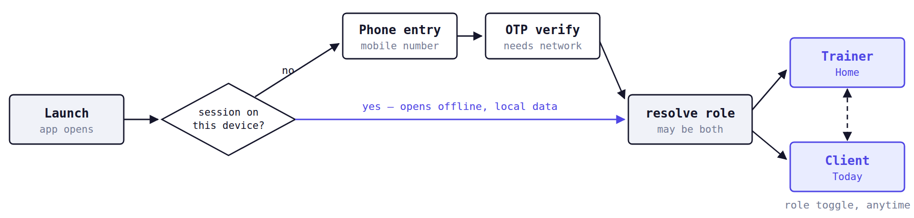
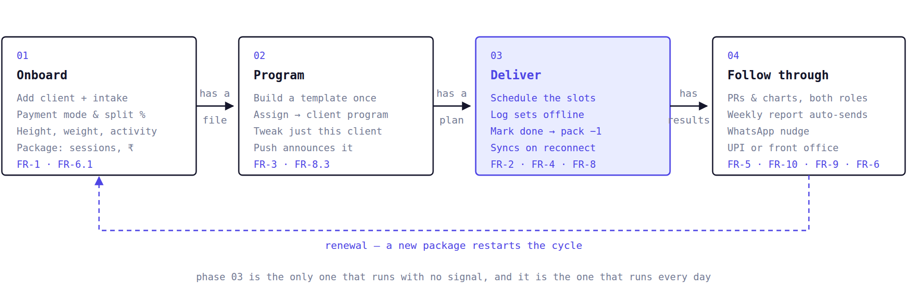
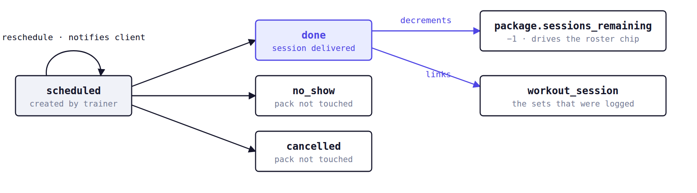
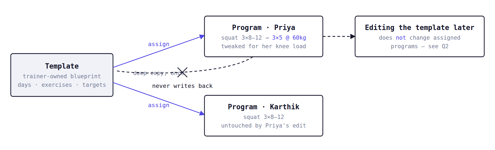
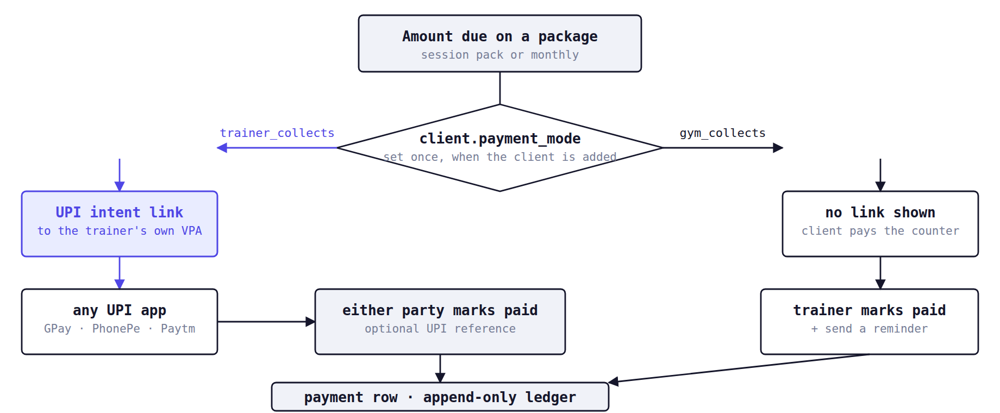
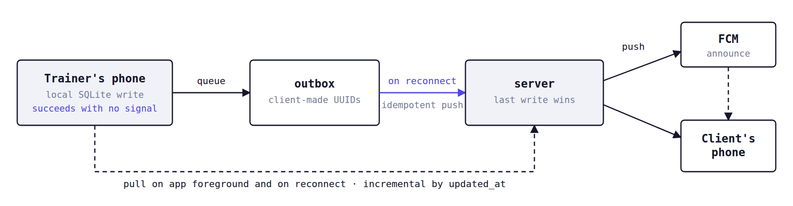

# XRep — MVP Interaction Map

**Version:** 1.0 · **Date:** 9 Aug 2026 · **For:** product design handover
**Scope:** FR-1 – FR-11 · **Roles:** trainer + client · **Platform:** phone only, offline-first · **Market:** Chennai / TN, English

Every screen, state, branch and edge case the MVP has to cover, traced back to
[`XRep_final_requirements_and_plan.md`](XRep_final_requirements_and_plan.md) v2.0. This says **what must be
possible**, not what it should look like.

---

## The whole flow — trainer and client


> Full-resolution vector: [`interaction-map/trainer-client-flow.svg`](interaction-map/trainer-client-flow.svg) — zoom in for the small type.

Reading it: the trainer lane hangs off **Home**, which is why the dashed rail runs down its middle. The orange band is
the only place the two roles touch — everything crossing it is a sync or a push, and nothing crossing it is instant.
The violet-filled boxes are the offline-critical or consequential ones: the workout log, the marked-done tap that
decrements a package, the UPI link, and the per-client program tweak.

---

## 00 · How to read this

XRep is one app with a trainer/client role toggle, for an in-person trainer running 10–30 clients in a gym. The
pinned definition of done is a single sentence: *a trainer can program, log on the floor offline, track progress, take
UPI payments and nudge over WhatsApp — without a spreadsheet.*

Three facts shape almost every screen:

- **The floor is offline.** Gym basements have no signal. Every write is local-first and optimistic; nothing may block
  on the network. "Saved" and "synced" are two different states and the UI has to show both.
- **Trainers are mid-set when they use this.** Logging a set is a few taps, one hand, with last week's numbers already
  prefilled. Screen time per interaction is measured in seconds.
- **Gym vs freelance is per client, not per trainer.** The same trainer has clients they collect UPI from directly and
  clients the gym front office collects for, side by side in one roster. Every payment surface branches on this.

**Status legend used throughout**

| Marker | Meaning |
|---|---|
| `built` | Exists in the app today — usable as a reference, open to redesign |
| `partial` | Some of it exists, the rest is greenfield |
| `to design` | Nothing exists yet |

---

## 01 · Information architecture

Entry is a phone number and an OTP — no password, no email, no signup form. After sign-in the app resolves to a role. A
person can be a trainer with their own clients and someone else's client at the same time, so the role toggle is a
persistent switch, not a one-time account type.



Sign-in is the one flow in the app that hard-requires a connection. A returning user never sees it — launch goes
straight to local data with the radio off, which is how a trainer starts most gym sessions.

### Trainer role

```
Home / Dashboard
├─ stat row: active · today · payment due
├─ today's sessions            → Session detail
├─ roster preview              → Client detail
├─ revenue + gym split                          (to design)
└─ renewals & payments due                      (to design)
Clients  (search + status filters)
├─ Add client (intake)
└─ Client detail
   ├─ Edit client
   ├─ Body metrics + charts                     (partial)
   ├─ Programs                → Program detail
   ├─ Sessions                → Session detail
   ├─ Package & payments                        (to design)
   ├─ Progress & PRs                            (to design)
   └─ Nudge                                     (to design)
Templates
├─ Template builder           → Exercise picker
└─ Template detail            → assign to client
Schedule
├─ Session list
├─ Calendar day / week / month                  (to design)
├─ Schedule session · Weekly slot picker
└─ Session detail             → Workout log
Settings                                        (to design)
├─ profile · UPI VPA
├─ notifications
└─ role switch · sign out
```

### Client role — all to design

```
Today
├─ today's / this week's plan
├─ next session card
└─ payment due banner
Workout
├─ log sets (same engine as trainer)
└─ session history
Progress
├─ PRs
├─ volume / top-set charts
├─ bodyweight chart
└─ log a body metric
Sessions
├─ upcoming
└─ reschedule request  (see Q3)
Payments
├─ amount due
├─ pay via UPI  (trainer-collects only)
├─ mark paid + reference
└─ history
Weekly report

Shared shell (both roles)
├─ sync bar / offline banner
├─ push notification permission primer
└─ role toggle
```

> **Navigation is currently a flat stack with no tab bar.** Everything routes through Home. Deciding the top-level
> shell — bottom tabs vs. hub-and-spoke — is the first real design decision, and it is open. See **Q1**.

### The spine — how the nine MVP features chain

The trees above show where things live; this shows the order a real client moves through them. Every requirement sits
on this loop, and the loop closing — a renewal — is what makes a trainer a repeat customer rather than a trialist.



Note where the weight sits: phases 01, 02 and 04 happen a handful of times per client, while phase 03 repeats two or
three times a week for every client on the roster — which is why the workout log and the mark-done tap get the tightest
interaction budget in the product.

---

## 02 · Screen inventory

Thirty-one screens cover the MVP. Sixteen exist in code today and can be pulled up on a device for reference; the rest
are greenfield.

### Trainer role

| Screen | Job to be done | Covers | Status |
|---|---|---|---|
| Phone entry | Enter a mobile number; request an OTP. | Auth | built |
| OTP verify | 6-digit code, resend timer, wrong-code state. | Auth | built |
| Home / Dashboard | Today at a glance: counts, today's sessions, roster preview, money. | FR-7 | partial |
| Client roster | Search, filter by status chip, jump to any client. | FR-1.6 | built |
| Add client | Name, phone, goal, payment mode, split %, height, starting weight, activity level. | FR-1.1–1.5 | built |
| Client detail | The client's whole file: chips, intake, metrics, programs, sessions, money, actions. | FR-1 | partial |
| Edit client | Change any intake field, pause or reactivate, soft-delete. | FR-1.1 | built |
| Body metric entry | Log weight / waist / chest with a date. Append-only. | FR-1.3 | to design |
| Template list | All reusable plans this trainer owns. | FR-3.2 | built |
| Template builder | Compose days → exercises → sets, reps, rest, target load. | FR-3.1–3.2 | built |
| Template detail | Review a template, assign it to a client, duplicate, rename. | FR-3.2–3.3 | built |
| Exercise picker | Search 873 seeded exercises by muscle / equipment; add a custom one. | FR-3.4 | built |
| Custom exercise | Name, muscle group, optional image, optional video link. | FR-3.4 | to design |
| Program list | A client's programs; which one is active. | FR-3.3 | built |
| Program detail | Per-client plan; tweak exercises without touching the template. | FR-3.3 | built |
| Session list | Upcoming and past appointments, per client or across the roster. | FR-2.1 | built |
| Calendar | Day / week / month views of all sessions. | FR-2.1 | to design |
| Schedule session | Pick client, date, time, duration. One-off. | FR-2.2 | built |
| Weekly slot picker | Recurring weekly slots (e.g. Mon/Wed/Fri 7am) generated in bulk. | FR-2.2 | built |
| Session detail | Mark done / no-show / cancel, reschedule, open the workout log. | FR-2.2 | built |
| Workout log | Log sets: load, reps, RPE, note. The floor screen. | FR-4 | built |
| Progress & PRs | Volume, top set, bodyweight charts; auto-detected PRs. | FR-5.1–5.2 | to design |
| Adherence overview | Who is showing up and who is drifting, across the roster. | FR-5.3 | to design |
| Package editor | Session-pack or monthly: sessions, amount, start, expiry. | FR-6.1 | to design |
| Payment sheet | Mode-aware: UPI deep link, or mark-paid for gym-collected. | FR-6.3–6.4 | to design |
| Payment history | Append-only ledger per client; amount, method, who confirmed. | FR-6 | to design |
| Nudge composer | Pick a WhatsApp template, edit the prefill, send, see delivery state. | FR-9 | to design |
| Weekly report | Preview the auto-generated report; share on demand. | FR-10.3 | to design |
| Settings / profile | Trainer name, **UPI VPA**, notification permission, role switch, sign out. | FR-6.3 | to design |

### Client role — all greenfield

They reuse the trainer's components wherever the data is the same. The workout log in particular must be the same
screen, because `logged_by` is the only difference.

| Screen | Job to be done | Covers |
|---|---|---|
| Today | Today's plan, next session, anything owed. | FR-11.1 |
| Workout log (client) | Log their own sets when training alone. | FR-4.3 |
| Progress | Their PRs, charts, bodyweight; log a metric. | FR-5.2 |
| Sessions | Upcoming appointments; reschedule notifications land here. | FR-2.3 |
| Payments | Pay via UPI, mark paid, history. | FR-11.2 |
| Weekly report | Read the report the server generated. | FR-10.2 |

---

## Feature flows

One block per requirement: entry points, the happy path, every branch, and the edge cases that have bitten this
category of product before. Design each block as a complete set — **the edge cases are not optional polish, they are
the cases.**

### FR-1 · Client management & intake

*Add client · Client roster · Client detail · Edit client · Body metrics*

**Happy path**

1. Trainer taps **+** from Home or roster → Add client.
2. Enters name (required) and phone; goal is free text.
3. Chooses **who collects payment** — `I collect` or `gym front office`. Picking the gym reveals a **split %** field
   (the trainer's share).
4. Baseline intake: height, starting weight, activity level (sedentary / light / moderate / active).
5. Save → the client appears in the roster immediately, before any network call.

**Roster status chips (FR-1.6)** — derived, never set by hand. Already implemented in `app/src/db/clientStatusRules.ts`;
design to these exact strings and tones.

| Chip | Fires when | Tone |
|---|---|---|
| `active` | Client status is active. Paused shows `paused`. | good / warn |
| `payment due ₹3000` | Any payment row is pending / due / unpaid. Amount appended when known. | warn |
| `overdue ₹3000` | A payment is explicitly overdue. | danger |
| `3 sessions left` | Fewest sessions remaining on a live package is ≤ 3. | warn |
| `pack empty` | Sessions remaining hits 0 or below. | danger |
| `5d left` / `ends today` | Soonest package or program end date is within 7 days. | warn |
| `expired` | That end date is in the past. | danger |

A client can carry several chips at once — worst case is four. The roster row must stay readable with all four, with a
20-character name, on a 360dp screen.

**Cases to cover**

- **Empty roster** — a brand-new trainer with zero clients. The single most important empty state in the app; the first
  thing every design partner sees.
- **Search with no results**, distinct from an empty roster.
- **Filtered to nothing** — filters on, no client matches; offer a clear-filters action.
- **Duplicate phone number** — the same person added twice. Warn, don't block.
- **No phone number** — phone is optional, but a client without one cannot receive WhatsApp nudges or UPI requests.
  Every nudge affordance must degrade for them.
- **Paused client** — stays in the roster, excluded from active counts, excluded from the weekly report.
- **Deleting a client** — soft delete only. Confirm, and say what happens to their history.
- **Split % edge values** — 0, 100, blank. Blank on a freelance client means the trainer keeps everything.
- **Long names and long goals** — Tamil is coming; every label must tolerate ~40% text growth.

> ⚠️ **Privacy constraint (DPDP Act 2023).** Name, phone and fitness metrics only. **No medical or health-condition
> fields anywhere** — no injuries, no conditions, no medications. If a trainer needs that, it is a separate consented
> feature later. Do not design an "injuries / health notes" field into intake.

### FR-2 · Scheduling & calendar

*Calendar · Session list · Schedule session · Weekly slot picker · Session detail*



Marking a session **done** is the only transition with side effects — it decrements the package and ties the appointment
to the logged workout. No-show and cancelled deliberately leave the pack alone, which is the rule trainers will argue
about (see Q4).

**Cases to cover**

- **Three calendar densities** — day (the working view, with time gutters), week (the planning view), month (the
  overview). Only day and week get used daily; design accordingly.
- **Recurring slots** — "Mon / Wed / Fri, 7:00am, 60 min, for 8 weeks" generated in one pass, with a preview of every
  generated date before commit.
- **Double booking** — two clients in the same slot. Show it; trainers sometimes do it on purpose.
- **Reschedule** — changes time, keeps identity, and fires a push to the client (FR-2.3). Needs an "are you sure,
  they'll be told" moment.
- **Cancel vs no-show** — different meanings, different consequences, and trainers must not confuse them.
- **Marking done for a session with no logged sets** — completely normal; the workout log is optional.
- **Retroactive marking** — yesterday's sessions still sitting as scheduled. Home should surface "3 sessions need
  marking".
- **Session on a client with no package** — allowed; nothing to decrement.
- **Timezone / device clock** — one market, one timezone (IST), but the device clock may be wrong.
- **Empty day / empty week** — a rest day should read as intentional, not broken.

### FR-3 · Plans, templates & per-client tweak

*Template list · Template builder · Template detail · Exercise picker · Program list · Program detail*

This is the feature that replaces the spreadsheet, and its whole value is one rule: **a template is a blueprint, a
program is a client's copy of it, and editing the copy never edits the blueprint.** If that boundary is invisible,
trainers will destroy their own templates.



Assignment is a one-time deep copy in both directions: the client's program is insulated from later template edits, and
the template is insulated from client tweaks. Whether trainers *want* the first half of that is an open question — Q2.

**Cases to cover**

- **Building from nothing** — first template, empty exercise list, empty day.
- **Exercise search across 873 seeded exercises** — by name, muscle group, equipment. Fast and forgiving of spelling.
- **Custom exercise** — created inline from the picker, mid-build, without losing the draft.
- **Targets are strings, not numbers** — reps are `"8–12"` or `"AMRAP"`; load is `"bodyweight"` or `"60kg"`. Do not
  design numeric steppers for these; they need free text.
- **Day structure** — days are indexed 0–6 and may carry labels ("Push Day"). A plan may be 3 days or 6.
- **Reordering** exercises within a day, and moving one between days.
- **Assigning a template to a client who already has an active program** — replace, or run both? Needs an explicit
  choice.
- **Tweaking a program** — the screen must state, visibly, that this affects only this client.
- **Deleting a template that has been assigned** — existing programs survive (they are copies); say so.
- **Assignment fires a push** to the client (FR-8.3) — the trainer should know it will.
- **Exercise images** come from a mirrored library and may be missing. Every exercise row needs a graceful no-image
  state.

### FR-4 · Workout logging — the floor screen

*Workout log · reachable from Session detail, Client detail, and the client's Today*

The highest-frequency screen in the product and the hardest constraint: one hand, mid-set, phone possibly on a bench,
no signal.

**Happy path**

1. Open the session → today's programmed exercises are already listed in order.
2. Tap an exercise → set rows appear with **last session's load, reps and RPE prefilled**.
3. Adjust what changed, confirm the set. Repeat.
4. Add an unplanned exercise if the rack is busy.
5. Finish → the session is complete and the appointment can be marked done.

**Cases to cover**

- **No program assigned** — log a freestyle session with exercises picked ad hoc.
- **First-ever session for an exercise** — nothing to prefill; the empty numeric state.
- **Partial sets** — load entered, reps not. Must save anyway.
- **Bodyweight and unloaded work** — load is legitimately blank.
- **Editing a set just logged**, and deleting a set logged by mistake.
- **Adding sets beyond the target** — target 3, trainer does 5.
- **Skipping an exercise** entirely — it should not look like a failure.
- **Two clients trained back to back** — switching sessions must be fast and unambiguous.
- **Force-close mid-session** — every set already entered survives. Nothing is held in memory awaiting a save button.
- **Logged by the client instead of the trainer** (FR-4.3) — same screen, and both roles must see who logged it.
- **A PR happening live** — the most rewarding thing the app can show. Decide whether it fires in-log or only in
  Progress (Q7).
- **Numeric keyboards throughout**: load is decimal, reps integer, RPE decimal 1–10.

> **Offline is the default assumption here, not an error state.** The workout log never shows a network error. It
> writes locally, always succeeds, and lets the sync bar carry the truth about upload.

### FR-5 · Progress & PR tracking

*Progress (trainer) · Progress (client) · Adherence overview · Body metric entry*

Visible to **both roles** — the same numbers, framed differently. The trainer looks across clients for who is drifting;
the client looks at themselves for proof it is working.

| Signal | Derived from | Notes for design |
|---|---|---|
| Personal records | Computed on read from logged sets — never stored | Heaviest load, best estimated 1RM, best volume. Needs a "PR" mark wherever a set appears. |
| Volume over time | Sum of load × reps per session | Per exercise and per session. |
| Top set over time | Heaviest working set per exercise | The line trainers actually read. |
| Bodyweight | Append-only body metrics | Sparse and irregular — weeks may have no entry. Charts must handle gaps, not interpolate lies. |
| Measurements | Waist, chest, etc. — extensible list | Same sparsity problem. |
| Adherence | Sessions done ÷ sessions scheduled | Roster-wide for the trainer (FR-5.3). |

**Cases to cover**

- **A brand-new client with one data point** — no chart is possible. The common case in week one; needs a real design,
  not a spinner.
- **Two to four data points** — a chart that does not lie about a trend.
- **A gap of months**, then a return.
- **Weight going the "wrong" way** for the stated goal — neutral framing, no judgement.
- **A PR set on a bodyweight exercise** — reps are the record, not load.
- **Deleted or corrected sets** changing a PR retroactively.
- **Unit consistency** — kg and cm throughout; no imperial in v1.
- **Charts must be legible on a 360dp screen in gym lighting.**

### FR-6 · Packages & payments — dual mode

*Package editor · Payment sheet · Payment history · client-side Payments*

There is no payment gateway in the MVP. Money moves over UPI between two people's own apps, or across a gym counter,
and XRep only records that it happened. **Reconciliation is manual by design.** The design job is to make an
honest ledger feel trustworthy without pretending to be a gateway.



The mode is a per-client property, so both branches live in one roster at the same time. Note the asymmetry the design
has to carry: on the left *either* party can confirm; on the right only the trainer can, because the money never
touched the app.

**Cases to cover**

- **Trainer has no UPI VPA saved** — the UPI button cannot exist. Route to Settings; this is the first-run gap for
  FR-6.3.
- **No UPI app installed** on the paying device — the deep link fails silently on Android. Needs a fallback (show the
  VPA as copyable text).
- **Client pays but nobody marks it** — the honest failure mode of manual reconciliation. Both sides need a nudge.
- **Both parties mark it paid** — must not create two payments or double-count revenue.
- **Partial payment** — half now, half next week. Very common in this market.
- **Cash** — `method: cash` exists and needs a path.
- **Marked paid by mistake** — history is append-only, so this is a reversing entry, not an edit. Design the
  correction, not a delete.
- **Gym-collected client with no amount** — amount is optional there; the trainer may only track paid/unpaid.
- **Package expiring with sessions left**, and **sessions exhausted before expiry** — both need a renewal prompt.
- **Renewal** — a new package for the same client, with the previous one's values prefilled.
- **Paying while offline** — the UPI app works, XRep's record queues. Never block the mark-paid.
- **Currency is ₹ only**, whole rupees in practice.

### FR-7 · Trainer dashboard

*Home — the screen that opens 20 times a day*

Its job is answering four questions in under five seconds: *who am I training today, who owes me, what am I earning,
who is about to churn.*

| Block | Content | Covers |
|---|---|---|
| Active clients | Count of active, excluding paused. | FR-7.1 |
| Revenue this month | Sum of confirmed payments in the calendar month. | FR-7.2 |
| Gym split | For gym-collected clients: the trainer's share vs the gym's, using each client's split %. Freelance clients are 100% trainer. | FR-7.3 |
| Today's sessions | Time, client, status; tap through to mark done. | FR-2.1 |
| Needs attention | Renewals due, payments pending, sessions not yet marked. | FR-7.4 |

**Cases to cover**

- **Day zero** — no clients, no sessions, no revenue. Every block empty at once; the state a design partner judges the
  product on.
- **Mixed roster** — the split view when the trainer has both kinds of client; make it obvious which half of the
  revenue is actually theirs.
- **All-freelance trainer** — the split block is meaningless and should collapse, not show 100% / 0%.
- **Rest day** — no sessions today.
- **Revenue that is provably incomplete** — gym-collected clients may have no amounts. The number must not overstate
  certainty.
- **Month boundary** — the number resets on the 1st; consider showing last month alongside.
- **Stale data** — the dashboard renders from local data that may be hours old. Show when it last synced.

### FR-8 · Sync & the trainer↔client bridge

*Global — sync bar, offline banner, push notifications*

Not a screen; a condition every screen is in. Sync is **eventual, not live** — there is no socket. A change made by the
trainer reaches the client when both devices next talk to the server, announced by a push.



The local write is the only step the user waits on; everything to the right of the outbox is invisible until it fails.
The design consequence: "saved" is instant and unconditional, and "synced" is a separate, quieter signal.

**Cases to cover**

- **Offline** — a persistent, non-alarming indicator. Trainers work offline daily; it is not an error.
- **Queued changes pending** — "12 changes waiting to sync". Reassurance, not a warning.
- **Syncing now** — brief, non-blocking.
- **Sync failed** — retryable, with the data visibly safe. The one state where a warning tone is right.
- **Conflict** — both sides edited the same record. Resolution is last-write-wins and silent; the UI does not ask. But
  the trainer may see a value change under them, so recency matters.
- **Session logged by the client while the trainer was offline** — appears after sync; should not look like the
  trainer's own entry.
- **Long offline stretch** — a week of logs syncing at once.
- **Push permission never granted** — every push-dependent promise must degrade. Design a primer that asks at a moment
  the value is obvious, not on first launch.
- **Push arrives while the app is open / closed / killed** — three different landings, all deep-linking to the right
  screen.

### FR-9 · WhatsApp reminders

*Nudge composer · nudge affordances on Client detail, Session detail, Payment sheet*

WhatsApp is where this market actually communicates. Messages go out through a business provider using **templates
pre-approved by Meta** — the trainer can edit the variables, not the wording. That constraint has to be legible in the
UI, or trainers will try to write free text and be confused when they can't.

| Template | Trigger | Mode-aware? |
|---|---|---|
| Session reminder | Before a scheduled session; manual or automatic. | no |
| Weekly check-in | Weekly, manual or automatic. | no |
| Payment reminder | Payment pending or overdue. | **yes** — "pay via UPI" vs "pay at the front office" |
| Plan renewal / expiry | Package or program ending within 7 days. | no |

**Cases to cover**

- **One-tap send from context** — reachable from the row that made it necessary, not from a separate messaging section.
- **Prefilled and editable variables**, with a preview of the exact message.
- **Client has no phone number** — the affordance must be absent or explained, not broken.
- **Delivery states** — queued, sent, failed. Sent ≠ read; do not imply read receipts.
- **Send while offline** — queues, goes out later.
- **Repeat sends** — show when this client was last nudged so trainers don't spam.
- **Automatic vs manual** — the trainer needs to know which reminders fire on their own, and be able to stop them.
- **Template rejected or provider down** — a failure the trainer can act on.

### FR-10 · Automated weekly report

*Weekly report (trainer preview + share) · Weekly report (client view)*

Generated server-side on a schedule, per active client: progress, PRs and adherence for the week. Sent to the client
automatically; the trainer can also generate and share one on demand. This is the artefact that makes a trainer look
professional to their client, so it carries more visual weight than anything else in the app.

**Cases to cover**

- **A week with zero sessions** — the report still has to say something true and not shaming.
- **A week with no PRs** — most weeks.
- **A great week** — the celebratory case; this is the shareable one.
- **A client who just started** — one session, no baseline.
- **Paused clients** — excluded.
- **Trainer preview before send**, and on-demand generation for any past week.
- **Delivery** — a WhatsApp link or a PDF. If a link, it renders outside the app and must stand alone.
- **Report opened weeks later** — dates must be unambiguous.

### FR-11 · Client role

*Today · Workout · Progress · Sessions · Payments · Report*

Same app, same components, different job. The client opens it two or three times a week for a minute. It must feel like
a lighter product, not a locked-down trainer app.

**Cases to cover**

- **A client with no plan yet** — signed up, nothing assigned. The most likely first launch.
- **Today is a rest day** — distinct from "no plan".
- **Logging their own workout** — same log screen, attributed to the client.
- **Their trainer changed the plan** — announced by push, visible on next open.
- **Paying** — UPI where the trainer collects; "pay at the front office" where the gym does. The client must never see
  a broken UPI button.
- **Marking their own payment as paid**, with an optional reference.
- **Session rescheduled by the trainer** — push, and the change visible in Sessions.
- **Both roles on one phone** — a trainer who is also somebody's client. Switching must be obvious and not lose state.
- **Client sees only their own data** — no roster, no revenue, no other clients, anywhere.

---

## 03 · The state matrix

Every screen in the inventory needs a defined answer for each of these. Most bugs in an offline-first app are missing
states, not wrong pixels — treat this as the checklist a screen is done against.

| State | When | What it must communicate |
|---|---|---|
| First run / empty | No data has ever existed here | What this screen is for and the one action that fills it. Never a bare "no data". |
| Emptied | Data existed, filters or deletion removed it | Different from first run — offer the way back (clear filters, undo). |
| Loading | Reading local data | Should be near-instant. Prefer no spinner over a flashing one. |
| Populated | Normal | — |
| Offline | No connection | Calm and persistent. Everything still works. Not an error. |
| Queued | Local changes not yet uploaded | Count of pending changes; reassurance that nothing is lost. |
| Syncing | Upload or download in progress | Non-blocking, peripheral. |
| Sync failed | Server unreachable or rejected | Retry, and an explicit promise that the local data is safe. |
| Saving | A form is committing | Disable double-submit; optimistic where possible. |
| Validation error | Bad input | Inline, next to the field, in plain words. Today these are system alerts — replace them. |
| Destructive confirm | Delete, cancel, remove | Name the consequence, not "are you sure". |
| Permission denied | Notifications refused | What stops working, and how to turn it back on. |
| Capability missing | No UPI VPA, no phone number, no UPI app | Hide or explain the affordance — never show a button that cannot work. |
| Stale | Local data is old | Last-synced time where the number matters (revenue, sessions remaining). |
| Long content | Long names, ~40% text growth for Tamil | No truncation that loses meaning; layouts must stretch. |

> ⚠️ **Every error message in the app today is a native system alert** — "Could not add set.", "Could not schedule
> session." Replacing these with inline, recoverable, human errors is in scope for the design pass. The copy is as much
> a deliverable as the layout.

---

## 04 · Notification inventory

Two channels, different jobs. Push is in-product and free; WhatsApp is out-of-product, costs money per message and is
template-locked. Anything time-critical and personal goes to WhatsApp; anything about app state goes to push.

| Event | Channel | Recipient | Deep links to |
|---|---|---|---|
| Plan assigned or changed | Push | Client | Today / plan |
| Session reminder | Push + WhatsApp | Client | Session detail |
| Session rescheduled | Push | Client | Sessions |
| Payment confirmed | Push | Both | Payment history |
| Payment due / overdue | WhatsApp | Client | Payments |
| Weekly report ready | Push + WhatsApp | Client | Report |
| Weekly check-in | WhatsApp | Client | — |
| Plan renewal / expiry | WhatsApp | Client | Payments |
| Session logged by client | Push | Trainer | Session detail |

---

## 05 · Component set

Both roles share one library, so each of these has to work in the trainer's dense context and the client's sparse one.

| Component | Variants it must carry |
|---|---|
| Status chip | good / warn / danger / neutral, with a number or currency inside. Up to four on one row. |
| Sync bar | offline · queued (n) · syncing · failed · in sync (silent). |
| Client row | Avatar, name, meta line, chip cluster, chevron. Must survive four chips and a long name. |
| Stat card | Number, label; a currency variant; a split variant showing two shares. |
| Session row | Time, client, duration, status (scheduled / done / no-show / cancelled). |
| Set row | Set number, load, reps, RPE, note, PR mark. Editable inline, deletable, prefilled ghost values. |
| Exercise row | Name, muscle group, image (and no-image), target string, drag handle. |
| Day tabs | Up to 7, labelled or numbered. |
| Empty state | Title, one line, one action. Needed on ~20 screens. |
| Money row | Amount, method, collected by, status, who confirmed, date. |
| UPI action | Enabled, disabled-no-VPA, disabled-no-phone, fallback copyable VPA. |
| Chart | Line with gaps, sparse points, one-point state, emphasised latest point. |
| Nudge card | Template name, preview, editable variables, send, last-sent-at, delivery state. |
| Inline error | Field-level and screen-level, with retry where applicable. |
| Bottom sheet | Payment, mark-done, add exercise — the recurring modal pattern. |

**Existing palette, for reference only.** The app runs on a placeholder set — indigo `#4F46E5` on `#F4F6FA`, with four
semantic tones (green / amber / red / grey) used for chips and the sync bar (`app/src/theme.ts`). It was explicitly
written as a stopgap, not a system. **The visual language is yours to define**; the only thing to preserve is that the
four semantic tones stay distinguishable, including for red-green colour blindness — status is currently carried by
colour alone, which is a defect to fix.

---

## 06 · Deliberately out of scope

Considered and parked. Designing them into the MVP is the main way this scope slips.

- **Engagement layer** — streaks, leaderboards, live gym crowd. Needs member density the launch won't have.
- **Gym owner tier** — multi-branch, staff assignment, a gym entity at all.
- **AI plan generation.**
- **Tamil localisation** — English at launch, but layouts must already tolerate the growth.
- **A separate member app** — one app, role toggle.
- **Payment gateway / auto-reconciliation** — UPI deep link only; reconciliation stays manual.
- **Web dashboard** — phone only in v1.
- **In-app chat** — WhatsApp is the channel.
- **Health or medical data** — legally excluded, not deferred.
- **Nutrition and diet plans.**

---

## 07 · Open questions for the design pass

Genuinely undecided, and each one changes screens. Worth resolving with the design-partner trainers rather than in a
review.

**Q1 · What is the top-level shell?**
The app is a flat stack today — everything funnels through Home. With eleven feature areas, a bottom tab bar
(Home · Clients · Schedule · Money) may be the right shape, or hub-and-spoke may suit a trainer who really only does
two things a day. This decision shapes every screen's header and back behaviour.

**Q2 · Does editing a template touch programs already assigned from it?**
Today: no — assignment is a one-time copy, and the trainer must reassign to propagate. That protects per-client tweaks
but means fixing a typo in a template leaves twelve clients with the typo. If propagation is wanted, it needs a "push
update to N clients, keeping their tweaks?" flow, which is a substantial screen.

**Q3 · Can a client request a reschedule?**
The requirement says the client *sees* upcoming sessions and is notified of changes — it doesn't say they can ask for
one. In practice they will WhatsApp the trainer. Deciding this now avoids a half-built request inbox.

**Q4 · Does a no-show burn a session from the pack?**
Currently no. Many trainers charge for it. This may need to be a per-trainer setting, or a choice at the moment of
marking — which turns one tap into two.

**Q5 · When does the app ask for notification permission?**
Push carries plan updates, reminders and payment confirmations. Asking on first launch gets refused; asking at the
moment of first value (assigning a plan, scheduling a session) converts. Needs a designed primer, not the system prompt
alone.

**Q6 · How much does the client see of the money?**
The split ratio is the trainer's business arrangement with the gym. The client should see what they owe and what they
paid — and nothing about splits, ever. Worth stating explicitly in the client-side payment designs.

**Q7 · Does a PR celebrate in the moment?**
The most emotionally valuable event in the product happens on the noisiest screen. In-log celebration risks
interrupting a working trainer; deferring it to Progress risks nobody noticing.

---

## Assets

| File | What it is |
|---|---|
| `interaction-map/trainer-client-flow.svg` / `.png` | The master flow chart — both roles, all screens |
| `interaction-map/entry-and-role-flow.*` | Launch, OTP, role resolution |
| `interaction-map/mvp-spine-four-phases.*` | The four-phase cycle all nine features sit on |
| `interaction-map/session-lifecycle.*` | scheduled → done / no-show / cancelled, and what `done` decrements |
| `interaction-map/template-to-program.*` | Why a client tweak never reaches the template |
| `interaction-map/payment-dual-mode.*` | The trainer-collects vs gym-collects branch |
| `interaction-map/offline-sync-bridge.*` | Local write → outbox → server → other device |

Diagrams are generated, not hand-drawn — regenerate the master chart with
`python3 interaction-map/gen_flow.py` if screens change.

---

*XRep MVP Interaction Map · v1.0 · 9 Aug 2026 · traced to FR-1 – FR-11 of the Final Requirements & Delivery Plan
v2.0 · 16 of 31 screens exist in code and can be run on a device for reference.*
